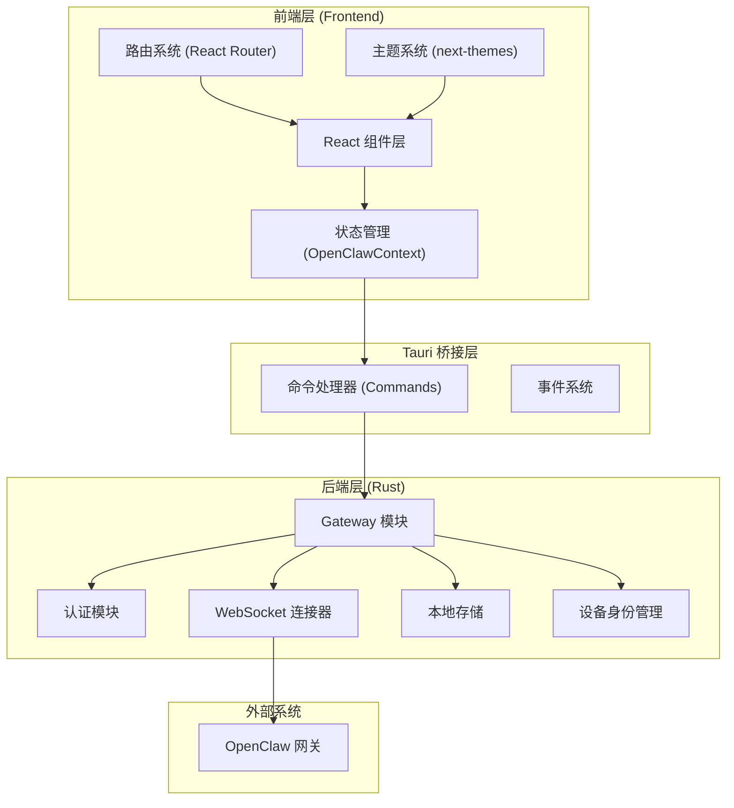

**ClawScope** 是一款面向 OpenClaw 生态系统的桌面管理工具，采用 **Tauri 2 + Rust** 技术栈构建，专注于提供记忆可见、配置可编辑、进化可实验的本地管理能力。项目代号"ClawScope"对应规划文档中的产品名"ClawForge"，其核心理念是"记忆可见，进化可期"。

Sources: [README.md](README.md#L1-L10), [tauri.conf.json](src-tauri/tauri.conf.json#L1-L5)

## 技术架构

ClawScope 采用经典的桌面应用分层架构，前端与后端通过 Tauri 的命令系统桥接通信。这种架构兼顾了 Web 技术的开发效率与原生应用的性能体验。

### 整体架构图



Sources: [App.tsx](src/app/App.tsx#L1-L24), [lib.rs](src-tauri/src/lib.rs#L1-L46), [routes.tsx](src/app/routes.tsx#L1-L26)

### 技术栈组成

| 层级 | 技术选型 | 版本 | 用途说明 |
|------|----------|------|----------|
| **前端框架** | React | ^18.2.0 | 组件化 UI 构建 |
| **前端语言** | TypeScript | ~5.2.0 | 类型安全开发 |
| **构建工具** | Vite | 6.3.5 | 快速开发与热更新 |
| **样式方案** | Tailwind CSS | 4.1.12 | 原子化 CSS 工具 |
| **UI 组件库** | Radix UI | 1.x | 无样式可访问组件 |
| **路由管理** | React Router | 7.13.0 | 客户端路由导航 |
| **主题系统** | next-themes | 0.4.6 | 明暗主题切换 |
| **桌面框架** | Tauri | 2.x | 跨平台桌面应用封装 |
| **后端语言** | Rust | 2024 Edition | 高性能原生代码 |
| **异步运行时** | Tokio | 1.x | Rust 异步 I/O |
| **WebSocket** | tokio-tungstenite | 0.24 | 实时通信连接 |
| **密码学** | ed25519-dalek | 2 | Ed25519 签名验证 |

Sources: [package.json](package.json#L1-L80), [Cargo.toml](src-tauri/Cargo.toml#L1-L36)

## 项目结构

ClawScope 采用 Monorepo 结构，前端代码位于 `src/` 目录，Rust 后端代码位于 `src-tauri/src/` 目录。

### 目录结构概览

```
claw-scope/
├── src/                          # 前端源代码
│   ├── app/                      # 应用核心
│   │   ├── App.tsx               # 根组件
│   │   ├── routes.tsx            # 路由配置
│   │   ├── components/           # 组件集合
│   │   │   ├── Shell.tsx         # 应用外壳布局
│   │   │   ├── ui/               # 通用 UI 组件 (50+)
│   │   │   ├── views/            # 四大视图组件
│   │   │   └── setup/            # 设置向导组件
│   │   └── contexts/             # React Context
│   │       ├── OpenClawContext.tsx   # 网关连接状态
│   │       └── I18nContext.tsx       # 国际化
│   ├── styles/                   # 全局样式
│   └── main.tsx                  # 前端入口
├── src-tauri/                    # Tauri/Rust 后端
│   ├── src/                      # Rust 源代码
│   │   ├── main.rs               # 应用入口
│   │   ├── lib.rs                # 库根模块
│   │   └── gateway/              # 网关核心模块
│   │       ├── commands.rs       # Tauri 命令
│   │       ├── connector.rs      # WebSocket 连接
│   │       ├── auth.rs           # 认证逻辑
│   │       ├── device_identity.rs# 设备身份
│   │       ├── store.rs          # 本地存储
│   │       └── ...               # 其他子模块
│   ├── Cargo.toml                # Rust 依赖配置
│   └── tauri.conf.json           # Tauri 应用配置
├── scripts/                      # 工具脚本
├── artifacts/                    # 构建产物
└── docs/                         # 文档目录
```

Sources: [目录结构](.), [gateway/mod.rs](src-tauri/src/gateway/mod.rs#L1-L13)

## 核心功能模块

ClawScope 围绕四个核心视图构建，分别对应代理身份管理、记忆库管理、连接配置和进化实验功能。

### 视图功能矩阵

| 视图 | 路径 | 核心功能 | 对应文档 |
|------|------|----------|----------|
| **Profile** | `/` | 代理身份查看、工作区信息、灵魂文档管理 | [Profile 视图](9-profile-shi-tu-dai-li-shen-fen-guan-li) |
| **Memory** | `/memory` | 文档浏览、语义搜索、时间线查看、知识面板 | [Memory 视图](10-memory-shi-tu-ji-yi-ku-yu-wen-dang-guan-li) |
| **Config** | `/config` | OpenClaw 连接配置、本地设置、认证管理 | [Config 视图](11-config-shi-tu-lian-jie-pei-zhi-yu-she-zhi) |
| **Evolution** | `/evolution` | 进化实验界面、实验数据管理 | [Evolution 视图](12-evolution-shi-tu-jin-hua-shi-yan-jie-mian) |

Sources: [routes.tsx](src/app/routes.tsx#L1-L26)

### Gateway 后端能力

Rust 后端通过 `gateway` 模块提供 30+ 个 Tauri 命令，涵盖以下能力域：

- **连接管理**：状态查询、端点规范化、连接/断开、代理列表获取
- **身份管理**：设备身份、代理身份、工作区身份、灵魂文档读写
- **内存操作**：文档读取、语义搜索、索引管理、运行时状态监控
- **时间线管理**：时间线获取、本地扫描、远程探测、条目读取
- **配置管理**：本地配置设置、内存配置更新

Sources: [lib.rs](src-tauri/src/lib.rs#L12-L44)

## 开发环境要求

### 必需依赖

| 组件 | Windows | macOS | Linux |
|------|---------|-------|-------|
| **Node.js** | LTS 版本 | LTS 版本 | LTS 版本 |
| **Rust** | `stable-msvc` | `stable` | `stable` |
| **构建工具** | VS Build Tools | Xcode | build-essential |

### Windows 特殊要求

Windows 平台需要安装 [Visual Studio Build Tools](https://visualstudio.microsoft.com/visual-cpp-build-tools/)，并勾选「使用 C++ 的桌面开发」工作负载。若构建报错 `dlltool.exe: program not found`，即表示缺少此工具链。

Sources: [README.md](README.md#L50-L58)

## 快速启动

### 开发模式

```bash
# 安装依赖
npm install

# 启动开发服务器（自动拉起 Tauri 窗口）
npm run tauri dev
```

开发服务器默认监听 `127.0.0.1:1420`，热更新端口为 `1421`。

### 生产构建

```bash
# 构建生产版本
npm run tauri build
```

构建产物输出至 `src-tauri/target/release/` 目录。

Sources: [README.md](README.md#L12-L20), [vite.config.ts](vite.config.ts#L1-L34)

## 质量保障

### 自动化测试

| 测试类型 | 工具 | 命令 | 说明 |
|----------|------|------|------|
| **单元测试** | Vitest | `npm run test` | React 组件与逻辑测试 |
| **类型检查** | TypeScript | `npm run lint` | 静态类型验证 |
| **视觉回归** | Playwright | `npm run visual:ci` | 明暗主题截图对比 |

### CI/CD 流程

GitHub Actions 工作流在每次 Push 和 PR 时自动执行：
1. Linux 依赖安装
2. Node.js 与 Rust 环境配置
3. 前端依赖安装与 Playwright 安装
4. Rust 代码检查 (`cargo check`, `cargo clippy`)
5. Linux 构建冒烟测试
6. 视觉回归基线生成与产物上传

Sources: [.github/workflows/ci.yml](.github/workflows/ci.yml#L1-L64), [README.md](README.md#L22-L44)

## 阅读指南

作为初学者，建议按以下顺序阅读文档以建立完整认知：

1. **[环境搭建与开发启动](2-huan-jing-da-jian-yu-kai-fa-qi-dong)** — 配置本地开发环境
2. **[构建与打包发布](3-gou-jian-yu-da-bao-fa-bu)** — 了解完整构建流程
3. **[ClawScope 产品定位与功能模块](4-clawscope-chan-pin-ding-wei-yu-gong-neng-mo-kuai)** — 理解产品设计理念
4. **[OpenClaw 网关连接原理](5-openclaw-wang-guan-lian-jie-yuan-li)** — 掌握核心连接机制

完成上述基础阅读后，可根据兴趣深入：
- **前端开发** → [React 应用架构与路由设计](6-react-ying-yong-jia-gou-yu-lu-you-she-ji)
- **状态管理** → [OpenClaw 上下文与状态管理](7-openclaw-shang-xia-wen-yu-zhuang-tai-guan-li)
- **后端开发** → [Tauri 命令与前端通信](15-tauri-ming-ling-yu-qian-duan-tong-xin)

## 许可证

本项目采用 MIT 许可证开源。