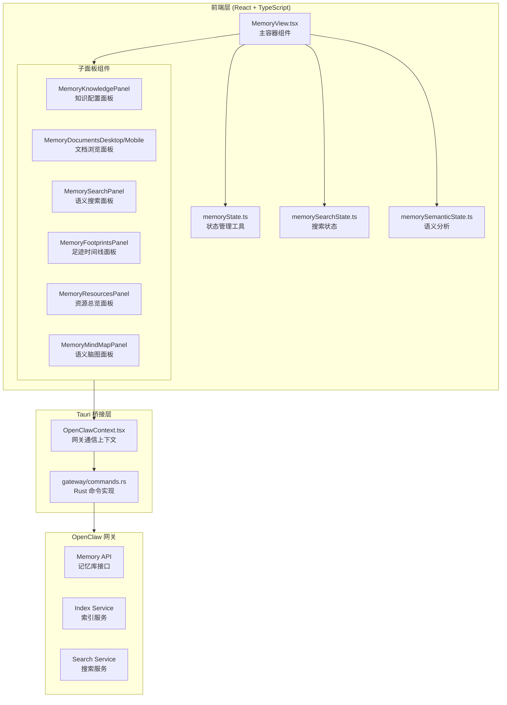

Memory 视图是 ClawScope 的核心功能模块，为用户提供代理记忆库的全方位管理能力。该视图整合了文档浏览、时间线足迹追踪、语义搜索和知识图谱四大功能区域，通过统一的状态管理和响应式架构，实现跨本地与远程网关环境的记忆数据操作。开发者可通过本视图深入理解 ClawScope 如何与 OpenClaw 网关协作，实现代理记忆的可视化管理和智能检索。

## 架构概览

Memory 视图采用分层组件架构，核心由 `MemoryView.tsx` 主容器协调五个子面板，通过 `memoryState.ts` 提供的状态管理工具函数实现数据流转。视图与 OpenClaw 网关的通信通过 Tauri 命令层桥接，支持本地 WebSocket 直连和远程 HTTP 连接两种模式。



Sources: [MemoryView.tsx](src/app/components/views/MemoryView.tsx#L1-L1544), [memoryState.ts](src/app/components/views/memoryState.ts#L1-L1052), [commands.rs](src-tauri/src/gateway/commands.rs#L107-L134)

## 五大功能分区

Memory 视图通过标签页导航组织五个独立的功能区域，每个区域针对记忆库的不同维度提供专业化操作界面。

### 1. Overview 总览区

总览区作为默认入口，聚合展示记忆库的关键统计信息和资源分布。`MemoryResourcesPanel` 组件以紧凑布局呈现工作空间路径、文档数量、索引状态等核心指标，并提供资源树形导航支持快速跳转至其他分区。

总览区的数据模型由 `buildMemoryResourceGroups` 函数构建，将记忆库资源分类为文档组、时间线组、外部源组和运行时健康组四大类别。每个资源项包含类型标识、标签文本和元数据信息，支持点击交互打开对应详情视图。

Sources: [MemoryResourcesPanel.tsx](src/app/components/views/MemoryResourcesPanel.tsx#L1-L367), [memoryResourcesState.ts](src/app/components/views/memoryResourcesState.ts#L1-L200)

### 2. Documents 文档区

文档区提供代理记忆文档的浏览、编辑和本地搜索功能。`MemoryDocumentsDesktop` 组件实现双栏布局：左侧为文档列表与搜索控件，右侧为内容展示与编辑器。组件支持响应式设计，在移动端切换至 `MemoryDocumentsMobile` 实现单栏堆叠布局。

文档编辑功能受权限系统控制，仅当用户具备 `operator.admin` 作用域时才可修改文档内容。编辑状态通过 `drafts` 状态对象管理，未保存的修改以草稿形式暂存，用户可执行保存或取消操作。文档内搜索支持关键词高亮和匹配项导航，通过 `collectTextSearchMatches` 函数实现文本匹配定位。

Sources: [MemoryDocumentsDesktop.tsx](src/app/components/views/MemoryDocumentsDesktop.tsx#L1-L530), [memoryState.ts](src/app/components/views/memoryState.ts#L226-L228)

### 3. Footprints 足迹区

足迹区专注于代理记忆时间线的可视化浏览，支持本地工作空间扫描和远程日期探测两种数据获取模式。`MemoryFootprintsPanel` 组件提供日期范围选择器，用户可设定探测区间执行批量查询，系统通过 `gatewayAgentMemoryTimelineRemoteProbe` 命令逐日获取远程代理的记忆条目。

时间线条目按日期分组展示，每个分组显示条目数量、总大小和最后更新时间。探测结果状态通过颜色编码直观呈现：命中(hit)、缺失(miss)、超时(timeout)和错误(error)。用户可选择特定日期条目查看完整内容，组件自动处理内容加载和高亮定位。

Sources: [MemoryFootprintsPanel.tsx](src/app/components/views/MemoryFootprintsPanel.tsx#L1-L347), [memoryState.ts](src/app/components/views/memoryState.ts#L281-L326)

### 4. Search 搜索区

搜索区实现基于向量嵌入的语义检索功能，依赖本地网关会话和可用的嵌入模型服务。`MemorySearchPanel` 组件在渲染时展示健康诊断面板，显示嵌入服务提供商、模型名称和就绪状态，帮助用户快速识别搜索功能可用性。

语义搜索支持结果分组过滤，可按文档、时间线、会话等来源类型筛选。搜索结果项展示匹配片段、相关度分数和来源路径，点击可打开详情抽屉查看完整内容。搜索功能的后端实现通过 `gatewayAgentMemorySearch` 命令调用，支持 `max_results` 和 `source_filter` 参数控制返回结果。

Sources: [MemorySearchPanel.tsx](src/app/components/views/MemorySearchPanel.tsx#L1-L311), [memorySearchState.ts](src/app/components/views/memorySearchState.ts#L1-L127), [commands.rs](src-tauri/src/gateway/commands.rs#L117-L134)

### 5. Knowledge 知识区

知识区是记忆库的高级配置中心，整合外部知识源管理、会话记忆开关和索引重建功能。`MemoryKnowledgePanel` 组件提供可视化界面配置 `extraPaths` 附加路径、`sessionMemory` 会话记忆和 `sources` 源目录，配置变更通过 `memoryKnowledgeActions.ts` 中的动作函数持久化至本地 OpenClaw CLI 配置。

知识区集成语义脑图功能，通过 `MemoryMindMapPanel` 组件以力导向图形式展示记忆库的概念聚类和关联关系。脑图基于 `memorySemanticState.ts` 实现的文本分析算法自动生成，从文档和时间线内容中提取关键词、构建概念节点、识别语义簇群。

Sources: [MemoryKnowledgePanel.tsx](src/app/components/views/MemoryKnowledgePanel.tsx#L1-L550), [memoryKnowledgeActions.ts](src/app/components/views/memoryKnowledgeActions.ts#L1-L170), [MemoryMindMapPanel.tsx](src/app/components/views/MemoryMindMapPanel.tsx#L1-L569)

## 状态管理设计

Memory 视图采用分散式状态管理策略，按功能域拆分为多个专用状态模块，通过 React hooks 组合在主视图中协调。

### 核心状态切片

| 状态模块 | 职责 | 关键类型 |
|---------|------|---------|
| `memoryState.ts` | 记忆库基础操作、时间线处理、文档编辑 | `MemoryFootprintGroup`, `MemorySearchMatch`, `MemoryExternalSourceItem` |
| `memorySearchState.ts` | 语义搜索分组、来源解析 | `SemanticMemorySearchGroup`, `SemanticMemorySearchSourceKind` |
| `memorySemanticState.ts` | 语义分析、脑图构建 | `SemanticMindMapModel`, `SemanticConcept`, `SemanticCluster` |
| `memoryKnowledgeState.ts` | 知识配置视图模型 | `MemoryKnowledgeViewModel` |
| `memoryResourcesState.ts` | 资源分组构建 | `MemoryResourceGroup` |
| `memoryConfigStatus.ts` | 配置状态摘要 | `MemoryConfigStatusSummary`, `MemoryIndexStrategy` |

Sources: [memoryState.ts](src/app/components/views/memoryState.ts#L13-L89), [memorySemanticTypes.ts](src/app/components/views/memorySemanticTypes.ts#L1-L95)

### 主视图状态架构

`MemoryView` 组件维护约 30 个独立状态变量，按功能域组织如下：

**数据获取状态**：`memoryResult`, `timelineResult`, `memoryStatus`, `memoryRuntimeStatus` 存储从网关获取的原始数据；`timelineAccess` 记录时间线访问模式解析结果。

**UI 交互状态**：`activeSection` 控制当前激活的标签页；`selectedAgentId`, `selectedDocumentName`, `selectedTimelineEntryName` 管理选中项；`drafts` 对象保存文档编辑草稿。

**搜索状态**：`searchQuery`, `searchResult`, `searchDetail` 构成语义搜索的完整状态机；`documentSearchState` 管理文档内文本搜索。

**探测状态**：`timelineProbeRange`, `timelineProbeState`, `timelineProbeFeedback` 支持时间线远程探测的异步操作和进度反馈。

Sources: [MemoryView.tsx](src/app/components/views/MemoryView.tsx#L287-L347)

## 语义分析引擎

Memory 视图内置轻量级语义分析引擎，无需依赖外部 NLP 服务即可从记忆内容中提取结构化知识。

### 文本预处理流程

语义分析首先通过 `tokenizeText` 函数执行标准化分词：转换为小写、按非字母数字分隔符切分、过滤停用词和短词。系统维护中英双语停用词表，涵盖常见虚词和记忆库领域特定词汇（如 "memory", "document", "view", "记忆", "内容" 等）。

关键词提取采用频率统计策略，`collectKeywords` 函数统计词项出现频次，返回频率最高的前 10 个关键词。短语提取则通过相邻词对共现分析实现，识别有意义的二元词组。

Sources: [memorySemanticState.ts](src/app/components/views/memorySemanticState.ts#L13-L150)

### 概念聚类算法

脑图构建采用分层聚类策略：

1. **条目向量化**：每个记忆条目表示为关键词向量，计算条目间 Jaccard 相似度
2. **概念识别**：提取高频关键词作为概念节点，关联包含该关键词的条目作为证据
3. **簇群构建**：基于概念共现关系将概念聚类为语义簇，每个簇群包含相关概念和代表性摘要
4. **图谱布局**：使用预设坐标将簇群和概念映射至 2D 可视化空间

算法参数通过常量配置控制：`MIN_KEYWORD_LENGTH=4` 定义最小词长，`MAX_KEYWORDS_PER_ENTRY=10` 限制条目关键词数，`MAX_CLUSTERS=8` 和 `MAX_CONCEPTS=18` 控制脑图复杂度。

Sources: [memorySemanticState.ts](src/app/components/views/memorySemanticState.ts#L200-L400), [memorySemanticTypes.ts](src/app/components/views/memorySemanticTypes.ts#L23-L65)

## UI 组件体系

Memory 视图共享一套统一的档案式 UI 组件体系，定义于 `memoryArchiveUi.tsx`，提供一致的视觉风格和交互模式。

### 主题色调系统

组件库支持五种主题色调：sky（天蓝，默认）、violet（紫罗兰）、emerald（翠绿）、amber（琥珀）、rose（玫瑰）。每种色调定义完整的 CSS 类映射，涵盖头部标识、按钮、标签页、诊断卡片等界面元素。色调通过 `ArchiveTone` 类型约束，确保类型安全。

```typescript
type ArchiveTone = "sky" | "violet" | "emerald" | "amber" | "rose";
```

Sources: [memoryArchiveUi.tsx](src/app/components/views/memoryArchiveUi.tsx#L1-L145)

### 布局组件

| 组件 | 用途 | 特性 |
|-----|------|------|
| `ArchiveSplitPanel` | 双栏主布局 | 支持响应式列宽配置，集成头部图标和描述 |
| `ArchiveListPane` | 左侧列表容器 | 内建滚动区域和标题栏 |
| `ArchiveDetailPane` | 右侧详情容器 | 支持内容溢出滚动 |
| `ArchiveSectionCard` | 章节卡片 | 圆角边框、渐变背景、阴影效果 |
| `ArchiveCapsule` | 胶囊容器 | 用于过滤器和控制按钮组 |

Sources: [memoryArchiveUi.tsx](src/app/components/views/memoryArchiveUi.tsx#L164-L400)

## 网关通信接口

Memory 视图通过 `OpenClawContext` 提供的一组异步函数与 Tauri 后端通信，所有函数返回 Promise 并遵循统一的错误处理模式。

### 核心命令映射

| 前端函数 | Rust 命令 | 功能 |
|---------|----------|------|
| `gatewayAgentMemoryGet` | `gateway_agent_memory_get` | 获取代理记忆库元数据和文档列表 |
| `gatewayAgentMemoryStatus` | `gateway_agent_memory_status` | 查询嵌入服务健康状态 |
| `gatewayAgentMemoryRuntimeStatus` | `gateway_agent_memory_runtime_status` | 获取运行时索引统计 |
| `gatewayAgentMemorySearch` | `gateway_agent_memory_search` | 执行语义搜索查询 |
| `gatewayAgentMemoryTimelineGet` | `gateway_agent_memory_timeline_get` | 获取时间线条目列表 |
| `gatewayAgentMemoryTimelineLocalScan` | `gateway_agent_memory_timeline_local_scan` | 本地扫描时间线文件 |
| `gatewayAgentMemoryTimelineRemoteProbe` | `gateway_agent_memory_timeline_remote_probe` | 远程探测日期范围 |
| `gatewayAgentMemoryIndex` | `gateway_agent_memory_index` | 触发索引重建 |

Sources: [OpenClawContext.tsx](src/app/contexts/OpenClawContext.tsx#L1-L200), [commands.rs](src-tauri/src/gateway/commands.rs#L107-L200)

### 类型定义体系

网关通信采用严格的 TypeScript 类型约束，核心类型包括：

- `GatewayAgentMemoryResult`：记忆库查询结果，包含工作空间路径、文档列表、共享代理和诊断信息
- `GatewayAgentMemorySearchResult`：语义搜索结果，包含结果项数组和诊断信息
- `GatewayAgentMemoryTimelineResult`：时间线查询结果，支持本地和远程两种来源
- `GatewayAgentFileEntry`：文件条目，包含名称、路径、大小、更新时间和内容

Sources: [OpenClawContext.tsx](src/app/contexts/OpenClawContext.tsx#L79-L195)

## 本地与远程模式适配

Memory 视图设计充分考虑本地网关和远程网关的差异，通过运行时检测实现功能适配。

### 模式检测机制

`isLocalGatewaySession` 状态通过正则表达式检测当前连接 URL 判断会话模式：

```typescript
const isLocalGatewaySession = /^(ws|http):\/\/(127\.0\.0\.1|localhost)(:\d+)?$/i.test(connectedOrigin);
```

Sources: [MemoryView.tsx](src/app/components/views/MemoryView.tsx#L349-L357)

### 功能可用性差异

| 功能 | 本地模式 | 远程模式 |
|-----|---------|---------|
| 运行时状态查询 | 完整支持 | 不可用（返回 null） |
| 知识配置修改 | 通过 CLI 直接修改 | 仅显示配置指南 |
| 索引重建 | 本地执行 | 不可用 |
| 时间线探测 | 本地扫描 + 远程探测 | 仅远程探测 |

远程模式下，知识配置面板显示命令行指南，用户需复制命令在代理所在环境手动执行。这种设计确保了远程代理记忆库的安全性，同时提供清晰的操作指引。

Sources: [MemoryKnowledgePanel.tsx](src/app/components/views/MemoryKnowledgePanel.tsx#L139-L172), [memoryKnowledgeActions.ts](src/app/components/views/memoryKnowledgeActions.ts#L54-L66)

## 下一步阅读

完成 Memory 视图的学习后，建议继续探索以下相关文档：

- [OpenClaw 上下文与状态管理](7-openclaw-shang-xia-wen-yu-zhuang-tai-guan-li) — 深入理解网关通信层的设计与实现
- [代理内存操作：文档读写与搜索](18-dai-li-nei-cun-cao-zuo-wen-dang-du-xie-yu-sou-suo) — 后端 Rust 实现的详细解析
- [时间线管理：本地扫描与远程探测](19-shi-jian-xian-guan-li-ben-di-sao-miao-yu-yuan-cheng-tan-ce) — 时间线功能的完整技术说明
- [Config 视图：连接配置与设置](11-config-shi-tu-lian-jie-pei-zhi-yu-she-zhi) — 应用级配置管理界面