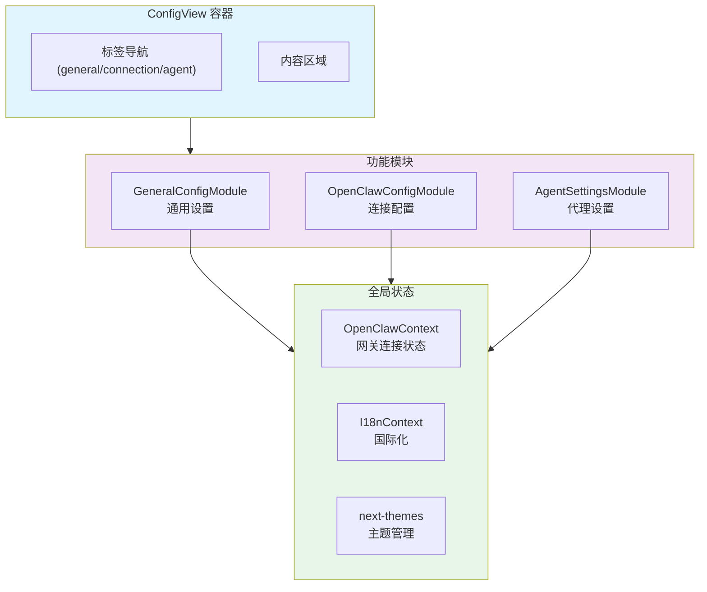
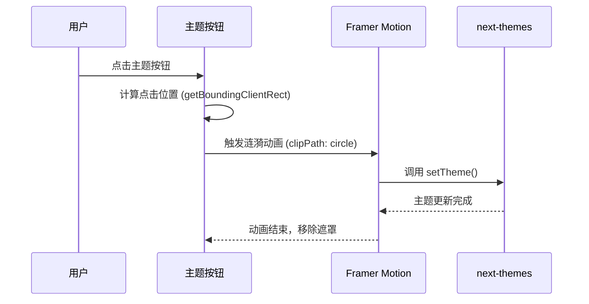
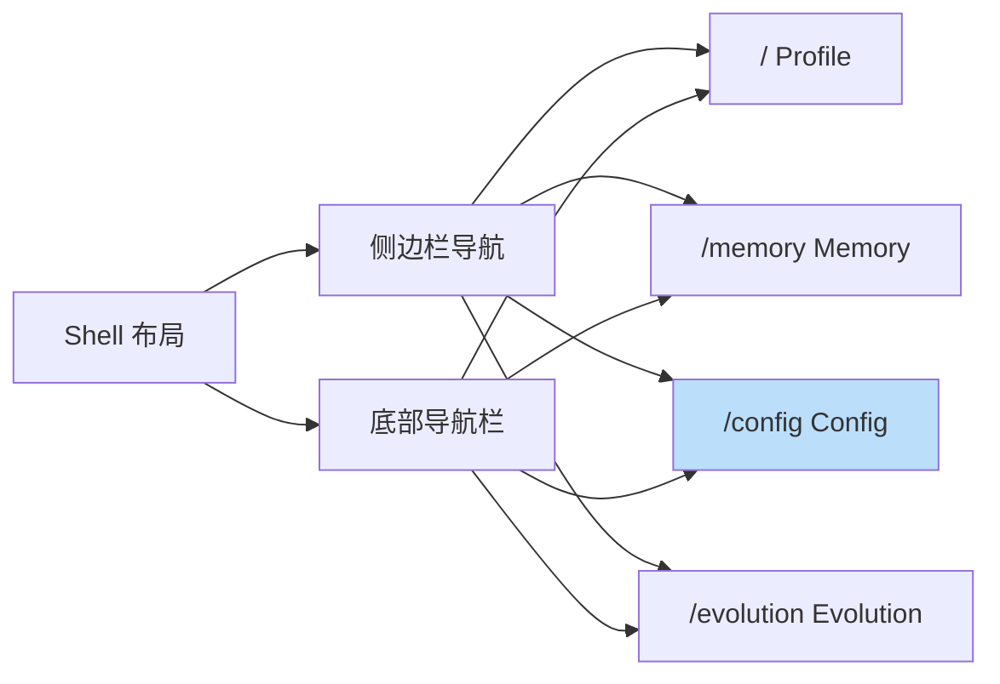

Config 视图是 ClawScope 桌面应用的核心配置中心，为用户提供统一的网关连接管理、应用偏好设置和代理运行时参数查看功能。该视图采用标签页导航设计，将功能划分为三个独立模块：**通用设置**、**连接配置**和**代理设置**，使不同层级的配置项得到清晰的组织与呈现。

Sources: [ConfigView.tsx](src/app/components/views/ConfigView.tsx#L1-L73)

## 架构概览

Config 视图在整个应用架构中扮演着"系统控制面板"的角色，它同时服务于首次启动时的引导流程（通过 [SetupWizard](src/app/components/setup/SetupWizard.tsx)）和日常运行时的配置调整需求。视图组件采用组合式设计模式，将三个功能模块解耦为独立的子组件，通过状态提升实现跨模块的数据共享。

Sources: [ConfigView.tsx](src/app/components/views/ConfigView.tsx#L14-L70), [OpenClawContext.tsx](src/app/contexts/OpenClawContext.tsx#L332-L354)

## 通用设置模块 (GeneralConfigModule)

通用设置模块负责管理与应用外观和行为相关的基础偏好，包括主题模式切换和界面语言选择。该模块采用卡片式布局，每个设置项封装在独立的视觉容器中，提供清晰的视觉层级。

### 主题切换机制

主题切换实现了独特的"涟漪扩散"动画效果：当用户点击主题按钮时，系统会捕获点击位置的坐标，然后使用 Framer Motion 的 `clipPath` 动画从点击点向外扩散，逐渐覆盖整个视口，实现平滑的主题过渡体验。

主题支持三种模式：**浅色模式** (`light`)、**深色模式** (`dark`) 和**跟随系统** (`system`)。每种模式都有对应的图标指示器和选中状态样式。

Sources: [GeneralConfigModule.tsx](src/app/components/setup/GeneralConfigModule.tsx#L25-L40), [GeneralConfigModule.tsx](src/app/components/setup/GeneralConfigModule.tsx#L115-L157)

### 语言选择

语言选择器使用网格布局展示所有支持的语言选项，当前选中的语言通过高亮边框和勾选图标进行标识。语言数据来源于 [I18nContext](src/app/contexts/I18nContext.tsx) 中定义的 `LANGUAGES` 常量数组。

通用设置模块还提供了一个快捷入口，允许用户直接跳转到 [Profile 视图](9-profile-shi-tu-dai-li-shen-fen-guan-li) 进行代理身份管理，这体现了视图间的导航关联设计。

Sources: [GeneralConfigModule.tsx](src/app/components/setup/GeneralConfigModule.tsx#L167-L182)

## 连接配置模块 (OpenClawConfigModule)

连接配置模块是 Config 视图的核心功能，负责管理与 OpenClaw 网关的连接参数。该模块与 [OpenClawContext](src/app/contexts/OpenClawContext.tsx) 深度集成，提供实时的连接状态反馈。

### 连接状态指示

模块顶部显示当前连接状态的摘要卡片，包含以下信息维度：

| 状态类型 | 视觉标识 | 触发条件 |
|---------|---------|---------|
| 已连接 | 绿色徽章 + 勾选图标 | `isConnected === true` |
| 未配置 | 灰色徽章 + 警告图标 | `!isConfigured` |
| 连接失败 | 红色徽章 + 错误图标 | `isConfigured && !isConnected` |

当连接成功时，系统还会展示从网关获取的授权作用域 (`grantedScopes`) 列表，以标签形式呈现。

Sources: [OpenClawConfigModule.tsx](src/app/components/setup/OpenClawConfigModule.tsx#L107-L125)

### 认证模式选择

OpenClaw 网关支持三种认证模式，通过按钮组进行切换：

| 模式 | 标识符 | 适用场景 | 凭证要求 |
|-----|--------|---------|---------|
| 配对设备 | `paired_device` | 本地开发环境，已配对设备 | 无需额外凭证 |
| Token 认证 | `token` | 生产环境，程序化访问 | 需要输入网关 Token |
| 密码认证 | `password` | 传统认证方式 | 需要输入访问密码 |

当选择非配对模式时，界面会动态展开凭证输入区域，使用 Framer Motion 的 `AnimatePresence` 实现平滑的高度过渡动画。

Sources: [OpenClawConfigModule.tsx](src/app/components/setup/OpenClawConfigModule.tsx#L150-L199), [openClawStorage.ts](src/app/contexts/openClawStorage.ts#L1-L42)

### 连接测试与保存

模块提供两个主要操作按钮：

1. **测试连接** (`testConnection`)：验证当前输入的参数是否能够成功建立网关连接，但不保存配置
2. **保存配置** (`updateConfig`)：将当前参数持久化到本地存储并尝试建立连接

测试和保存操作都会触发 [OpenClawContext](src/app/contexts/OpenClawContext.tsx) 中的异步方法，这些方法通过 Tauri 的 `invoke` API 调用 Rust 后端实现的网关连接逻辑。

Sources: [OpenClawConfigModule.tsx](src/app/components/setup/OpenClawConfigModule.tsx#L39-L64), [OpenClawContext.tsx](src/app/contexts/OpenClawContext.tsx#L344-L345)

### 高级设置

点击"高级"按钮可展开额外的连接参数配置区域，包括：
- **连接超时**：请求超时时间（毫秒）
- **心跳间隔**：WebSocket 保活间隔（毫秒）
- **代理服务器**：HTTP 代理地址

这些参数当前以占位符形式展示，为后续功能扩展预留接口。

Sources: [OpenClawConfigModule.tsx](src/app/components/setup/OpenClawConfigModule.tsx#L205-L234)

## 代理设置模块 (AgentSettingsModule)

代理设置模块用于查看和管理已连接网关上的代理运行时配置。该模块采用只读设计（当前版本），展示从网关获取的代理工作目录和模型配置信息。

### 代理选择器

当网关返回多个代理时，用户可以通过下拉选择器切换查看不同代理的配置。选择器使用 `resolveSelectedAgentId` 工具函数确保当前选中的代理在列表更新后仍然有效。

Sources: [AgentSettingsModule.tsx](src/app/components/setup/AgentSettingsModule.tsx#L196-L206), [agentSettingsState.ts](src/app/components/setup/agentSettingsState.ts#L1-L7)

### 权限控制

代理设置的编辑权限通过 `canEditAgentSettings` 函数进行校验，该函数检查当前连接是否包含 `operator.admin` 作用域。如果用户不具备编辑权限，界面会显示只读提示。

代理配置信息通过 `gatewayAgentSettingsGet` 函数从网关获取，返回的数据包含：
- **工作目录** (`workspace`)：代理文件系统根路径
- **模型配置** (`model`)：当前使用的 AI 模型标识

Sources: [AgentSettingsModule.tsx](src/app/components/setup/AgentSettingsModule.tsx#L65-L66), [AgentSettingsModule.tsx](src/app/components/setup/AgentSettingsModule.tsx#L243-L251), [agentSettingsState.ts](src/app/components/setup/agentSettingsState.ts#L9-L11)

## 与设置向导的关系

Config 视图中的连接配置模块与首次启动时显示的 [SetupWizard](src/app/components/setup/SetupWizard.tsx) 共享相同的底层逻辑和 UI 组件模式。两者的主要区别在于：

| 特性 | SetupWizard | ConfigView/OpenClawConfigModule |
|-----|-------------|--------------------------------|
| 触发时机 | 首次启动或未配置时强制显示 | 用户主动导航到配置页面 |
| 界面形式 | 全屏模态对话框 | 嵌入式页面内容 |
| 步骤流程 | 4步引导流程（欢迎→连接→结果→完成） | 单页配置表单 |
| 额外功能 | 语言选择、主题切换、功能介绍 | 高级设置、连接状态监控 |

这种设计确保了用户在首次配置和后续修改时获得一致的体验，同时避免了代码重复。

Sources: [SetupWizard.tsx](src/app/components/setup/SetupWizard.tsx#L11-L130)

## 路由与导航

Config 视图在应用路由中注册为 `/config` 路径，由 [Shell](src/app/components/Shell.tsx) 组件的侧边栏和底部导航栏提供入口。导航链接使用 React Router 的 `NavLink` 组件，支持激活状态样式。

Sources: [routes.tsx](src/app/routes.tsx#L1-L26), [Shell.tsx](src/app/components/Shell.tsx#L225-L229)

## 下一步

完成 Config 视图的配置后，您可以：

- 返回 [Profile 视图](9-profile-shi-tu-dai-li-shen-fen-guan-li) 查看和管理代理身份信息
- 访问 [Memory 视图](10-memory-shi-tu-ji-yi-ku-yu-wen-dang-guan-li) 浏览代理的记忆库和文档
- 探索 [Evolution 视图](12-evolution-shi-tu-jin-hua-shi-yan-jie-mian) 了解进化实验功能

如需深入了解网关连接的后端实现，请参考 [Tauri 命令与前端通信](15-tauri-ming-ling-yu-qian-duan-tong-xin) 和 [连接管理：认证与 WebSocket 通信](17-lian-jie-guan-li-ren-zheng-yu-websocket-tong-xin) 章节。