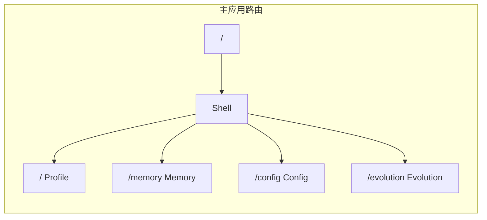

Evolution 视图是 ClawScope 中用于管理和执行 Agent 记忆进化的核心界面。通过选择不同的进化模板，用户可以预览系统结构变更的 Diff 效果，并确认应用这些变更，从而让智能体的认知结构持续更新和优化。该视图采用 Emerald（翠绿色）作为主题色调，象征着成长与进化。

## 功能概述

Evolution 视图提供了三种进化策略模板，分别对应不同的记忆重组强度和风险等级。用户首先需要选择目标节点，然后从模板中选择一个进化策略，最后在 Diff 预览区域查看具体的变更内容，确认无误后即可应用变更。整个界面采用响应式布局，在桌面端和移动端都能提供良好的操作体验。

界面顶部包含页面标题、描述以及节点选择器，中间区域展示三个进化模板卡片，底部则是 Diff 预览终端和确认按钮。这种垂直流式布局确保了用户能够按照"选择节点 → 选择模板 → 预览变更 → 应用变更"的自然流程完成操作。

Sources: [EvolutionView.tsx](src/app/components/views/EvolutionView.tsx#L1-L113), [I18nContext.tsx](src/app/contexts/I18nContext.tsx#L2564-L2594)

## 路由与导航

Evolution 视图在应用路由系统中注册为 `/evolution` 路径，是 ClawScope 四大核心视图之一。在侧边栏导航中，Evolution 使用 `BrainCircuit` 图标作为视觉标识，并应用 Emerald 色调来区分于其他视图。

当用户切换到 Evolution 视图时，侧边栏导航项会呈现 Emerald 色调的激活状态，包括背景色、边框色和图标色的变化。移动端底部导航栏同样支持 Evolution 的快速切换，使用相同的图标和色调系统。

Sources: [routes.tsx](src/app/routes.tsx#L1-L26), [Shell.tsx](src/app/components/Shell.tsx#L230-L234), [viewTone.ts](src/app/components/views/viewTone.ts#L1-L34)

## 节点选择机制

Evolution 视图支持多节点环境下的目标选择。当 OpenClaw 网关连接包含多个节点时，界面顶部会显示一个下拉选择器，允许用户指定要执行进化操作的特定节点。

节点选择器使用 `Network` 图标作为视觉标识，下拉列表会显示所有可用节点的名称和状态。离线状态的节点会在名称后标注 "(Offline)" 提示。选中节点后，界面会显示一个状态条，包含脉动的 Emerald 色指示器和当前目标节点名称，提供清晰的视觉反馈。

节点数据来源于 `useOpenClaw` 上下文中的 `nodes` 数组，每个节点包含 `id`、`name` 和 `status` 字段。组件内部使用 `useState` 管理当前选中的节点 ID，默认选中第一个可用节点。

Sources: [EvolutionView.tsx](src/app/components/views/EvolutionView.tsx#L6-L48), [OpenClawContext.tsx](src/app/contexts/OpenClawContext.tsx#L33-L37)

## 进化模板系统

Evolution 视图提供了三种不同强度的进化模板，每种模板对应不同的记忆重组策略和风险等级。模板卡片采用网格布局，在桌面端并排显示三列，在移动端垂直堆叠。

| 模板 | 名称 | 风险等级 | 状态 | 描述 |
|------|------|----------|------|------|
| 保守型 | Conservative | 极低 | 推荐 | 仅重构明显冗余的记忆条目，保持原有逻辑结构不变更，适合日常整理 |
| 激进型 | Aggressive | 中等 | 可用 | 深度压缩早期历史，重组实体关系图谱，会改变多数旧有文件的目录结构 |
| 自定义 | Custom | 未知 | 开发中 | 编写本地 Node.js 或 Python 脚本精确控制记忆重组的每一步 |

保守型模板被标记为"推荐"，使用 Emerald 色调的强调边框和背景色，表示当前选中状态。激进型模板使用 Amber（琥珀色）作为主题色，表示中等风险。自定义模板目前处于开发中状态，使用灰色调并禁用交互。

每个模板卡片包含图标、标题、描述和操作按钮。保守型模板使用 `CheckCircle2` 图标，激进型使用 `Beaker` 图标，自定义使用 `FileCode2` 图标，通过不同的图标语义传达模板特性。

Sources: [EvolutionView.tsx](src/app/components/views/EvolutionView.tsx#L50-L79), [I18nContext.tsx](src/app/contexts/I18nContext.tsx#L2626-L2762)

## Diff 预览终端

Diff 预览区域模拟代码编辑器的界面风格，采用深色主题（Slate 900 背景色），展示记忆结构变更的具体内容。这个区域位于模板选择下方，占据剩余可用空间。

预览终端的顶部工具栏包含标题、文件统计信息和当前文件名标签。主体区域使用等宽字体显示 Diff 内容，采用标准的代码差异着色方案：删除行使用红色背景（`#450a0a`）和红色文字（`#f87171`），添加行使用绿色背景（`#052e16`）和绿色文字（`#4ade80`），上下文行使用 Slate 灰色。

预览内容展示了典型的记忆文件变更示例，包括日期、上下文描述、删除的冗余偏好记录、更新的偏好记录以及任务列表的变更。这种预览方式让用户在应用变更前能够清楚地了解将要发生的具体修改。

Diff 预览区域支持垂直滚动，当内容超出可视区域时可以滚动查看完整的变更列表。滚动条采用自定义样式，与整体深色主题保持一致。

Sources: [EvolutionView.tsx](src/app/components/views/EvolutionView.tsx#L81-L103), [I18nContext.tsx](src/app/contexts/I18nContext.tsx#L2764-L2903)

## 应用变更操作

界面底部提供"应用变更"按钮，用于确认并执行选中的进化模板。按钮采用 Sky（天蓝色）作为主色调，与 Evolution 的 Emerald 主题形成对比，突出其作为主要操作的地位。

按钮包含 `CheckCircle2` 图标和文字标签，悬停时图标会有缩放动画效果。按钮还配置了焦点环样式，在使用键盘导航时提供清晰的焦点指示。

当前版本的 Evolution 视图主要展示界面结构和交互流程，实际的后端进化命令执行逻辑需要在后续版本中实现。应用按钮的点击事件目前作为 UI 占位符，为后续功能扩展预留接口。

Sources: [EvolutionView.tsx](src/app/components/views/EvolutionView.tsx#L105-L109)

## 国际化支持

Evolution 视图的完整界面支持 13 种语言的国际化显示。所有文本内容通过 `useI18n` 上下文的 `t` 函数获取，翻译键名以 `evo.` 为前缀。

主要翻译键包括：
- `evo.title` / `evo.desc`：页面标题和描述
- `evo.rec` / `evo.dev`：状态标签（推荐/开发中）
- `evo.tpl1.*` / `evo.tpl2.*` / `evo.tpl3.*`：三个模板的标题、描述和按钮文本
- `evo.preview.*`：Diff 预览区域的各项文本
- `evo.apply`：应用变更按钮

翻译数据存储在 [I18nContext.tsx](src/app/contexts/I18nContext.tsx) 的 DICT 对象中，采用数组结构存储各语言的翻译文本，通过语言代码索引获取对应语言的文本。

Sources: [I18nContext.tsx](src/app/contexts/I18nContext.tsx#L2564-L2903)

## 视觉设计与主题

Evolution 视图采用 Emerald（翠绿色）作为主题色调，这种颜色选择象征着成长、进化和生命力，与视图的功能定位高度契合。

主题色调通过 `resolveViewToneClasses('emerald')` 工具函数应用于导航激活状态、图标高亮和移动端导航背景。视图支持亮暗两种主题模式，所有颜色都配置了对应的深色模式变体（使用 `dark:` 前缀的 Tailwind 类）。

卡片组件使用不同的边框和背景色来区分状态：保守型模板使用 Emerald 色边框（`border-[#0ea5e9]`）和浅蓝色背景（`bg-[#f0f9ff]`），激进型使用 Amber 色图标和悬停效果，自定义模板使用灰色调表示禁用状态。

Diff 预览终端采用固定的深色主题，不跟随系统主题切换，以确保代码差异的可读性。终端使用 Slate 色阶的深色变体作为背景，配合语义化的红绿色差标记。

Sources: [viewTone.ts](src/app/components/views/viewTone.ts#L21-L34), [EvolutionView.tsx](src/app/components/views/EvolutionView.tsx#L14-L79)

## 后续阅读

了解了 Evolution 视图的界面结构和功能后，你可以继续探索以下内容：

- [Profile 视图：代理身份管理](9-profile-shi-tu-dai-li-shen-fen-guan-li) — 了解如何配置 Agent 的身份定义和灵魂准则
- [Memory 视图：记忆库与文档管理](10-memory-shi-tu-ji-yi-ku-yu-wen-dang-guan-li) — 深入了解记忆库的结构和文档管理功能
- [Config 视图：连接配置与设置](11-config-shi-tu-lian-jie-pei-zhi-yu-she-zhi) — 学习如何配置 OpenClaw 网关连接
- [OpenClaw 上下文与状态管理](7-openclaw-shang-xia-wen-yu-zhuang-tai-guan-li) — 理解节点数据的管理和状态同步机制
- [主题系统与暗黑模式](14-zhu-ti-xi-tong-yu-an-hei-mo-shi) — 深入了解 ClawScope 的主题系统实现