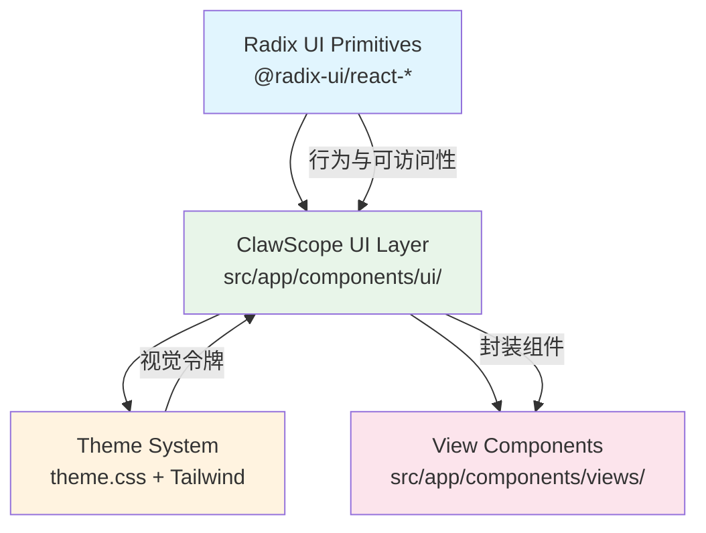

ClawScope 采用 **Radix UI** 作为底层无头组件库，在其之上构建了一套符合项目设计系统的封装组件。Radix UI 提供了完整的可访问性支持、键盘导航和焦点管理，而我们的封装层则添加了统一的视觉样式、主题适配和开发者友好的 API。这种架构让团队既能享受 Radix 的稳健基础，又能保持界面的一致性和品牌识别度。

Sources: [package.json](package.json#L16-L42)

## 架构概览

组件封装遵循**分层架构模式**：底层是 Radix UI 提供的原始无头组件（Headless Components），中间层是 Tailwind CSS 样式系统，顶层是项目封装的语义化组件。这种分层让样式与行为解耦，便于维护和主题切换。



Sources: [src/app/components/ui/](src/app/components/ui/)

## 核心技术栈

| 技术 | 版本 | 用途 |
|------|------|------|
| `@radix-ui/react-*` | 1.1.x - 1.2.x | 无头组件基础（26+ 个组件） |
| `class-variance-authority` | 0.7.1 | 变体样式管理 |
| `tailwind-merge` | 3.2.0 | Tailwind 类名合并 |
| `clsx` | 2.1.1 | 条件类名处理 |
| `lucide-react` | 0.487.0 | 图标系统 |

Sources: [package.json](package.json#L44-L49)

## 样式工具函数

所有 UI 组件共享一个核心工具函数 `cn`，它整合了 `clsx` 和 `tailwind-merge` 的功能，用于处理条件类名和避免 Tailwind 类名冲突。

```typescript
// utils.ts
import { clsx, type ClassValue } from "clsx";
import { twMerge } from "tailwind-merge";

export function cn(...inputs: ClassValue[]) {
  return twMerge(clsx(inputs));
}
```

这个函数是组件封装的基石，每个组件都通过它来合并基础样式、变体样式和外部传入的 `className`。

Sources: [src/app/components/ui/utils.ts](src/app/components/ui/utils.ts#L1-L7)

## 组件封装模式

### 基础组件封装模式

以 **Button** 组件为例，展示标准的封装模式：

```typescript
// button.tsx
import * as React from "react";
import { Slot } from "@radix-ui/react-slot";
import { cva, type VariantProps } from "class-variance-authority";
import { cn } from "./utils";

const buttonVariants = cva(
  "inline-flex items-center justify-center gap-2 whitespace-nowrap rounded-md text-sm font-medium transition-all...",
  {
    variants: {
      variant: {
        default: "bg-primary text-primary-foreground hover:bg-primary/90",
        destructive: "bg-destructive text-white hover:bg-destructive/90...",
        outline: "border bg-background text-foreground hover:bg-accent...",
        secondary: "bg-secondary text-secondary-foreground hover:bg-secondary/80",
        ghost: "hover:bg-accent hover:text-accent-foreground...",
        link: "text-primary underline-offset-4 hover:underline",
      },
      size: {
        default: "h-9 px-4 py-2 has-[>svg]:px-3",
        sm: "h-8 rounded-md gap-1.5 px-3 has-[>svg]:px-2.5",
        lg: "h-10 rounded-md px-6 has-[>svg]:px-4",
        icon: "size-9 rounded-md",
      },
    },
    defaultVariants: {
      variant: "default",
      size: "default",
    },
  },
);

function Button({
  className,
  variant,
  size,
  asChild = false,
  ...props
}: React.ComponentProps<"button"> & VariantProps<typeof buttonVariants> & { asChild?: boolean }) {
  const Comp = asChild ? Slot : "button";
  return (
    <Comp
      data-slot="button"
      className={cn(buttonVariants({ variant, size, className }))}
      {...props}
    />
  );
}
```

**关键设计点**：
- 使用 `cva` 定义变体系统，支持 `variant` 和 `size` 多维度组合
- `asChild` 属性通过 `@radix-ui/react-slot` 实现组件多态，允许将 Button 的行为附加到任意元素
- `data-slot` 属性用于样式调试和自动化测试定位
- 所有样式类使用主题变量（如 `bg-primary`、`text-primary-foreground`）确保主题适配

Sources: [src/app/components/ui/button.tsx](src/app/components/ui/button.tsx#L1-L59)

### 复合组件封装模式

对于包含多个子组件的复杂 UI（如 Dialog、Select），采用**复合组件模式**：

```typescript
// dialog.tsx 简化示例
import * as DialogPrimitive from "@radix-ui/react-dialog";

function Dialog({ ...props }: React.ComponentProps<typeof DialogPrimitive.Root>) {
  return <DialogPrimitive.Root data-slot="dialog" {...props} />;
}

function DialogTrigger({ ...props }: React.ComponentProps<typeof DialogPrimitive.Trigger>) {
  return <DialogPrimitive.Trigger data-slot="dialog-trigger" {...props} />;
}

function DialogContent({ className, children, ...props }: React.ComponentProps<typeof DialogPrimitive.Content>) {
  return (
    <DialogPortal>
      <DialogOverlay />
      <DialogPrimitive.Content
        className={cn("bg-background rounded-xl border shadow-lg...", className)}
        {...props}
      >
        {children}
        <DialogPrimitive.Close className="absolute top-4 right-4...">
          <XIcon />
        </DialogPrimitive.Close>
      </DialogPrimitive.Content>
    </DialogPortal>
  );
}

// 导出完整组件族
export { Dialog, DialogTrigger, DialogContent, DialogHeader, DialogFooter, DialogTitle, DialogDescription };
```

这种模式让开发者可以像使用原生 Radix 一样灵活组合，同时获得预设的样式和布局。

Sources: [src/app/components/ui/dialog.tsx](src/app/components/ui/dialog.tsx#L1-L136)

## 主题系统集成

所有组件样式都基于 CSS 变量系统，定义在 `theme.css` 中：

```css
:root {
  --primary: #030213;
  --primary-foreground: oklch(1 0 0);
  --secondary: oklch(0.95 0.0058 264.53);
  --secondary-foreground: #030213;
  --destructive: #d4183d;
  --border: rgba(0, 0, 0, 0.1);
  --input: transparent;
  --input-background: #f3f3f5;
  --radius: 0.625rem;
}

.dark {
  --primary: oklch(0.985 0 0);
  --primary-foreground: oklch(0.205 0 0);
  --secondary: oklch(0.269 0 0);
  --secondary-foreground: oklch(0.985 0 0);
  --border: oklch(0.269 0 0);
}
```

组件中使用这些变量（如 `bg-primary`、`text-primary-foreground`）确保在明暗主题切换时自动适配。

Sources: [src/styles/theme.css](src/styles/theme.css#L1-L79)

## 常用组件速查

### 表单组件

| 组件 | Radix 基础 | 主要变体/特性 |
|------|-----------|-------------|
| `Button` | `@radix-ui/react-slot` | default, destructive, outline, secondary, ghost, link |
| `Input` | 原生 input | 支持 aria-invalid 状态样式 |
| `Label` | `@radix-ui/react-label` | 自动关联 disabled 状态 |
| `Checkbox` | `@radix-ui/react-checkbox` | 自定义勾选动画 |
| `Switch` | `@radix-ui/react-switch` | 滑动 thumb 动画 |
| `Select` | `@radix-ui/react-select` | sm/default 尺寸，滚动按钮 |
| `Textarea` | 原生 textarea | 自动调整高度 |

### 导航与布局组件

| 组件 | Radix 基础 | 主要特性 |
|------|-----------|----------|
| `Tabs` | `@radix-ui/react-tabs` | 圆角胶囊样式，激活状态高亮 |
| `Dialog` | `@radix-ui/react-dialog` | 内置遮罩层，关闭按钮 |
| `DropdownMenu` | `@radix-ui/react-dropdown-menu` | 支持 Checkbox/Radio 项 |
| `Popover` | `@radix-ui/react-popover` | 智能定位，Portal 渲染 |
| `Tooltip` | `@radix-ui/react-tooltip` | 零延迟，箭头指示器 |
| `ScrollArea` | `@radix-ui/react-scroll-area` | 自定义滚动条样式 |

### 展示组件

| 组件 | 说明 |
|------|------|
| `Card` | 卡片容器，含 Header/Content/Footer 子组件 |
| `Badge` | 标签，支持 default/secondary/destructive/outline 变体 |
| `Alert` | 警告提示，支持标题和描述结构 |

Sources: [src/app/components/ui/](src/app/components/ui/)

## 使用示例

### 基础按钮使用

```tsx
import { Button } from "@/app/components/ui/button";

// 默认样式
<Button>点击我</Button>

// 变体样式
<Button variant="destructive">删除</Button>
<Button variant="outline" size="sm">小按钮</Button>

// 作为链接渲染
<Button asChild>
  <a href="/profile">查看资料</a>
</Button>
```

### 对话框组合

```tsx
import {
  Dialog,
  DialogContent,
  DialogHeader,
  DialogTitle,
  DialogDescription,
  DialogFooter,
} from "@/app/components/ui/dialog";

<Dialog open={isOpen} onOpenChange={setIsOpen}>
  <DialogContent>
    <DialogHeader>
      <DialogTitle>确认删除</DialogTitle>
      <DialogDescription>
        此操作不可撤销，确定要删除该文档吗？
      </DialogDescription>
    </DialogHeader>
    <DialogFooter>
      <Button variant="outline" onClick={() => setIsOpen(false)}>
        取消
      </Button>
      <Button variant="destructive" onClick={handleDelete}>
        删除
      </Button>
    </DialogFooter>
  </DialogContent>
</Dialog>
```

### 表单控件组合

```tsx
import { Label } from "@/app/components/ui/label";
import { Input } from "@/app/components/ui/input";
import { Checkbox } from "@/app/components/ui/checkbox";

<div className="space-y-4">
  <div className="space-y-2">
    <Label htmlFor="email">邮箱地址</Label>
    <Input id="email" type="email" placeholder="your@email.com" />
  </div>
  
  <div className="flex items-center space-x-2">
    <Checkbox id="terms" />
    <Label htmlFor="terms">同意服务条款</Label>
  </div>
</div>
```

## 组件开发规范

在 ClawScope 中开发新的 UI 组件时，请遵循以下规范：

1. **文件位置**：所有 UI 组件放在 `src/app/components/ui/` 目录
2. **命名约定**：组件名使用 PascalCase，文件名与组件名一致
3. **样式合并**：始终使用 `cn()` 函数合并类名
4. **data-slot**：为根元素添加 `data-slot` 属性便于调试
5. **类型导出**：导出组件 Props 类型供外部使用
6. **可访问性**：保留 Radix 提供的所有 ARIA 属性和键盘行为

## 相关文档

- [主题系统与暗黑模式](14-zhu-ti-xi-tong-yu-an-hei-mo-shi) - 了解完整的主题配置和 CSS 变量系统
- [React 应用架构与路由设计](6-react-ying-yong-jia-gou-yu-lu-you-she-ji) - 了解组件在应用中的组织方式
- [OpenClaw 上下文与状态管理](7-openclaw-shang-xia-wen-yu-zhuang-tai-guan-li) - 了解组件如何与后端通信