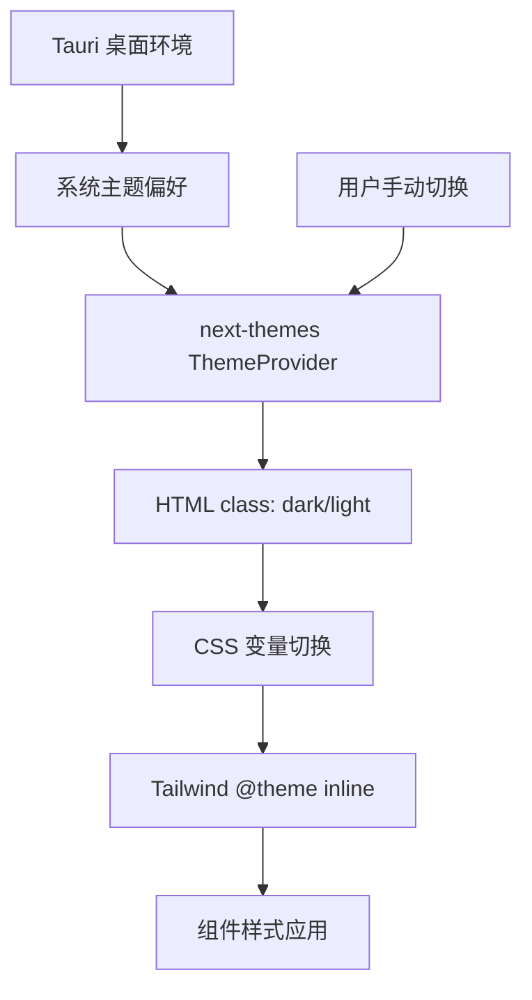

ClawScope 采用现代化的主题架构，基于 **Tailwind CSS v4** 与 **next-themes** 构建，实现了完整的亮/暗双主题支持与系统级主题同步。本页将深入解析主题系统的设计原理、CSS 变量体系、组件级主题适配以及开发者如何扩展自定义主题。

## 架构概览

主题系统采用三层架构设计：底层 CSS 变量定义、中间层 Tailwind 主题映射、顶层 React 上下文管理。这种分层设计确保了主题切换的即时性与一致性，同时支持系统主题偏好自动检测。



系统通过 `next-themes` 库监听操作系统主题变化，当检测到系统主题变更时自动同步应用状态。在 Tauri 桌面环境中，这一机制能够响应 Windows/macOS 的系统主题切换事件，实现原生级的主题体验。

Sources: [App.tsx](src/app/App.tsx#L1-L24), [theme.css](src/styles/theme.css#L1-L182)

## CSS 变量体系

主题系统的核心是 CSS 自定义属性（CSS Variables），在 [theme.css](src/styles/theme.css) 中定义了两套完整的色彩体系：`:root` 用于亮色模式，`.dark` 选择器用于暗色模式。

### 基础色彩变量

| 变量名 | 亮色模式值 | 暗色模式值 | 用途说明 |
|--------|-----------|-----------|---------|
| `--background` | `#ffffff` | `oklch(0.145 0 0)` | 页面主背景 |
| `--foreground` | `oklch(0.145 0 0)` | `oklch(0.985 0 0)` | 主文本颜色 |
| `--card` | `#ffffff` | `oklch(0.145 0 0)` | 卡片背景 |
| `--card-foreground` | `oklch(0.145 0 0)` | `oklch(0.985 0 0)` | 卡片文本 |
| `--primary` | `#030213` | `oklch(0.985 0 0)` | 主要操作色 |
| `--primary-foreground` | `oklch(1 0 0)` | `oklch(0.205 0 0)` | 主色上的文本 |
| `--secondary` | `oklch(0.95 0.0058 264.53)` | `oklch(0.269 0 0)` | 次要操作色 |
| `--muted` | `#ececf0` | `oklch(0.269 0 0)` | 静音/禁用背景 |
| `--border` | `rgba(0, 0, 0, 0.1)` | `oklch(0.269 0 0)` | 边框颜色 |

色彩选择遵循现代设计原则：亮色模式使用纯白色背景搭配高对比度深色文本，暗色模式采用 OKLCH 色彩空间的深灰色调（接近 `#0f172a`），确保在 OLED 屏幕上的显示效果与视觉舒适度。

Sources: [theme.css](src/styles/theme.css#L3-L70)

### Tailwind 主题映射

Tailwind CSS v4 引入 `@theme inline` 指令，将 CSS 变量映射为 Tailwind 工具类：

```css
@theme inline {
  --color-background: var(--background);
  --color-foreground: var(--foreground);
  --color-card: var(--card);
  --color-primary: var(--primary);
  --color-secondary: var(--secondary);
  /* ... 其他映射 */
}
```

这使得开发者可以直接使用 `bg-background`、`text-foreground` 等语义化类名，这些类名会根据当前主题自动解析为对应的 CSS 变量值。同时，Tailwind v4 的 `@custom-variant dark` 指令定义了暗色模式的匹配规则 `&:is(.dark *)`，确保 `dark:` 前缀的类名仅在 `.dark` 祖先元素下生效。

Sources: [theme.css](src/styles/theme.css#L1-L1), [theme.css](src/styles/theme.css#L72-L108)

## React 主题管理

应用通过 `next-themes` 的 `ThemeProvider` 组件在根级别提供主题上下文，配置采用 `attribute="class"` 策略，将主题状态同步到 HTML 元素的 class 属性。

```tsx
<ThemeProvider
  attribute="class"
  defaultTheme="system"
  enableSystem
>
  {/* 应用内容 */}
</ThemeProvider>
```

`defaultTheme="system"` 与 `enableSystem` 的组合使应用默认跟随操作系统主题偏好，用户也可通过界面手动覆盖。主题切换时，`next-themes` 自动在 `<html>` 元素上添加或移除 `dark` 类名，触发 CSS 变量的重新计算。

Sources: [App.tsx](src/app/App.tsx#L8-L14)

### 主题切换实现

在 Shell 组件的标题栏中，主题切换按钮通过 `useTheme` Hook 获取当前主题状态与切换函数：

```tsx
const { theme, setTheme } = useTheme();

const handleThemeToggle = (e: React.MouseEvent) => {
  const nextTheme = theme === 'dark' ? 'light' : 'dark';
  setTheme(nextTheme);
};
```

切换过程伴随精心设计的动画效果：使用 `framer-motion` 创建从点击位置扩散的圆形遮罩动画，遮罩颜色在新旧主题背景色之间过渡，产生"涟漪扩散"的视觉反馈。这种微交互增强了主题切换的仪式感与品质感。

Sources: [Shell.tsx](src/app/components/Shell.tsx#L1-L60)

## 组件级主题适配

### UI 组件主题模式

所有基础 UI 组件均采用 `dark:` 前缀实现双主题适配。以 Button 组件为例，其变体定义中同时包含亮色与暗色状态的样式：

```tsx
const buttonVariants = cva(
  "inline-flex items-center...",
  {
    variants: {
      variant: {
        destructive:
          "bg-destructive text-white hover:bg-destructive/90 focus-visible:ring-destructive/20 dark:focus-visible:ring-destructive/40 dark:bg-destructive/60",
        outline:
          "border bg-background text-foreground hover:bg-accent hover:text-accent-foreground dark:bg-input/30 dark:border-input dark:hover:bg-input/50",
        // ...
      }
    }
  }
);
```

`cva`（class-variance-authority）工具函数管理变体类名的组合，确保类型安全与可维护性。暗色模式下的特殊处理包括：降低 destructive 按钮的背景不透明度至 60%、为 outline 按钮添加半透明背景等，这些微调确保了暗色环境下的视觉层次与可读性。

Sources: [button.tsx](src/app/components/ui/button.tsx#L1-L59)

### 表单控件适配

表单控件如 Input 和 Switch 也遵循相同的适配模式。Input 组件在暗色模式下使用半透明背景：

```tsx
className={cn(
  "dark:bg-input/30 border-input flex h-9 w-full...",
  "focus-visible:border-ring focus-visible:ring-ring/50",
  "aria-invalid:ring-destructive/20 dark:aria-invalid:ring-destructive/40",
  className,
)}
```

Switch 组件则更为复杂，需要处理 checked/unchecked 两种状态在双主题下的表现：

```tsx
<SwitchPrimitive.Root
  className={cn(
    "peer data-[state=checked]:bg-primary data-[state=unchecked]:bg-switch-background",
    "dark:data-[state=unchecked]:bg-input/80",
    // ...
  )}
>
  <SwitchPrimitive.Thumb
    className={cn(
      "bg-card dark:data-[state=unchecked]:bg-card-foreground",
      "dark:data-[state=checked]:bg-primary-foreground",
    )}
  />
</SwitchPrimitive.Root>
```

通过 `dark:data-[state=unchecked]:` 等复合前缀，实现状态与主题的交叉样式定义。

Sources: [input.tsx](src/app/components/ui/input.tsx#L1-L24), [switch.tsx](src/app/components/ui/switch.tsx#L1-L28)

## 视图色调系统

除全局亮/暗主题外，ClawScope 还实现了**视图级色调系统**（View Tone），为不同功能视图分配独特的品牌色，增强视觉识别度。

### 色调定义

| 视图 | 色调 | 应用场景 |
|------|------|---------|
| Profile | sky（天蓝） | 代理身份管理 |
| Memory | violet（紫罗兰） | 记忆库与文档 |
| Config | slate（石板灰） | 连接配置 |
| Evolution | emerald（翠绿） | 进化实验 |

色调定义在 [viewTone.ts](src/app/components/views/viewTone.ts) 中，每个色调提供一套完整的样式映射，包括徽章、图标、卡片悬停、导航激活等状态。

Sources: [viewTone.ts](src/app/components/views/viewTone.ts#L1-L10)

### 双主题色调适配

每个色调的样式对象同时包含亮色与暗色模式的类名定义：

```tsx
case "violet":
  return {
    softBadge: "border-violet-200 bg-violet-50 text-violet-700 dark:border-violet-800/70 dark:bg-violet-950/30 dark:text-violet-300",
    iconText: "text-violet-500 dark:text-violet-400",
    navActive: "bg-violet-50 dark:bg-violet-950/30 border-violet-500 text-violet-700 dark:text-violet-300",
    // ...
  };
```

暗色模式下，色彩调整为更低饱和度的版本（如 `violet-950/30` 替代 `violet-50`），并降低边框对比度（`violet-800/70`），确保暗色环境的视觉舒适度。这种"色调保持、明度反转"的策略是暗色模式设计的最佳实践。

Sources: [viewTone.ts](src/app/components/views/viewTone.ts#L11-L30)

## Toast 通知主题

Toast 通知组件（基于 `sonner` 库）需要独立处理主题适配，因其渲染在 React 树之外。实现方式是将 `next-themes` 的主题状态传递给 Sonner 的 `theme` 属性：

```tsx
const Toaster = ({ ...props }: ToasterProps) => {
  const { theme = "system" } = useTheme();

  return (
    <Sonner
      theme={theme as ToasterProps["theme"]}
      style={{
        "--normal-bg": "var(--popover)",
        "--normal-text": "var(--popover-foreground)",
        "--normal-border": "var(--border)",
      }}
      {...props}
    />
  );
};
```

同时通过 CSS 变量注入确保 Toast 的背景、文本、边框颜色与当前主题保持一致。

Sources: [sonner.tsx](src/app/components/ui/sonner.tsx#L1-L26)

## 样式加载顺序

样式文件按以下顺序在 [index.css](src/styles/index.css) 中导入：

1. **fonts.css** - 字体定义（当前为空，使用系统默认字体栈）
2. **tailwind.css** - Tailwind 核心与动画库
3. **theme.css** - 主题变量与基础样式

这种顺序确保 CSS 变量的定义晚于 Tailwind 的引入，使 `@theme inline` 能够正确解析变量引用。最终通过 [main.tsx](src/main.tsx) 导入 `index.css`，完成样式系统的初始化。

Sources: [index.css](src/styles/index.css#L1-L4), [main.tsx](src/main.tsx#L1-L7)

## 扩展指南

### 添加新主题变量

如需扩展主题系统，遵循以下步骤：

1. 在 [theme.css](src/styles/theme.css) 的 `:root` 和 `.dark` 中定义新变量
2. 在 `@theme inline` 块中添加映射：`--color-{name}: var(--{name})`
3. 在组件中使用 `bg-{name}` 或 `text-{name}` 类名

### 自定义组件主题适配

为新组件添加主题支持时，使用 `dark:` 前缀定义暗色模式样式：

```tsx
<div className="bg-white dark:bg-slate-900 text-slate-900 dark:text-slate-100">
  {/* 内容 */}
</div>
```

对于复杂组件，参考 `viewTone.ts` 的模式，创建色调映射函数实现视图级色彩定制。

## 相关阅读

- [Radix UI 组件封装与使用](13-radix-ui-zu-jian-feng-zhuang-yu-shi-yong) - 了解 UI 组件的底层实现
- [React 应用架构与路由设计](6-react-ying-yong-jia-gou-yu-lu-you-she-ji) - Shell 布局与视图结构
- [国际化 (i18n) 实现方案](8-guo-ji-hua-i18n-shi-xian-fang-an) - 主题切换按钮的文本国际化