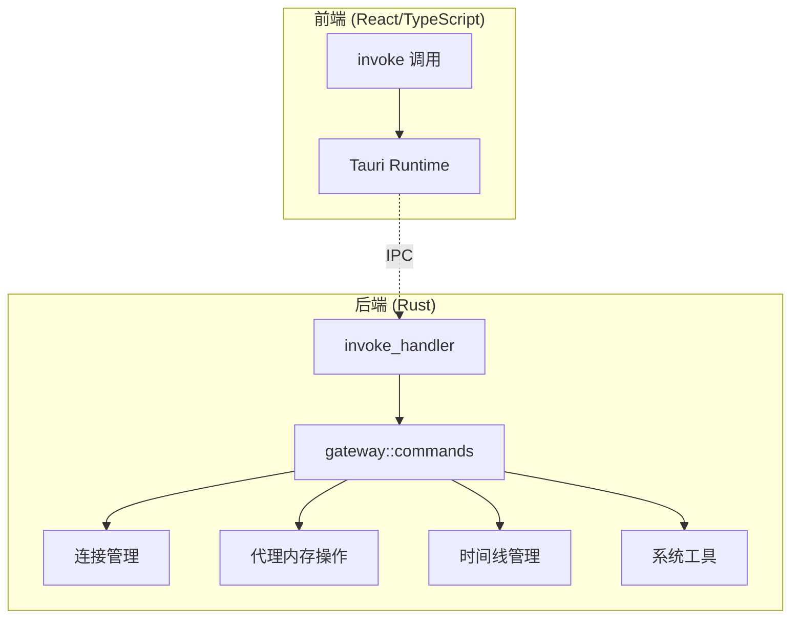

ClawScope 采用 Tauri 2.0 作为桌面应用框架，通过 **Command 模式** 实现前端 React 与后端 Rust 之间的安全通信。本文档详细解析命令注册机制、类型系统映射、状态管理以及错误处理策略，帮助开发者理解前后端通信的完整链路。

Sources: [lib.rs](src-tauri/src/lib.rs#L1-L46), [commands.rs](src-tauri/src/gateway/commands.rs#L1-L50), [OpenClawContext.tsx](src/app/contexts/OpenClawContext.tsx#L1-L50)

## 命令注册与架构概览

Tauri 的命令系统通过 `invoke_handler` 在应用启动时集中注册所有可调用的后端函数。ClawScope 将所有 Gateway 相关的命令统一组织在 `gateway::commands` 模块中，形成清晰的命令分层结构。



命令注册采用 `tauri::generate_handler!` 宏，在 [lib.rs](src-tauri/src/lib.rs#L13-L42) 中集中声明 42 个命令处理器。这种集中式注册模式确保了命令的可追溯性，同时利用 Rust 的宏系统在编译期完成函数签名验证。

Sources: [lib.rs](src-tauri/src/lib.rs#L8-L45)

## 命令分类与功能矩阵

ClawScope 的命令按功能域划分为四大类别，每个类别对应特定的业务场景和数据流模式。

| 类别 | 命令前缀 | 命令数量 | 核心功能 |
|------|----------|----------|----------|
| **连接管理** | `gateway_*` | 4 | 建立/断开 Gateway 连接、状态查询、端点规范化 |
| **代理内存操作** | `gateway_agent_*` | 18 | 文档读写、内存搜索、索引管理、身份配置 |
| **时间线管理** | `gateway_agent_memory_timeline_*` | 7 | 本地扫描、远程探测、条目读取 |
| **系统工具** | `open_external_url`, `export_markdown_document` | 2 | 外部链接打开、文档导出 |

连接管理类命令是应用的生命线，包括 `gateway_connect`、`gateway_disconnect`、`gateway_status` 和 `gateway_normalize_endpoint`。这些命令通过 `GatewayAppState` 管理 WebSocket 连接的生命周期，并在状态变更时触发前端 UI 更新。

Sources: [commands.rs](src-tauri/src/gateway/commands.rs#L24-L55), [OpenClawContext.tsx](src/app/contexts/OpenClawContext.tsx#L892-L949)

## 类型系统与序列化映射

前后端通信的核心挑战在于类型系统的对齐。ClawScope 采用 **serde** 进行序列化，通过严格的命名约定确保 TypeScript 与 Rust 类型之间的可靠转换。

Rust 端使用 `#[serde(rename_all = "camelCase")]` 属性统一字段命名风格，例如 `GatewayStatusSnapshot` 结构体在 [types.rs](src-tauri/src/gateway/types.rs#L53-L64) 中定义了连接状态的完整视图，包含连接阶段、网关地址、设备 ID、授权角色等关键字段。对应的 TypeScript 接口在 [OpenClawContext.tsx](src/app/contexts/OpenClawContext.tsx#L47-L56) 中保持完全一致的字段命名。

枚举类型的映射需要特别注意变体命名风格。Rust 端使用 `#[serde(rename_all = "snake_case")]` 将 `GatewayConnectionPhase` 的变体（如 `WaitingForChallenge`）序列化为 `waiting_for_challenge`，而 TypeScript 端则使用联合类型 `'waiting_for_challenge' | 'connected' | ...` 进行匹配。

Sources: [types.rs](src-tauri/src/gateway/types.rs#L38-L64), [OpenClawContext.tsx](src/app/contexts/OpenClawContext.tsx#L12-L22)

## 状态管理与依赖注入

Tauri 的命令系统支持通过 `State<'_>` 提取器实现依赖注入。ClawScope 在应用启动时通过 `.manage(GatewayAppState::default())` 将全局状态注入 Tauri 的托管状态容器，使得每个命令处理器都能以声明式方式访问共享状态。

```rust
#[tauri::command]
pub async fn gateway_connect(
    state: State<'_, GatewayAppState>,
    config: GatewayConnectConfig,
) -> Result<GatewayStatusSnapshot, GatewayErrorSummary>
```

`GatewayAppState` 采用 **Arc 内部可变性模式** 实现线程安全的状态共享。其内部结构包含三个关键组件：用于存储连接状态快照的 `Mutex<GatewayStatusSnapshot>`、管理 WebSocket 会话的 `AsyncMutex<Option<GatewayActiveConnection>>`，以及时间线探测结果的缓存。这种设计允许命令在异步上下文中安全地读取和修改状态，同时避免了锁竞争导致的性能瓶颈。

Sources: [state.rs](src-tauri/src/gateway/state.rs#L114-L141), [commands.rs](src-tauri/src/gateway/commands.rs#L38-L46)

## 前端调用封装与运行时检测

前端通过 `@tauri-apps/api/core` 提供的 `invoke` 函数调用后端命令。ClawScope 在 [OpenClawContext.tsx](src/app/contexts/OpenClawContext.tsx#L455-L461) 中封装了 `invokeGateway` 辅助函数，增加了运行时可用性检测，确保在浏览器环境中（如开发时的 HMR 场景）能够优雅降级。

```typescript
async function invokeGateway<T>(command: string, args?: Record<string, unknown>) {
  if (!isTauriRuntimeAvailable()) {
    throw createRuntimeUnavailableError();
  }
  return invoke<T>(command, args);
}
```

`isTauriRuntimeAvailable` 函数通过检测 `window.__TAURI_INTERNALS__` 判断当前是否运行在 Tauri 环境中。这种检测机制使得同一套代码可以在纯浏览器环境和桌面应用环境中运行，为开发调试提供了便利。

Sources: [OpenClawContext.tsx](src/app/contexts/OpenClawContext.tsx#L381-L398), [OpenClawContext.tsx](src/app/contexts/OpenClawContext.tsx#L455-L461)

## 错误处理与用户体验

ClawScope 建立了分层错误处理体系，将底层 Gateway 错误转换为结构化的 `GatewayErrorSummary`，包含错误分类、错误代码、用户友好消息、重试建议和指导提示五个维度。

Rust 端的错误转换逻辑在 [errors.rs](src-tauri/src/gateway/errors.rs#L42-L200) 中实现，针对不同错误类型提供本地化的中文提示。例如，当连接被拒绝时，系统会根据错误代码（如 `CONNECT_ERROR_PAIRING_REQUIRED`）生成具体的配对指导；当权限不足时，会提示用户申请 `operator.admin` 或 `operator.write` 权限。

前端通过 `toGatewayErrorSummary` 函数统一处理未知错误，确保即使后端返回非预期格式的错误，也能被转换为标准的错误摘要对象。这种防御式编程策略提升了应用的健壮性。

Sources: [errors.rs](src-tauri/src/gateway/errors.rs#L1-L100), [OpenClawContext.tsx](src/app/contexts/OpenClawContext.tsx#L425-L453)

## 异步命令与并发控制

所有涉及网络 I/O 的命令都标记为 `async`，由 Tauri 的异步运行时调度执行。ClawScope 在 [connector.rs](src-tauri/src/gateway/connector.rs#L56-L68) 中定义了精细的超时策略，不同操作根据预期耗时采用不同的超时阈值：普通请求 15 秒、内存搜索 65 秒、时间线条目读取 65 秒。

命令执行流程遵循 **请求-响应模式**。前端发起 `invoke` 调用后，Tauri IPC 层将参数序列化并传输到 Rust 端；Rust 命令处理器执行业务逻辑，可能涉及 WebSocket 通信、本地存储访问或文件系统操作；最终结果通过 `Result<T, GatewayErrorSummary>` 返回，由前端解析并更新 UI 状态。

Sources: [connector.rs](src-tauri/src/gateway/connector.rs#L56-L70), [commands.rs](src-tauri/src/gateway/commands.rs#L1-L30)

## 下一步阅读

理解 Tauri 命令通信机制后，建议继续阅读以下相关内容：

- 如需了解 Gateway 模块的整体架构，请参阅 [Gateway 模块架构概览](16-gateway-mo-kuai-jia-gou-gai-lan)
- 如需深入 WebSocket 连接与认证流程，请参阅 [连接管理：认证与 WebSocket 通信](17-lian-jie-guan-li-ren-zheng-yu-websocket-tong-xin)
- 如需了解前端状态管理，请参阅 [OpenClaw 上下文与状态管理](7-openclaw-shang-xia-wen-yu-zhuang-tai-guan-li)
- 如需查看内存操作的具体实现，请参阅 [代理内存操作：文档读写与搜索](18-dai-li-nei-cun-cao-zuo-wen-dang-du-xie-yu-sou-suo)