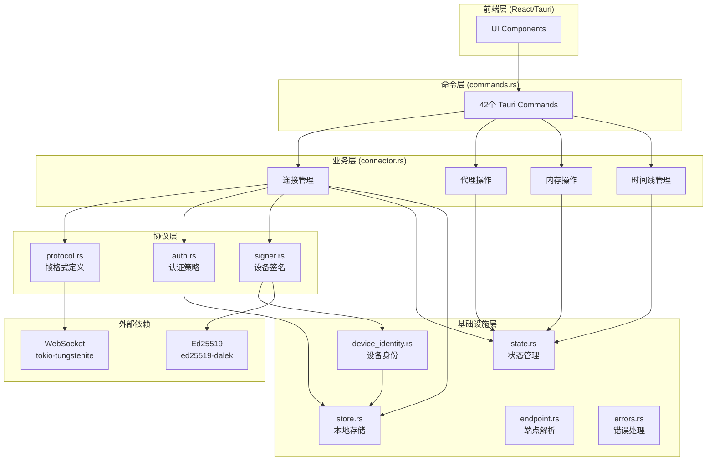
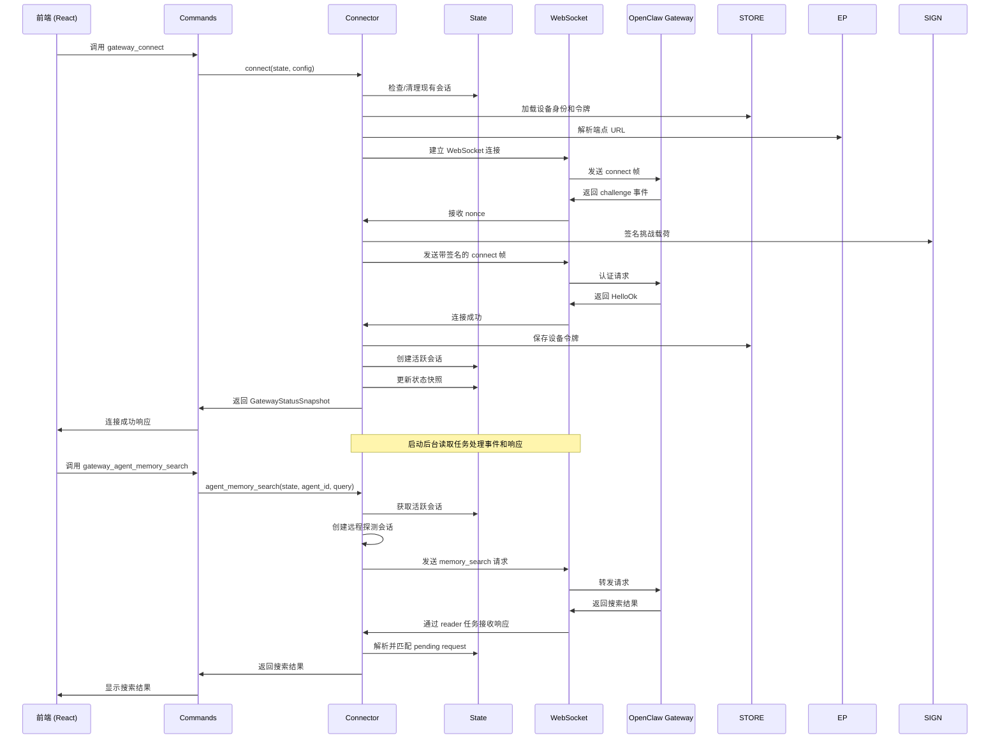

Gateway 模块是 ClawScope 桌面应用的核心后端组件，负责与 OpenClaw Gateway 建立安全连接并代理所有代理相关的操作请求。该模块采用分层架构设计，将连接管理、协议处理、身份认证和业务操作清晰地分离，确保代码的可维护性和可扩展性。

Sources: [mod.rs](src-tauri/src/gateway/mod.rs#L1-L13), [lib.rs](src-tauri/src/lib.rs#L1-L46)

## 架构设计原则

Gateway 模块遵循**关注点分离**和**状态集中管理**两大核心设计原则。所有子模块通过 `mod.rs` 统一暴露接口，而 `lib.rs` 作为 Tauri 应用的入口点，负责将 Gateway 命令注册到前端可调用的事件处理器中。模块内部采用 Rust 的异步运行时（tokio）处理 WebSocket 通信，同时使用 `Arc<Mutex>` 模式管理共享状态，确保线程安全。

Sources: [state.rs](src-tauri/src/gateway/state.rs#L1-L30)

## 模块结构图

Sources: [commands.rs](src-tauri/src/gateway/commands.rs#L1-L50), [connector.rs](src-tauri/src/gateway/connector.rs#L1-L100)

## 核心组件详解

### 1. 状态管理 (state.rs)

`GatewayAppState` 是整个模块的中心状态容器，采用**内部可变性模式**设计。它维护三个关键状态：连接快照（`GatewayStatusSnapshot`）、活跃会话（`GatewayActiveConnection`）和时间线探测缓存。`GatewayActiveConnection` 封装了 WebSocket 写入器、待处理请求映射和服务器支持的方法集合，实现了请求-响应的异步匹配机制。

Sources: [state.rs](src-tauri/src/gateway/state.rs#L114-L175)

### 2. 命令接口 (commands.rs)

该模块暴露 42 个 Tauri 命令，构成前端与后端交互的完整 API  surface。命令按功能分为五类：连接管理（`gateway_connect`、`gateway_disconnect`）、代理信息查询（`gateway_agents_list`、`gateway_agent_identity_get`）、内存操作（`gateway_agent_memory_get`、`gateway_agent_memory_search`）、时间线管理（`gateway_agent_memory_timeline_*`）以及配置操作（`gateway_config_set_local`）。所有命令遵循统一的错误处理模式，将内部 `GatewayError` 转换为前端友好的 `GatewayErrorSummary`。

Sources: [commands.rs](src-tauri/src/gateway/commands.rs#L24-L55), [lib.rs](src-tauri/src/lib.rs#L13-L42)

### 3. 连接管理器 (connector.rs)

`connector.rs` 是实现 OpenClaw 协议的核心文件，包含超过 4000 行代码。其 `connect` 函数实现了完整的连接生命周期：端点解析 → 设备身份加载 → 认证策略选择 → WebSocket 握手 → 会话建立。模块定义了精细的超时策略，连接挑战等待 10 秒，请求响应等待 15 秒，远程时间线探测等待最长 60 秒。连接成功后，会启动独立的异步任务 `spawn_connection_reader` 处理服务器推送的事件和响应帧。

Sources: [connector.rs](src-tauri/src/gateway/connector.rs#L56-L70), [connector.rs](src-tauri/src/gateway/connector.rs#L73-L145)

### 4. 协议定义 (protocol.rs)

协议层定义了 OpenClaw Gateway 通信的帧格式和常量。核心结构包括：`ConnectParams`（连接请求参数）、`RequestFrame`（请求帧）、`ResponseFrame`（响应帧）、`EventFrame`（事件帧）以及 `HelloOk`（连接成功响应）。协议版本当前为 v3，支持设备签名认证、Token 认证和密码认证三种模式。错误恢复机制通过 `ConnectErrorRecoveryAdvice` 结构实现，支持设备令牌重试等恢复策略。

Sources: [protocol.rs](src-tauri/src/gateway/protocol.rs#L1-L20), [protocol.rs](src-tauri/src/gateway/protocol.rs#L58-L82)

### 5. 认证系统 (auth.rs)

认证模块实现了灵活的凭证选择策略。`SelectedConnectAuth` 结构封装了五种凭证状态：显式 token、密码、存储的设备令牌、解析后的设备令牌以及重试标志。`select_connect_auth` 函数根据配置和存储状态智能选择认证方式：Token 模式优先使用显式 token，Password 模式使用密码，PairedDevice 模式使用存储的设备令牌。该设计支持连接失败后的自动重试机制。

Sources: [auth.rs](src-tauri/src/gateway/auth.rs#L8-L94)

### 6. 设备身份与签名 (device_identity.rs & signer.rs)

设备身份基于 Ed25519 密钥对实现，符合现代加密安全标准。`GatewayDeviceIdentity` 在首次启动时自动生成密钥对，并持久化到本地存储。设备 ID 由公钥的 SHA-256 哈希派生，确保唯一性和不可伪造性。`signer.rs` 实现了 v3 版本的设备认证协议，将客户端信息、角色、权限范围和时间戳等元数据编码为签名载荷，使用 URL-safe Base64 编码传输。

Sources: [device_identity.rs](src-tauri/src/gateway/device_identity.rs#L16-L91), [signer.rs](src-tauri/src/gateway/signer.rs#L20-L54)

### 7. 本地存储 (store.rs)

存储模块管理两个核心数据文件：`device.json`（设备身份）和 `device-auth.json`（认证令牌）。设备身份文件采用版本化格式（当前 v1），认证令牌存储采用 v2 格式，支持按网关原点、角色和权限范围的精确匹配。存储路径遵循平台惯例：Windows 使用 `%APPDATA%/claw-scope/gateway`，Unix 系统使用 `~/.claw-scope/gateway`。

Sources: [store.rs](src-tauri/src/gateway/store.rs#L12-L75)

### 8. 端点解析 (endpoint.rs)

`GatewayEndpoint` 结构将用户输入的 Gateway URL 规范化为 WebSocket 端点。支持四种协议方案（http、https、ws、wss）的自动转换，并识别传输类型：本地回环（localhost/127.0.0.1）、直接连接。`origin_key` 字段作为存储和缓存的标识键，格式为 `{scheme}://{host}:{port}`。

Sources: [endpoint.rs](src-tauri/src/gateway/endpoint.rs#L19-L71)

### 9. 类型定义 (types.rs)

`types.rs` 集中定义了模块间共享的数据结构，包括：连接配置（`GatewayConnectConfig`）、连接状态快照（`GatewayStatusSnapshot`）、代理信息（`GatewayAgentSummary`）、内存搜索结果（`GatewayAgentMemorySearchResult`）、时间线探测结果（`GatewayAgentMemoryTimelineResult`）等。所有类型实现 Serde 的序列化/反序列化 trait，支持 JSON 传输。

Sources: [types.rs](src-tauri/src/gateway/types.rs#L14-L78)

### 10. 错误处理 (errors.rs)

错误系统采用枚举 + 结构化摘要的双层设计。`GatewayError` 是内部错误类型，包含传输错误、协议错误、存储错误、设备身份错误和连接/请求拒绝错误等变体。`GatewayErrorSummary` 是面向前端的错误表示，包含分类、错误码、消息、可重试标志和用户提示。错误转换逻辑实现了智能的提示生成，例如对权限不足错误提供具体的 scope 建议。

Sources: [errors.rs](src-tauri/src/gateway/errors.rs#L15-L100)

## 数据流架构

Sources: [connector.rs](src-tauri/src/gateway/connector.rs#L311-L400), [state.rs](src-tauri/src/gateway/state.rs#L49-L99)

## 关键设计模式

| 模式 | 应用场景 | 实现位置 |
|------|----------|----------|
| **内部可变性** | 共享状态管理 | `GatewayAppState` 使用 `Arc<GatewayStateInner>` |
| **请求-响应匹配** | 异步 RPC 调用 | `GatewayActiveConnection::register_pending_request` |
| **策略模式** | 认证方式选择 | `select_connect_auth` 函数 |
| **缓存模式** | 时间线探测结果 | `timeline_probe_cache` 带 TTL |
| **错误转换** | 内部错误到用户友好消息 | `GatewayErrorSummary::from_error` |

Sources: [state.rs](src-tauri/src/gateway/state.rs#L25-L99), [auth.rs](src-tauri/src/gateway/auth.rs#L31-L94)

## 超时与性能配置

模块定义了多层超时策略以平衡响应性和可靠性：

| 操作类型 | 等待超时 | 请求超时 | 说明 |
|----------|----------|----------|------|
| 连接挑战 | 10s | 15s | 初始握手阶段 |
| 通用请求 | - | 15s | 大多数 RPC 调用 |
| 远程时间线探测 | 20s | 25s | 首次探测 |
| 远程时间线重试探测 | 35s | 40s | 失败后的重试 |
| 时间线条目读取 | 60s | 65s | 大文档传输 |
| 内存搜索 | 60s | 65s | 向量检索操作 |

时间线探测缓存 TTL 为 120 秒，最大探测日期范围为 31 天。

Sources: [connector.rs](src-tauri/src/gateway/connector.rs#L56-L68)

## 后续阅读建议

理解 Gateway 模块架构后，建议按以下顺序深入相关主题：

1. **[连接管理：认证与 WebSocket 通信](17-lian-jie-guan-li-ren-zheng-yu-websocket-tong-xin)** — 深入了解连接握手流程、认证协议细节和 WebSocket 帧处理机制
2. **[代理内存操作：文档读写与搜索](18-dai-li-nei-cun-cao-zuo-wen-dang-du-xie-yu-sou-suo)** — 探索内存文档的获取、搜索和索引操作流程
3. **[时间线管理：本地扫描与远程探测](19-shi-jian-xian-guan-li-ben-di-sao-miao-yu-yuan-cheng-tan-ce)** — 了解时间线数据的本地缓存和远程探测策略
4. **[设备身份与签名机制](20-she-bei-shen-fen-yu-qian-ming-ji-zhi)** — 深入 Ed25519 密钥管理和签名协议
5. **[本地存储与令牌管理](21-ben-di-cun-chu-yu-ling-pai-guan-li)** — 了解设备身份和认证令牌的持久化机制