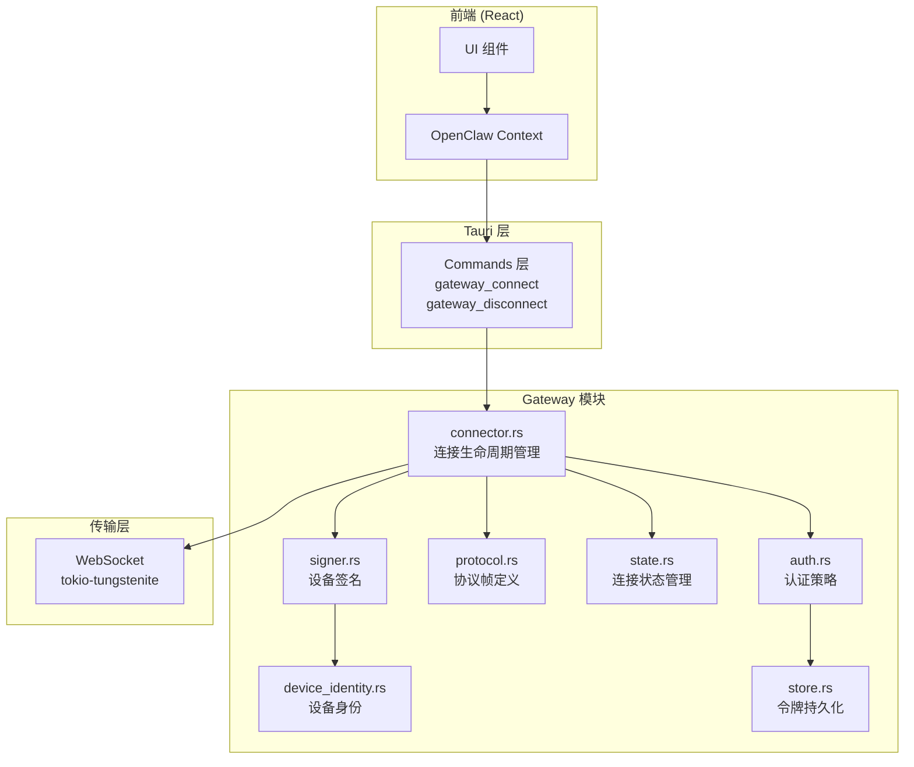
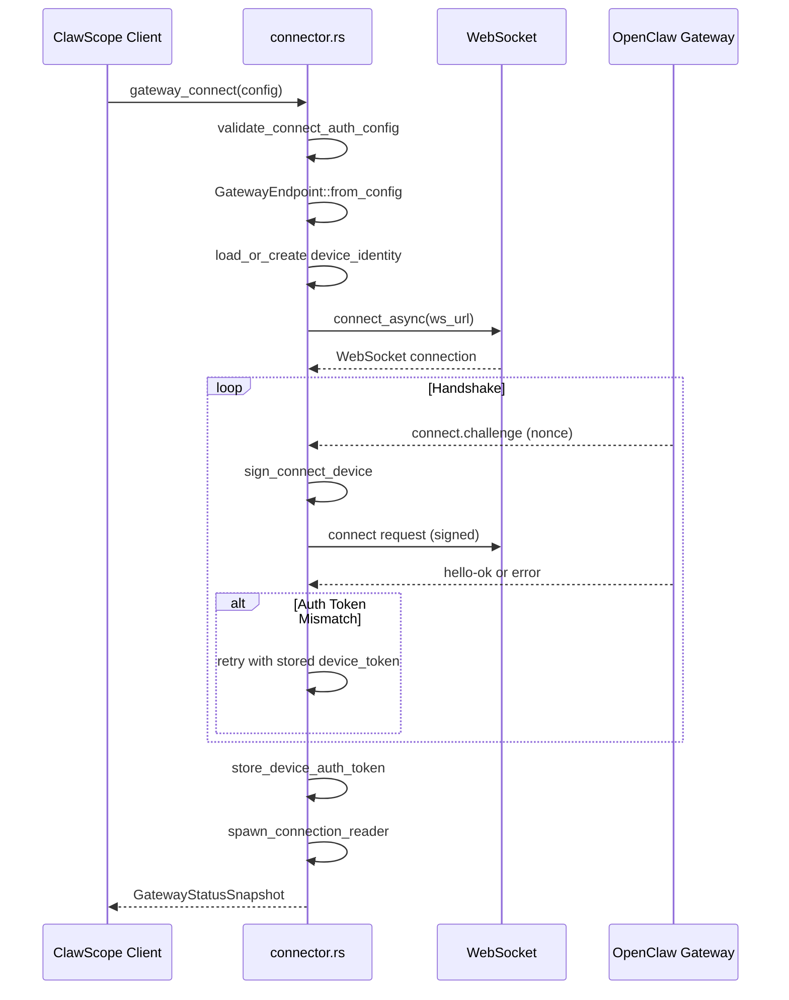

ClawScope 通过 Rust 后端实现与 OpenClaw Gateway 的安全 WebSocket 连接，采用多层次的认证机制和状态驱动的连接生命周期管理。本文档深入解析连接建立、认证流程、协议帧处理以及连接状态管理的实现细节，为高级开发者提供系统性的架构理解。

Sources: [lib.rs](src-tauri/src/lib.rs#L1-L46), [mod.rs](src-tauri/src/gateway/mod.rs#L1-L13)

## 架构概览

Gateway 模块采用分层架构设计，将连接管理、认证逻辑、协议解析和状态管理解耦为独立子模块。这种设计使得每个组件职责单一，便于测试和维护。



Sources: [connector.rs](src-tauri/src/gateway/connector.rs#L1-L100), [auth.rs](src-tauri/src/gateway/auth.rs#L1-L30), [protocol.rs](src-tauri/src/gateway/protocol.rs#L1-L50)

## 连接生命周期与状态机

连接管理采用明确的状态机模型，通过 `GatewayConnectionPhase` 枚举定义从空闲到已连接的完整生命周期。

### 连接阶段定义

| 阶段 | 说明 | 触发条件 |
|------|------|----------|
| `Idle` | 初始状态，未连接 | 应用启动或断开连接后 |
| `ResolvingEndpoint` | 解析 Gateway 地址 | 开始连接流程 |
| `OpeningSocket` | 建立 WebSocket 连接 | 地址解析完成 |
| `WaitingForChallenge` | 等待服务端挑战 | Socket 连接成功 |
| `SendingConnect` | 发送连接请求 | 收到挑战 nonce |
| `WaitingForApproval` | 等待配对批准 | 发送连接请求后 |
| `Connected` | 连接成功 | 收到 HelloOk 响应 |
| `Failed` | 连接失败 | 握手或认证失败 |
| `Disconnected` | 已断开 | 主动断开或连接异常 |

Sources: [types.rs](src-tauri/src/gateway/types.rs#L38-L51)

### 连接流程详解

连接流程由 `connector::connect` 函数 orchestrate，包含以下关键步骤：

1. **配置验证**：验证认证配置完整性，确保 Token 或 Password 模式下的凭据非空
2. **端点解析**：将用户输入的 URL 规范化为 WebSocket URL，支持 http/https/ws/wss 协议自动转换
3. **设备身份加载**：从本地存储加载或生成 Ed25519 设备密钥对
4. **握手循环**：执行 WebSocket 握手，支持设备令牌重试机制
5. **会话建立**：创建活跃连接会话，启动后台消息读取任务



Sources: [connector.rs](src-tauri/src/gateway/connector.rs#L73-L200), [connector.rs](src-tauri/src/gateway/connector.rs#L2884-L2995)

## 认证机制

ClawScope 支持三种认证模式，通过 `GatewayAuthMode` 枚举定义：

### 认证模式对比

| 模式 | 凭据类型 | 适用场景 | 安全性 |
|------|----------|----------|--------|
| `PairedDevice` | 设备签名 + 存储的 device_token | 首次配对后的常规连接 | 高（Ed25519 签名） |
| `Token` | Gateway 共享 Token | 多设备共享访问 | 中（共享密钥） |
| `Password` | Gateway 访问密码 | 临时访问或测试环境 | 中（共享密钥） |

Sources: [types.rs](src-tauri/src/gateway/types.rs#L5-L12), [auth.rs](src-tauri/src/gateway/auth.rs#L8-L30)

### 设备身份与签名

设备身份基于 Ed25519 椭圆曲线加密，实现于 `device_identity.rs`：

- **设备 ID 派生**：通过公钥的 SHA-256 哈希生成唯一设备标识
- **密钥持久化**：私钥和公钥使用 URL-safe Base64 编码存储于本地 JSON 文件
- **签名流程**：使用挑战 nonce、时间戳、角色、权限等上下文生成防重放攻击的签名

```rust
// 签名载荷格式 (V3 协议)
"v3|{device_id}|{client_id}|{client_mode}|{role}|{scopes}|{signed_at_ms}|{token}|{nonce}|{platform}|{device_family}"
```

Sources: [device_identity.rs](src-tauri/src/gateway/device_identity.rs#L1-L50), [signer.rs](src-tauri/src/gateway/signer.rs#L20-L40)

### 认证令牌管理

设备令牌通过 `store.rs` 实现持久化存储，支持按 Gateway 源、角色和权限范围进行键值绑定：

- **绑定键生成**：`{gateway_origin}|{role}|{sorted_scopes}` 确保精确匹配
- **版本演进**：存储格式从 V1 演进至 V2，支持更细粒度的令牌查找
- **回退策略**：当精确匹配失败时，按 Gateway 源和角色进行模糊匹配

Sources: [store.rs](src-tauri/src/gateway/store.rs#L89-L175)

### 认证重试策略

当使用共享 Token 认证失败时，系统支持自动回退到已存储的 device_token 进行重试：

```rust
// 重试条件判断
fn should_retry_with_stored_device_token(
    endpoint: &GatewayEndpoint,
    config: &GatewayConnectConfig,
    selected_auth: &SelectedConnectAuth,
    error: &GatewayError,
    already_retried: bool,
) -> bool {
    // 仅对本地回环地址启用自动重试
    // 错误码为 AUTH_TOKEN_MISMATCH 或服务端建议 retry_with_device_token
}
```

Sources: [connector.rs](src-tauri/src/gateway/connector.rs#L3238-L3270)

## WebSocket 协议与帧处理

### 协议帧结构

Gateway 协议采用 JSON 帧格式，定义于 `protocol.rs`：

**请求帧 (RequestFrame)**：
```json
{
  "type": "req",
  "id": "随机十六进制ID",
  "method": "connect",
  "params": { ... }
}
```

**响应帧 (ResponseFrame)**：
```json
{
  "type": "res",
  "id": "对应请求ID",
  "ok": true,
  "payload": { ... },
  "error": null
}
```

**事件帧 (EventFrame)**：
```json
{
  "type": "event",
  "event": "connect.challenge",
  "payload": { "nonce": "随机挑战值" }
}
```

Sources: [protocol.rs](src-tauri/src/gateway/protocol.rs#L84-L135)

### 连接握手协议

握手过程遵循挑战-响应模式：

1. **挑战接收**：服务端发送 `connect.challenge` 事件，包含随机 nonce
2. **请求构造**：客户端构造 `ConnectParams`，包含设备签名和认证信息
3. **响应处理**：服务端返回 `HelloOk`，包含协议版本、授权角色、权限范围和方法列表

```rust
pub struct HelloOk {
    pub protocol: u32,
    pub server: HelloServer,
    pub features: HelloFeatures,      // 可用方法列表
    pub auth: Option<HelloAuth>,      // 签发的 device_token、角色、权限
    pub policy: HelloPolicy,          // 最大载荷、缓冲区限制
}
```

Sources: [protocol.rs](src-tauri/src/gateway/protocol.rs#L137-L189)

### 运行时消息处理

连接成功后，`spawn_connection_reader` 启动后台任务持续读取 WebSocket 消息：

- **响应匹配**：通过请求 ID 将响应路由到对应的 pending request channel
- **连接监控**：检测连接异常，自动清理会话状态并通知前端
- **优雅关闭**：支持主动关闭和异常断开两种场景

```rust
async fn spawn_connection_reader(
    state: GatewayAppState,
    connection: GatewayActiveConnection,
    mut reader: GatewaySocketReader,
) {
    // 循环读取消息直到连接关闭
    // 异常时清理会话状态，更新 GatewayStatusSnapshot
}
```

Sources: [connector.rs](src-tauri/src/gateway/connector.rs#L3150-L3198), [connector.rs](src-tauri/src/gateway/connector.rs#L3201-L3230)

## 连接状态管理

### 应用状态结构

`GatewayAppState` 作为 Tauri 托管的状态资源，提供线程安全的连接状态管理：

```rust
pub struct GatewayAppState {
    inner: Arc<GatewayStateInner>,
}

struct GatewayStateInner {
    snapshot: Mutex<GatewayStatusSnapshot>,           // 连接状态快照
    session: AsyncMutex<Option<GatewayActiveConnection>>, // 活跃会话
    timeline_probe_cache: Mutex<HashMap<String, CachedTimelineProbeResult>>, // 时间线探测缓存
}
```

Sources: [state.rs](src-tauri/src/gateway/state.rs#L114-L141)

### 活跃连接会话

`GatewayActiveConnection` 封装已建立的 WebSocket 连接：

- **请求注册**：`register_pending_request` 创建请求-响应的异步 channel
- **请求解析**：`resolve_pending_request` 将响应路由到等待中的请求
- **方法支持检查**：`supports_method` 验证服务端是否支持特定 RPC 方法

Sources: [state.rs](src-tauri/src/gateway/state.rs#L25-L112)

### 状态快照与前端同步

`GatewayStatusSnapshot` 提供连接状态的序列化表示，通过 Tauri Commands 暴露给前端：

```rust
pub struct GatewayStatusSnapshot {
    pub phase: GatewayConnectionPhase,
    pub gateway_origin: Option<String>,
    pub device_id: Option<String>,
    pub granted_role: Option<String>,
    pub granted_scopes: Vec<String>,
    pub last_error: Option<GatewayErrorSummary>,
    pub is_paired: bool,
    pub can_retry_with_device_token: bool,
}
```

Sources: [types.rs](src-tauri/src/gateway/types.rs#L53-L78)

## 错误处理与恢复

### 错误分类体系

`GatewayError` 枚举定义了连接过程中可能遇到的错误类型：

| 错误类型 | 说明 | 用户提示 |
|----------|------|----------|
| `InvalidUrl` | Gateway 地址格式错误 | 检查地址格式示例 |
| `UnsupportedScheme` | 不支持的 URL 协议 | 使用 http/https/ws/wss |
| `Transport` | 网络传输错误 | 确认 Gateway 已启动且网络可达 |
| `ConnectRejected` | 连接被拒绝（认证失败） | 根据错误码提供具体指导 |
| `RequestRejected` | RPC 请求被拒绝 | 检查 role/scopes 与方法匹配 |

Sources: [errors.rs](src-tauri/src/gateway/errors.rs#L206-L241)

### 连接拒绝错误码

`ConnectRejected` 错误包含详细的恢复建议：

- **PAIRING_REQUIRED**：设备未配对或权限升级，需服务端执行 `openclaw devices approve`
- **AUTH_TOKEN_MISMATCH**：Token 认证失败，支持自动重试 device_token
- **AUTH_PASSWORD_MISMATCH**：密码认证失败
- **AUTH_RATE_LIMITED**：认证频率受限
- **DEVICE_AUTH_SIGNATURE_INVALID**：设备签名校验失败

Sources: [errors.rs](src-tauri/src/gateway/errors.rs#L120-L200), [protocol.rs](src-tauri/src/gateway/protocol.rs#L8-L16)

## 超时与性能配置

连接流程中定义了多个超时常量：

| 常量 | 值 | 用途 |
|------|-----|------|
| `CONNECT_CHALLENGE_TIMEOUT` | 10s | 等待挑战 nonce |
| `CONNECT_RESPONSE_TIMEOUT` | 15s | 等待 HelloOk 响应 |
| `REQUEST_TIMEOUT` | 15s | 常规 RPC 请求 |
| `REMOTE_TIMELINE_PROBE_WAIT_TIMEOUT` | 20s | 远程时间线探测等待 |
| `REMOTE_TIMELINE_PROBE_REQUEST_TIMEOUT` | 25s | 远程时间线探测请求 |
| `REMOTE_MEMORY_SEARCH_WAIT_TIMEOUT` | 60s | 内存搜索等待 |

Sources: [connector.rs](src-tauri/src/gateway/connector.rs#L56-L68)

## 与前端集成

### Tauri Commands 暴露

`commands.rs` 将内部连接 API 暴露为前端可调用的 Tauri Commands：

- `gateway_status`：获取当前连接状态
- `gateway_connect`：建立 Gateway 连接
- `gateway_disconnect`：断开连接
- `gateway_normalize_endpoint`：验证并规范化 Gateway 地址

Sources: [commands.rs](src-tauri/src/gateway/commands.rs#L24-L55), [lib.rs](src-tauri/src/lib.rs#L13-L42)

### 前端调用示例

```typescript
// 建立连接
const result = await invoke<GatewayStatusSnapshot>('gateway_connect', {
  config: {
    gatewayUrl: 'http://127.0.0.1:18789',
    authMode: 'paired_device',
    role: 'operator',
    scopes: ['operator.admin']
  }
});

// 监听状态变化（通过 React Context）
const { snapshot } = useOpenClaw();
```

## 延伸阅读

- [Gateway 模块架构概览](16-gateway-mo-kuai-jia-gou-gai-lan) — 了解 Gateway 模块整体架构
- [设备身份与签名机制](20-she-bei-shen-fen-yu-qian-ming-ji-zhi) — 深入设备身份加密实现
- [本地存储与令牌管理](21-ben-di-cun-chu-yu-ling-pai-guan-li) — 了解令牌持久化机制
- [Tauri 命令与前端通信](15-tauri-ming-ling-yu-qian-duan-tong-xin) — 前端与 Rust 后端通信模式