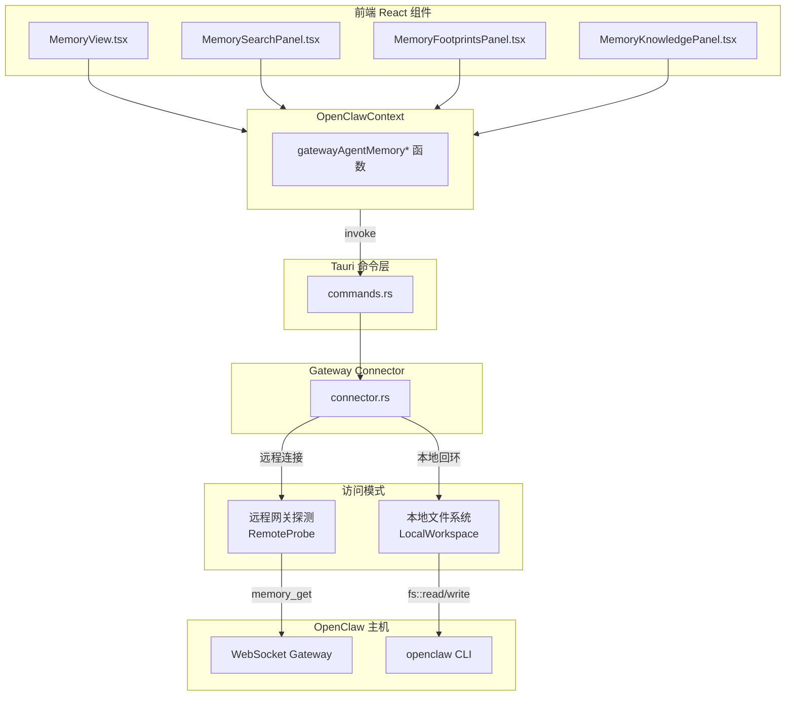
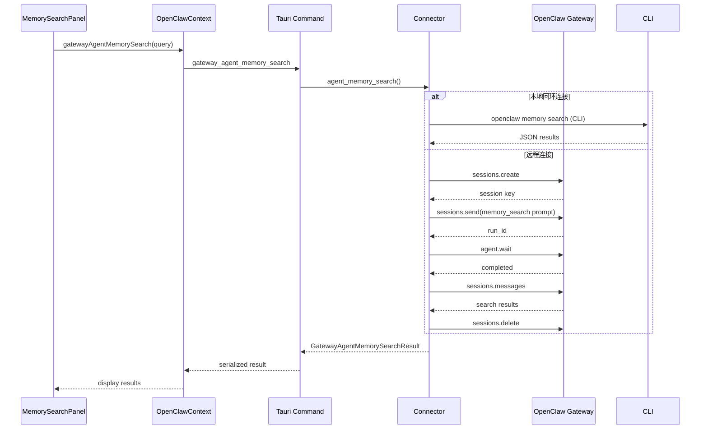

ClawScope 的代理内存操作模块提供了完整的文档管理、语义搜索和时间线访问能力。该模块通过 Rust 后端与 OpenClaw 网关进行通信，支持本地文件系统直接访问和远程网关代理两种模式，使开发者能够灵活地读取、写入、索引和搜索代理的记忆文档。

## 架构概述

代理内存操作采用分层架构设计，前端通过 Tauri 命令与 Rust 后端交互，后端则根据连接模式选择本地文件系统访问或远程网关通信。



Sources: [MemoryView.tsx](src/app/components/views/MemoryView.tsx#L1-L200), [commands.rs](src-tauri/src/gateway/commands.rs#L107-L134), [connector.rs](src-tauri/src/gateway/connector.rs#L1-L100)

## 核心类型定义

代理内存操作涉及多个核心数据结构，涵盖文档条目、搜索结果、时间线访问等多个维度。

| 类型 | 用途 | 关键字段 |
|------|------|----------|
| `GatewayAgentFileEntry` | 文档条目 | `name`, `path`, `missing`, `size`, `content` |
| `GatewayAgentMemoryResult` | 内存查询结果 | `agentId`, `workspace`, `documents`, `diagnostics` |
| `GatewayAgentMemorySearchEntry` | 搜索结果条目 | `path`, `snippet`, `score`, `sourceKind`, `openTarget` |
| `GatewayAgentMemorySearchResult` | 语义搜索结果 | `query`, `executedAtMs`, `diagnostics`, `results` |
| `GatewayAgentMemoryTimelineResult` | 时间线数据 | `entries`, `source`, `diagnostics`, `probe` |
| `GatewayAgentMemoryStatusResult` | 索引状态 | `provider`, `model`, `indexedFiles`, `chunks`, `bySource` |

Sources: [types.rs](src-tauri/src/gateway/types.rs#L108-L285), [OpenClawContext.tsx](src/app/contexts/OpenClawContext.tsx#L79-L228)

## 文档读写操作

### 读取代理文档

文档读取支持多种来源，包括根记忆文档（MEMORY.md）、SOUL.md、IDENTITY.md 以及自定义工作区文档。

```rust
// 获取代理内存文档列表
pub async fn agent_memory_get(
    state: GatewayAppState,
    agent_id: &str,
) -> Result<GatewayAgentMemoryResult, GatewayError>

// 读取特定文档内容
pub async fn agent_file_read(
    state: GatewayAppState,
    agent_id: &str,
    name: &str,
) -> Result<GatewayAgentFileGetResult, GatewayError>
```

前端通过 `OpenClawContext` 提供的封装函数调用这些命令：

```typescript
// 获取代理内存文档列表
export async function gatewayAgentMemoryGet(agentId: string) {
  return invokeGateway<GatewayAgentMemoryResult>('gateway_agent_memory_get', { agentId });
}

// 读取特定文档
export async function gatewayAgentFileRead(agentId: string, name: string) {
  return invokeGateway<GatewayAgentFileGetResult>('gateway_agent_file_read', { agentId, name });
}
```

Sources: [commands.rs](src-tauri/src/gateway/commands.rs#L107-L115), [OpenClawContext.tsx](src/app/contexts/OpenClawContext.tsx#L486-L503)

### 写入代理文档

文档写入通过 `agents.files.set` 网关方法实现，支持更新 MEMORY.md、SOUL.md、IDENTITY.md 等核心文档。

```rust
#[tauri::command]
pub async fn gateway_agent_memory_set(
    state: State<'_, GatewayAppState>,
    agent_id: String,
    name: String,
    content: String,
) -> Result<(), GatewayErrorSummary>

// 内部实现
async fn agent_file_set(
    state: GatewayAppState,
    agent_id: &str,
    name: &str,
    content: &str,
) -> Result<(), GatewayError> {
    request_json(
        state,
        "agents.files.set",
        Some(json!({
            "agentId": agent_id,
            "name": name,
            "content": content,
        })),
    ).await?;
    Ok(())
}
```

Sources: [commands.rs](src-tauri/src/gateway/commands.rs#L257-L267), [connector.rs](src-tauri/src/gateway/connector.rs#L1071-L1088)

## 语义搜索功能

### 搜索架构

语义搜索通过 OpenClaw 网关的 `memory_search` 工具实现，支持基于向量的语义相似度检索。



Sources: [connector.rs](src-tauri/src/gateway/connector.rs#L320-L405), [MemorySearchPanel.tsx](src/app/components/views/MemorySearchPanel.tsx#L1-L100)

### 搜索参数与过滤

搜索支持结果数量限制和来源过滤，可针对特定文档类型进行精确检索。

```rust
#[tauri::command]
pub async fn gateway_agent_memory_search(
    state: State<'_, GatewayAppState>,
    agent_id: String,
    query: String,
    max_results: Option<usize>,
    source_filter: Option<String>,
) -> Result<GatewayAgentMemorySearchResult, GatewayErrorSummary>
```

支持的来源过滤器包括：

| 过滤器值 | 匹配的文档类型 |
|----------|---------------|
| `root_memory` | MEMORY.md / memory.md |
| `daily_memory` | memory/YYYY-MM-DD.md |
| `workspace_markdown` | 工作区内的 Markdown 文件 |
| `extra_path` | 额外配置路径中的文档 |
| `session_transcript` | sessions/ 目录下的会话记录 |

Sources: [commands.rs](src-tauri/src/gateway/commands.rs#L117-L134), [connector.rs](src-tauri/src/gateway/connector.rs#L1174-L1189)

### 搜索结果归一化

后端对原始搜索结果进行归一化处理，添加来源类型标识和打开目标路由信息。

```rust
fn normalize_remote_memory_search_entry(
    workspace: &str,
    diagnostics: Option<&GatewayAgentMemoryDiagnostics>,
    entry: RemoteMemorySearchReplyEntry,
    index: usize,
) -> GatewayAgentMemorySearchEntry {
    let source_kind = resolve_memory_search_source_kind(path.as_str(), workspace, diagnostics);
    let open_target = resolve_memory_search_open_target(source_kind);
    
    GatewayAgentMemorySearchEntry {
        id: format!("{path}#{stable_line}:{index}"),
        path,
        snippet: entry.snippet.unwrap_or_default().trim().to_string(),
        score: entry.score,
        line_start: entry.line_start,
        line_end: entry.line_end,
        source_kind,
        open_target,
        canonical_document_name,
        timeline_entry_name,
    }
}
```

Sources: [connector.rs](src-tauri/src/gateway/connector.rs#L1224-L1263)

## 时间线访问模式

### 双模式访问策略

时间线（Footprints）支持两种访问模式，系统根据工作区可访问性自动选择最优策略。

| 访问模式 | 触发条件 | 实现方式 | 适用场景 |
|----------|----------|----------|----------|
| `LocalWorkspace` | 工作区为本地可读目录 | 直接文件系统读取 | 本地 OpenClaw 实例 |
| `RemoteProbe` | 工作区远程或不可读 | 通过网关会话探测 | 远程或容器化部署 |

```rust
fn resolve_memory_timeline_access(
    workspace_path: &Path,
    is_connected: bool,
) -> Result<ResolvedMemoryTimelineAccess, GatewayError> {
    match fs::metadata(workspace_path) {
        Ok(metadata) if metadata.is_dir() => Ok(ResolvedMemoryTimelineAccess {
            mode: GatewayAgentMemoryTimelineSource::LocalWorkspace,
            reason: GatewayAgentMemoryTimelineAccessReason::WorkspaceLocalAndReadable,
            local_workspace_path: Some(workspace_path.to_path_buf()),
        }),
        Ok(_) | Err(_) => Ok(ResolvedMemoryTimelineAccess {
            mode: GatewayAgentMemoryTimelineSource::RemoteProbe,
            reason: GatewayAgentMemoryTimelineAccessReason::WorkspaceRemoteOrNotReadable,
            local_workspace_path: None,
        }),
    }
}
```

Sources: [connector.rs](src-tauri/src/gateway/connector.rs#L1378-L1410)

### 本地时间线扫描

本地模式直接扫描工作区 `memory/` 目录，按日期排序返回条目。

```rust
fn scan_local_memory_timeline_entries(
    workspace_path: &Path,
) -> Result<LocalMemoryTimelineScan, GatewayError> {
    let memory_dir = workspace_path.join("memory");
    // 读取目录、过滤有效日期文件、排序返回
    Ok(LocalMemoryTimelineScan {
        entries: order_daily_memory_entries(entries),
        local_scan_directory: memory_dir.display().to_string(),
        local_scan_files_count,
        local_scan_skipped_count,
    })
}
```

Sources: [connector.rs](src-tauri/src/gateway/connector.rs#L1412-L1478)

### 远程时间线探测

远程模式通过创建临时会话、发送 `memory_get` 工具调用来探测指定日期范围的条目，支持重试机制和结果缓存。

```rust
pub async fn agent_memory_timeline_remote_probe(
    state: GatewayAppState,
    agent_id: &str,
    start_date: &str,
    end_date: &str,
) -> Result<GatewayAgentMemoryTimelineResult, GatewayError> {
    // 检查缓存
    if let Some(cached_result) = state.load_timeline_probe_cache(cache_key.as_str(), now_ms) {
        return Ok(cached_result);
    }
    
    // 执行远程探测
    let result = run_remote_timeline_probe(...).await?;
    
    // 缓存有效结果
    if should_cache_remote_probe_result(&probe.status) {
        state.store_timeline_probe_cache(cache_key, result.clone(), ...);
    }
    
    Ok(result)
}
```

探测结果包含详细的统计信息：`hitDays`（命中）、`missDays`（缺失）、`timeoutDays`（超时）、`errorDays`（错误）等。

Sources: [connector.rs](src-tauri/src/gateway/connector.rs#L729-L776), [types.rs](src-tauri/src/gateway/types.rs#L325-L393)

## 内存索引管理

### 索引状态查询

系统提供两种索引状态查询方式：`doctor.memory.status`（网关 API）和 `openclaw memory status`（本地 CLI）。

```rust
pub async fn agent_memory_status(
    state: GatewayAppState,
    agent_id: &str,
) -> Result<GatewayAgentMemoryStatusResult, GatewayError>

pub async fn agent_memory_runtime_status(
    state: GatewayAppState,
    agent_id: &str,
) -> Result<GatewayAgentMemoryRuntimeStatusResult, GatewayError>
```

`runtime_status` 仅限本地回环连接使用，它通过调用 `openclaw` CLI 获取更详细的运行时信息。

Sources: [connector.rs](src-tauri/src/gateway/connector.rs#L407-L589)

### 强制索引重建

索引重建操作同样仅限本地连接，通过 CLI 触发完整的文档重新索引。

```rust
pub async fn agent_memory_index(
    state: GatewayAppState,
    agent_id: &str,
    force: bool,
) -> Result<GatewayAgentMemoryIndexResult, GatewayError> {
    // 仅限本地连接
    if endpoint != GatewayTransportKind::LocalLoopback {
        return Err(GatewayError::NotImplemented { ... });
    }
    
    let output = Command::new("openclaw")
        .args(["memory", "index", "--agent", agent_id])
        .output()?;
    // 返回 stdout 结果
}
```

Sources: [connector.rs](src-tauri/src/gateway/connector.rs#L591-L639), [commands.rs](src-tauri/src/gateway/commands.rs#L269-L278)

## 前端状态管理

### 搜索状态

前端使用 `memorySearchState.ts` 管理搜索相关状态，包括来源类型解析和分组排序逻辑。

```typescript
export type SemanticMemorySearchSourceKind =
  | "root_memory"
  | "daily_memory"
  | "workspace_markdown"
  | "extra_path"
  | "session_transcript"
  | "unknown";

export function resolveSemanticMemorySearchSourceKind(
  path: string,
): SemanticMemorySearchSourceKind {
  if (normalizedPath.endsWith("/MEMORY.md")) return "root_memory";
  if (DAILY_MEMORY_PATH_RE.test(normalizedPath)) return "daily_memory";
  if (normalizedPath.includes("/sessions/")) return "session_transcript";
  if (normalizedPath.endsWith(".md")) return "workspace_markdown";
  return "unknown";
}
```

Sources: [memorySearchState.ts](src/app/components/views/memorySearchState.ts#L1-L57)

### 时间线状态

`memoryState.ts` 提供时间线范围解析、探测结果合并等工具函数，支持日期范围预设和验证。

```typescript
export function resolveTimelineProbeRangePreset(referenceDate: string) {
  const endDate = parseCanonicalDate(referenceDate);
  const startDate = new Date(endDate.getTime());
  startDate.setUTCDate(startDate.getUTCDate() - (TIMELINE_PROBE_DEFAULT_DAYS - 1));
  
  return {
    startDate: formatCanonicalDate(startDate),
    endDate: formatCanonicalDate(endDate),
  };
}
```

Sources: [memoryState.ts](src/app/components/views/memoryState.ts#L135-L151)

## 超时与缓存配置

系统为远程操作配置了合理的超时参数，确保用户体验的同时避免长时间阻塞。

| 操作类型 | 等待超时 | 请求超时 | 重试等待超时 | 重试请求超时 |
|----------|----------|----------|--------------|--------------|
| 时间线探测 | 20s | 25s | 35s | 40s |
| 时间线条目读取 | 60s | 65s | - | - |
| 语义搜索 | 60s | 65s | - | - |

远程探测结果默认缓存 120 秒（`REMOTE_TIMELINE_PROBE_CACHE_TTL`），避免重复探测相同日期范围。

Sources: [connector.rs](src-tauri/src/gateway/connector.rs#L56-L68)

## 错误处理

代理内存操作模块实现了全面的错误分类和恢复建议：

| 错误类别 | 场景 | 恢复建议 |
|----------|------|----------|
| `transport` | 网络连接失败 | 检查网关连接状态 |
| `protocol` | 协议解析错误 | 检查 OpenClaw 版本兼容性 |
| `request_rejected` | 网关拒绝请求 | 检查代理权限和范围配置 |
| `not_implemented` | 远程会话不支持本地 CLI 功能 | 切换到本地网关连接 |

Sources: [errors.rs](src-tauri/src/gateway/errors.rs), [connector.rs](src-tauri/src/gateway/connector.rs#L1616-L1704)

## 相关文档

- [Memory 视图：记忆库与文档管理](10-memory-shi-tu-ji-yi-ku-yu-wen-dang-guan-li) - 前端视图层实现细节
- [时间线管理：本地扫描与远程探测](19-shi-jian-xian-guan-li-ben-di-sao-miao-yu-yuan-cheng-tan-ce) - 时间线功能的深入解析
- [Tauri 命令与前端通信](15-tauri-ming-ling-yu-qian-duan-tong-xin) - Tauri 后端命令设计模式
- [连接管理：认证与 WebSocket 通信](17-lian-jie-guan-li-ren-zheng-yu-websocket-tong-xin) - 网关连接建立流程