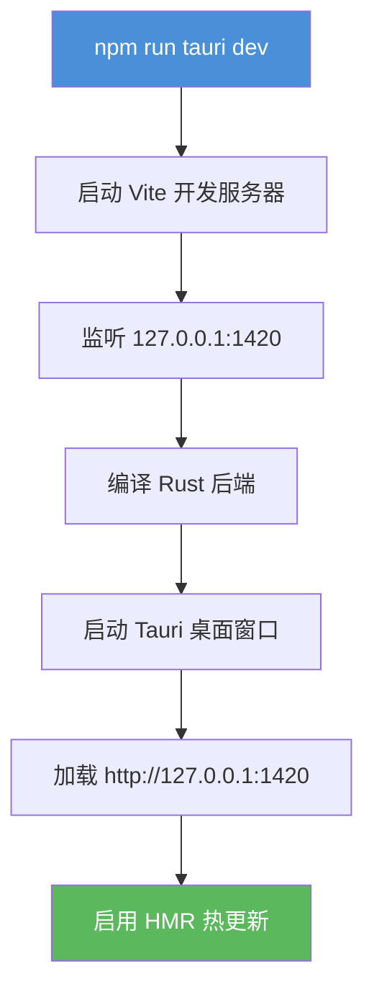

ClawScope 是一款基于 **Tauri 2** 与 **React + Vite** 技术栈构建的桌面应用，旨在为 OpenClaw 提供记忆可见、配置可编辑、进化可实验的本地管理能力。本页将引导初学者从零开始搭建开发环境，并成功运行首个本地实例。

## 技术栈概览

ClawScope 采用前后端分离的架构设计，通过 Tauri 桥接 Web 技术与原生系统能力：

| 层级 | 技术选型 | 版本要求 | 核心职责 |
|------|----------|----------|----------|
| **前端框架** | React + TypeScript | React ^18.2.0 | UI 渲染与状态管理 |
| **构建工具** | Vite | ^6.3.5 | 模块打包与热更新 |
| **样式方案** | Tailwind CSS 4 + CSS 模块 | Tailwind 4.1.12 | 原子化样式与主题系统 |
| **桌面框架** | Tauri 2 | ^2.0.0 | 原生窗口与系统 API |
| **后端语言** | Rust | Edition 2024 | 安全高效的系统级操作 |
| **组件库** | Radix UI | 最新稳定版 | 无障碍 headless 组件 |

Sources: [package.json](package.json#L1-L80), [src-tauri/Cargo.toml](src-tauri/Cargo.toml#L1-L36)

## 前置依赖安装

在开始之前，请确保系统已安装以下工具链。不同操作系统的要求略有差异：

### 通用依赖

| 工具 | 最低版本 | 验证命令 | 安装指南 |
|------|----------|----------|----------|
| **Node.js** | v18+ | `node --version` | [nodejs.org](https://nodejs.org) |
| **npm** | v9+ | `npm --version` | 随 Node.js 一同安装 |
| **Rust** | 1.70+ | `rustc --version` | [rustup.rs](https://rustup.rs) |
| **Cargo** | 1.70+ | `cargo --version` | 随 Rust 一同安装 |

当前开发环境版本示例：`rustc 1.92.0`, `cargo 1.92.0`, `node v20.19.3`, `npm 11.7.0`。

Sources: [README.md](README.md#L50-L55)

### Windows 平台特殊要求

Windows 用户需额外安装 **Visual Studio Build Tools**，以提供 Rust 编译所需的 C++ 工具链：

1. 访问 [Visual Studio 下载页](https://visualstudio.microsoft.com/visual-cpp-build-tools/)
2. 安装「使用 C++ 的桌面开发」工作负载
3. 建议将 Rust 切换至 MSVC 工具链：`rustup default stable-msvc`

> **常见问题**：若构建时遇到 `dlltool.exe: program not found` 错误，说明未正确安装 Visual Studio Build Tools。

Sources: [README.md](README.md#L50-L55)

## 项目初始化

完成依赖安装后，按以下步骤克隆并初始化项目：

```bash
# 1. 克隆仓库
git clone <repository-url>
cd claw-scope

# 2. 安装前端依赖
npm install

# 3. Rust 依赖会自动在首次构建时下载
```

`npm install` 将安装约 30+ 个核心依赖，包括 React 生态系统、Tauri API 客户端、Radix UI 组件库以及 Tailwind CSS 相关工具。

Sources: [package.json](package.json#L12-L80)

## 开发模式启动

ClawScope 提供一键启动的开发命令，Vite 开发服务器与 Tauri 桌面窗口将同时启动：

```bash
npm run tauri dev
```

该命令执行以下流程：



**开发服务器配置**（定义于 [vite.config.ts](vite.config.ts#L10-L20)）：

| 配置项 | 值 | 说明 |
|--------|-----|------|
| 主机地址 | `127.0.0.1` | 本地回环，安全隔离 |
| 前端端口 | `1420` | 严格模式，端口被占用时报错 |
| HMR 端口 | `1421` | 热模块替换专用通道 |
| 监控排除 | `src-tauri/**` | 避免 Rust 文件变更触发前端重载 |

Sources: [vite.config.ts](vite.config.ts#L1-L34), [src-tauri/tauri.conf.json](src-tauri/tauri.conf.json#L7-L11)

## 应用窗口配置

Tauri 在开发模式下创建的窗口具有以下特性（可在 [tauri.conf.json](src-tauri/tauri.conf.json#L14-L23) 中调整）：

| 属性 | 配置值 | 说明 |
|------|--------|------|
| 默认标题 | "ClawScope - 记忆可见，进化可期" | 窗口标题栏显示 |
| 初始宽度 | 1440px | 推荐分辨率 |
| 初始高度 | 900px | 推荐分辨率 |
| 最小宽度 | 1280px | 防止过度缩小 |
| 最小高度 | 820px | 防止过度缩小 |
| 系统装饰 | `false` | 使用自定义标题栏 |

窗口采用无边框设计（`decorations: false`），由前端 React 组件实现自定义标题栏控制按钮，以支持主题定制与 Windows 11 风格集成。

Sources: [src-tauri/tauri.conf.json](src-tauri/tauri.conf.json#L1-L40), [index.html](index.html#L7-L25)

## 项目结构导航

熟悉项目目录结构有助于快速定位代码：

```
claw-scope/
├── src/                    # 前端源代码
│   ├── app/                # 应用级组件与路由
│   │   ├── App.tsx         # 根组件
│   │   ├── routes.tsx      # 路由配置
│   │   ├── components/     # 业务组件
│   │   └── contexts/       # React Context
│   ├── components/         # 通用 UI 组件
│   ├── styles/             # 全局样式
│   └── main.tsx            # 入口文件
├── src-tauri/              # Rust 后端源代码
│   ├── src/                # Rust 源码
│   │   ├── lib.rs          # 库入口与命令注册
│   │   ├── main.rs         # 可执行入口
│   │   └── gateway/        # 网关模块
│   ├── Cargo.toml          # Rust 依赖配置
│   └── tauri.conf.json     # Tauri 应用配置
├── scripts/                # 构建与测试脚本
├── docs/                   # 文档目录
└── artifacts/              # 构建产物与测试报告
```

Sources: [get_dir_structure](.) 输出

## 常用开发命令

| 命令 | 作用 | 使用场景 |
|------|------|----------|
| `npm run dev` | 纯前端开发模式 | 调试 UI 无需桌面功能 |
| `npm run tauri dev` | 完整桌面应用开发 | 日常开发首选 |
| `npm run build` | 生产构建前端 | CI 流程或预览 |
| `npm run tauri build` | 打包桌面应用 | 生成分发版本 |
| `npm run lint` | TypeScript 类型检查 | 提交前验证 |
| `npm run test` | 运行单元测试 | 回归验证 |

Sources: [package.json](package.json#L6-L11)

## 故障排查

### 端口占用

若 `1420` 或 `1421` 端口被占用，Vite 将报错退出（`strictPort: true`）。解决方案：

```bash
# 查找占用进程（Windows）
netstat -ano | findstr :1420
taskkill /PID <PID> /F
```

### Rust 编译缓慢

首次编译 Rust 后端时需下载并编译大量依赖，耗时可能达数分钟。后续开发将利用增量编译显著提速。

### HMR 失效

若热更新不生效，检查：
1. 是否修改了 `src-tauri/` 下的 Rust 文件（被排除监控）
2. 浏览器控制台是否有 WebSocket 连接错误

## 下一步

成功启动开发环境后，建议按以下路径深入：

1. **[项目概览](1-xiang-mu-gai-lan)** — 了解 ClawScope 的产品定位与核心功能
2. **[React 应用架构与路由设计](6-react-ying-yong-jia-gou-yu-lu-you-she-ji)** — 掌握前端代码组织方式
3. **[Tauri 命令与前端通信](15-tauri-ming-ling-yu-qian-duan-tong-xin)** — 理解前后端交互机制