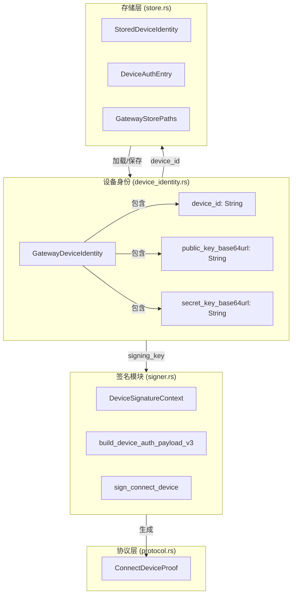
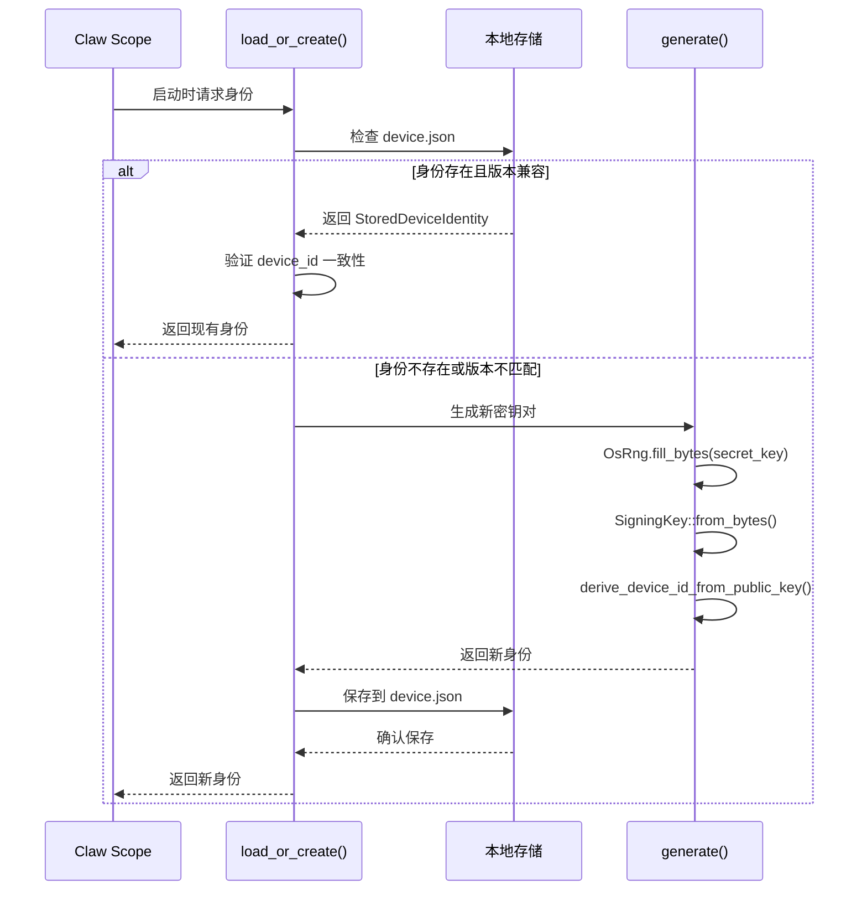
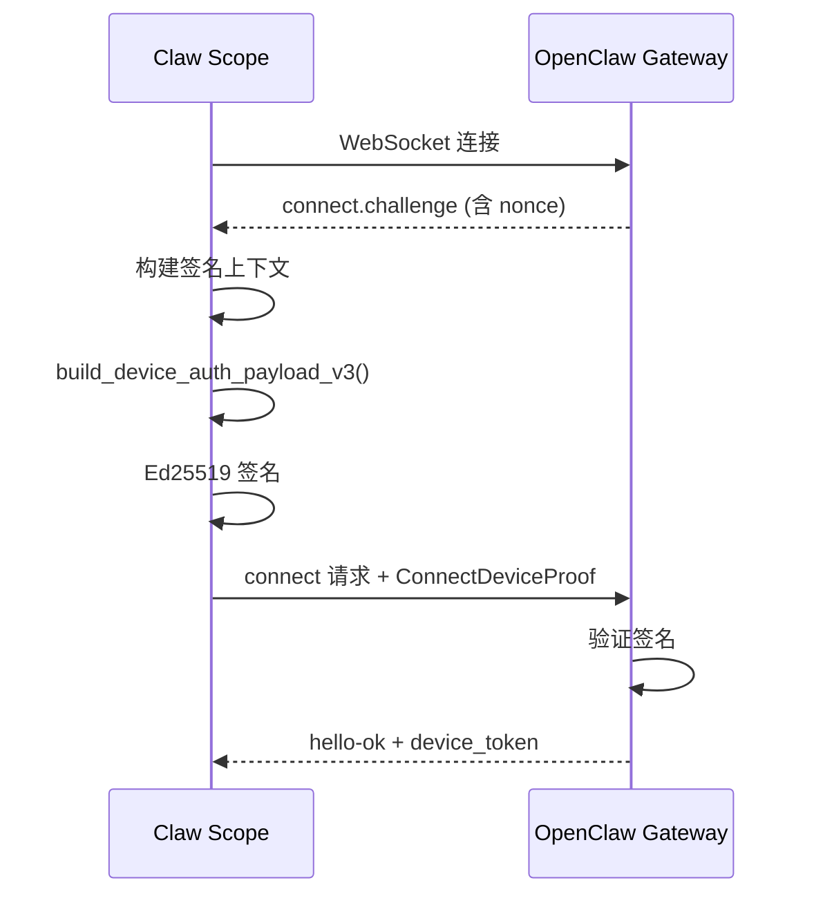

Claw Scope 采用基于 Ed25519 的加密身份系统，为每个桌面客户端实例建立唯一的设备身份。该机制确保只有经过授权的客户端能够与 OpenClaw 网关建立安全连接，实现设备级别的认证与访问控制。

## 核心架构

设备身份系统由三个核心模块协同工作：**设备身份管理**负责密钥的生成与持久化，**签名模块**处理认证载荷的构建与签名，**存储层**则确保身份数据的安全保存。这种分层设计将加密操作与业务逻辑解耦，便于独立测试与安全审计。



Sources: [device_identity.rs](src-tauri/src/gateway/device_identity.rs#L1-L147), [signer.rs](src-tauri/src/gateway/signer.rs#L1-L103), [store.rs](src-tauri/src/gateway/store.rs#L1-L200)

## 设备身份结构

`GatewayDeviceIdentity` 是设备身份的核心数据结构，包含三个关键字段：设备标识符（`device_id`）、Base64 URL 编码的公钥（`public_key_base64url`）和私钥（`secret_key_base64url`）。设备 ID 并非随机生成，而是通过公钥的 SHA-256 哈希派生，确保其唯一性与可验证性。

```rust
pub struct GatewayDeviceIdentity {
    pub device_id: String,
    pub public_key_base64url: String,
    pub secret_key_base64url: String,
}
```

密钥生成使用操作系统级别的熵源（`OsRng`），通过 Ed25519 算法创建 32 字节的密钥对。私钥采用 Base64 URL 安全编码（无填充）存储，便于在 JSON 配置中传输。

Sources: [device_identity.rs](src-tauri/src/gateway/device_identity.rs#L16-L21), [device_identity.rs](src-tauri/src/gateway/device_identity.rs#L80-L91)

## 身份生命周期管理

设备身份遵循"加载或创建"的懒加载模式。首次启动时，系统检查本地存储的身份文件；若不存在或版本不匹配，则生成新身份并持久化。这种设计确保每个客户端实例拥有稳定不变的长期身份。



身份验证包含一项关键检查：从存储加载后，系统会重新计算 `device_id` 并与存储值比对。若不一致，立即更新存储以修复潜在的数据损坏。

Sources: [device_identity.rs](src-tauri/src/gateway/device_identity.rs#L24-L57), [device_identity.rs](src-tauri/src/gateway/device_identity.rs#L93-L96)

## 签名认证流程

连接 OpenClaw 网关时，客户端必须提供经过签名的设备证明（`ConnectDeviceProof`）。该流程采用挑战-响应机制，防止重放攻击。



签名载荷采用版本化的结构化格式（v3），由管道符分隔的字段组成，包含协议版本、设备 ID、客户端标识、角色、权限范围、时间戳、令牌、随机数、平台信息等。这种设计确保载荷的完整性与可读性。

```rust
pub fn build_device_auth_payload_v3(context: &DeviceSignatureContext, device_id: &str) -> String {
    // 格式: v3|device_id|client_id|client_mode|role|scopes|signed_at_ms|token|nonce|platform|device_family
}
```

Sources: [signer.rs](src-tauri/src/gateway/signer.rs#L20-L39), [connector.rs](src-tauri/src/gateway/connector.rs#L2920-L2934)

## 安全存储机制

设备身份与授权令牌存储在应用数据目录的 `gateway/identity/` 子目录下。Windows 系统使用 `%APPDATA%/claw-scope/gateway/`，类 Unix 系统使用 `~/.claw-scope/gateway/`。

| 文件 | 用途 | 数据结构 |
|------|------|----------|
| `device.json` | 设备身份 | `StoredDeviceIdentity` |
| `device-auth.json` | 授权令牌映射 | `DeviceAuthStore` |

`DeviceAuthStore` 采用版本化存储（当前 v2），支持按网关地址、角色和权限范围绑定多个令牌。系统优先匹配精确绑定键，若无匹配则回退到基于网关地址和角色的模糊匹配。

```rust
pub struct DeviceAuthStore {
    pub version: u8,
    pub device_id: String,
    pub tokens: BTreeMap<String, DeviceAuthEntry>,
}
```

Sources: [store.rs](src-tauri/src/gateway/store.rs#L33-L39), [store.rs](src-tauri/src/gateway/store.rs#L59-L74), [store.rs](src-tauri/src/gateway/store.rs#L89-L133)

## 认证模式集成

设备身份系统支持三种认证模式，与 OpenClaw 网关的认证策略灵活配合：

| 认证模式 | 设备身份作用 | 适用场景 |
|----------|--------------|----------|
| `PairedDevice` | 主要认证手段，配合存储的设备令牌 | 首次配对后的常规连接 |
| `Token` | 提供额外签名令牌，设备身份作为辅助验证 | 共享令牌环境 |
| `Password` | 设备身份独立存在，密码单独验证 | 传统密码认证 |

在 `Token` 模式下，若共享令牌验证失败且存在存储的设备令牌，系统支持自动重试机制。这通过 `should_retry_with_stored_device_token` 函数实现，仅对本地回环地址（localhost）启用，防止令牌泄露风险。

Sources: [auth.rs](src-tauri/src/gateway/auth.rs#L31-L94), [connector.rs](src-tauri/src/gateway/connector.rs#L3238-L3270)

## 错误处理与恢复

设备身份相关的连接错误通过标准化错误码传递，便于客户端实施恢复策略：

| 错误码 | 含义 | 恢复建议 |
|--------|------|----------|
| `DEVICE_IDENTITY_REQUIRED` | 网关要求设备身份 | 确保客户端生成并发送身份 |
| `DEVICE_AUTH_NONCE_REQUIRED` | 挑战随机数缺失 | 检查网关协议版本兼容性 |
| `DEVICE_AUTH_SIGNATURE_INVALID` | 签名验证失败 | 可能表明密钥损坏，需重新生成身份 |
| `AUTH_TOKEN_MISMATCH` | 令牌不匹配 | 可尝试使用存储的设备令牌重试 |
| `PAIRING_REQUIRED` | 需要配对授权 | 等待管理员在网关侧批准设备 |

`ConnectErrorRecoveryAdvice` 结构体携带详细的恢复建议，包括是否可重试、推荐下一步操作以及配对原因（如权限升级）。

Sources: [protocol.rs](src-tauri/src/gateway/protocol.rs#L8-L16), [protocol.rs](src-tauri/src/gateway/protocol.rs#L197-L203)

## 测试与验证

设备身份模块包含全面的单元测试，覆盖核心功能：

- **ID 派生验证**：使用已知公钥字节验证 `derive_device_id_from_public_key` 输出确定性哈希
- **身份持久化**：验证 `load_or_create` 正确重用现有身份而非重复生成
- **载荷格式**：确认 v3 签名载荷的字段顺序与分隔符符合协议规范
- **元数据规范化**：测试平台字符串的小写转换与空白处理

这些测试确保身份系统的密码学正确性与协议兼容性。

Sources: [device_identity.rs](src-tauri/src/gateway/device_identity.rs#L110-L146), [signer.rs](src-tauri/src/gateway/signer.rs#L70-L102)

## 相关文档

- [连接管理：认证与 WebSocket 通信](17-lian-jie-guan-li-ren-zheng-yu-websocket-tong-xin) — 完整的连接建立流程
- [本地存储与令牌管理](21-ben-di-cun-chu-yu-ling-pai-guan-li) — 持久化存储的详细设计
- [OpenClaw 网关连接原理](5-openclaw-wang-guan-lian-jie-yuan-li) — 协议层面的连接机制