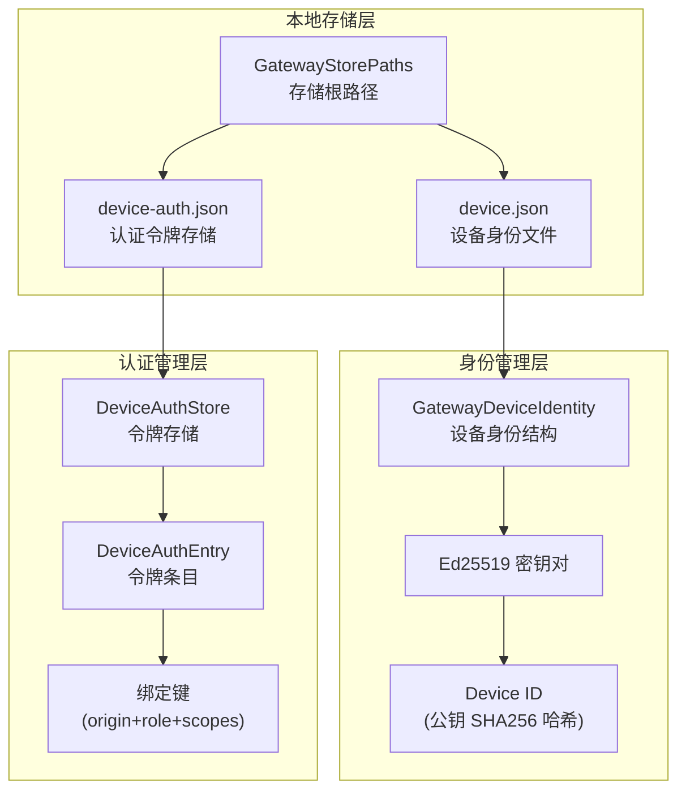

本文档深入解析 ClawScope 桌面应用如何在本地安全地持久化存储设备身份凭证和认证令牌，涵盖存储路径解析、身份生成、令牌生命周期管理以及安全设计原则。

## 存储架构概览

ClawScope 采用分层存储策略，将敏感数据分离到独立的 JSON 文件中，并通过平台特定的应用数据目录进行隔离。存储系统由 `store` 模块统一管控，核心职责包括设备身份持久化、认证令牌管理以及存储路径解析。



Sources: [store.rs](src-tauri/src/gateway/store.rs#L41-L57), [device_identity.rs](src-tauri/src/gateway/device_identity.rs#L16-L22)

## 存储路径解析

### 跨平台存储目录策略

存储路径的解析遵循平台优先原则，依次尝试以下环境变量：

| 平台 | 环境变量 | 默认路径 |
|------|----------|----------|
| Windows | `APPDATA` | `%APPDATA%\claw-scope\gateway` |
| Unix/Linux | `HOME` | `~/.claw-scope/gateway` |
| Fallback | `USERPROFILE` 或当前目录 | `./.claw-scope/gateway` |

这种设计确保了在主流操作系统上都能自动定位到符合平台惯例的应用数据目录，同时提供降级机制以防环境变量缺失。

Sources: [store.rs](src-tauri/src/gateway/store.rs#L59-L74)

### 文件组织结构

每个存储根目录下包含 `identity` 子目录，其中存放两个核心文件：

- **device.json**: 存储设备的 Ed25519 密钥对（公钥和私钥的 base64url 编码）以及设备 ID
- **device-auth.json**: 存储与该设备配对过的各个 Gateway 的认证令牌

```rust
pub struct GatewayStorePaths {
    pub root: PathBuf,              // 存储根目录
    pub identity_file: PathBuf,     // identity/device.json
    pub device_auth_file: PathBuf,  // identity/device-auth.json
}
```

Sources: [store.rs](src-tauri/src/gateway/store.rs#L41-L57)

## 设备身份管理

### 身份生成与持久化

设备身份采用 **Ed25519 数字签名算法** 生成密钥对，具有高性能和高安全性的特点。身份生成流程如下：

1. **密钥生成**: 使用 `OsRng`（操作系统提供的密码学安全随机数生成器）生成 32 字节私钥
2. **公钥派生**: 通过 Ed25519 算法从私钥计算对应的公钥
3. **设备 ID 派生**: 对公钥进行 SHA256 哈希，生成 64 字符十六进制字符串作为唯一设备标识
4. **持久化存储**: 将公钥、私钥（base64url 编码）和设备 ID 写入 `device.json`

```rust
pub struct GatewayDeviceIdentity {
    pub device_id: String,              // SHA256(公钥) 的十六进制表示
    pub public_key_base64url: String,   // 公钥的 base64url 编码
    pub secret_key_base64url: String,   // 私钥的 base64url 编码
}
```

Sources: [device_identity.rs](src-tauri/src/gateway/device_identity.rs#L16-L22), [device_identity.rs](src-tauri/src/gateway/device_identity.rs#L80-L91)

### 身份加载策略

`load_or_create` 方法实现了智能的身份管理策略：

- **首次启动**: 生成新的密钥对并持久化
- **后续启动**: 从磁盘加载现有身份，验证设备 ID 与公钥的派生关系一致性
- **版本迁移**: 支持从旧版本存储格式迁移（当前版本为 v1）
- **完整性校验**: 加载时验证密钥长度和编码格式

这种设计确保了设备身份在应用生命周期内的稳定性和一致性。

Sources: [device_identity.rs](src-tauri/src/gateway/device_identity.rs#L24-L57)

## 认证令牌管理

### 令牌存储结构

认证令牌以 **Gateway 原点 + 角色 + 权限范围** 为复合键进行存储，支持多 Gateway 和多角色的场景：

```rust
pub struct DeviceAuthStore {
    pub version: u8,                                    // 存储格式版本（当前 v2）
    pub device_id: String,                              // 关联的设备 ID
    pub tokens: BTreeMap<String, DeviceAuthEntry>,      // 令牌映射表
}

pub struct DeviceAuthEntry {
    pub token: String,              // 认证令牌
    pub gateway_origin: String,     // Gateway 地址（如 ws://127.0.0.1:18789）
    pub role: String,               // 角色（如 operator）
    pub scopes: Vec<String>,        // 权限范围列表
    pub updated_at_ms: i64,         // 最后更新时间戳
}
```

Sources: [store.rs](src-tauri/src/gateway/store.rs#L22-L39)

### 绑定键设计

令牌查找使用复合绑定键确保精确匹配：

```rust
fn device_auth_binding_key(gateway_origin: &str, role: &str, scopes: &[String]) -> String {
    format!("{}\n{}\n{}", origin, role, scopes.join(","))
}
```

这种设计使得同一设备可以同时维护多个 Gateway 的令牌，每个令牌与特定的原点、角色和权限范围绑定。

Sources: [store.rs](src-tauri/src/gateway/store.rs#L203-L210)

### 令牌查找与回退策略

`load_device_auth_token` 实现了分层的令牌查找策略：

1. **精确匹配**: 首先尝试按绑定键精确查找（v2 格式）
2. **同原点同角色回退**: 如果精确匹配失败，查找同一 Gateway 和角色的最新令牌
3. **同角色回退**: 最后尝试仅按角色匹配（遗留兼容）

这种分层策略既保证了安全性（优先使用精确匹配的令牌），又提供了向后兼容性。

Sources: [store.rs](src-tauri/src/gateway/store.rs#L89-L133)

### 权限范围规范化

存储系统对权限范围进行规范化处理，自动推导隐含的权限：

| 输入权限 | 推导结果 |
|----------|----------|
| `operator.admin` | `operator.admin`, `operator.read`, `operator.write` |
| `operator.write` | `operator.write`, `operator.read` |
| `operator.read` | `operator.read` |

这种设计遵循权限继承原则，确保高权限自动包含低权限。

Sources: [store.rs](src-tauri/src/gateway/store.rs#L182-L197)

## 认证流程集成

### 连接时的令牌选择

认证模块 `auth.rs` 实现了灵活的令牌选择策略，支持三种认证模式：

| 认证模式 | 行为描述 |
|----------|----------|
| `PairedDevice` | 优先使用本地存储的设备令牌，支持 Ed25519 签名挑战 |
| `Token` | 使用用户显式提供的共享令牌，可配合设备令牌重试 |
| `Password` | 使用用户提供的密码，不涉及设备令牌 |

Sources: [auth.rs](src-tauri/src/gateway/auth.rs#L17-L29), [types.rs](src-tauri/src/gateway/types.rs#L5-L12)

### 设备签名认证

当使用 `PairedDevice` 模式时，设备通过 Ed25519 签名响应 Gateway 的挑战：

```rust
pub fn sign_connect_device(
    identity: &GatewayDeviceIdentity,
    context: &DeviceSignatureContext,
) -> Result<ConnectDeviceProof, GatewayError> {
    let payload = build_device_auth_payload_v3(context, &identity.device_id);
    let signature = identity.sign_payload(&payload)?;
    Ok(ConnectDeviceProof {
        id: identity.device_id.clone(),
        public_key: identity.public_key_base64url.clone(),
        signature,
        signed_at: context.signed_at_ms,
        nonce: context.nonce.clone(),
    })
}
```

签名负载采用管道符分隔的格式：`v3|device_id|client_id|client_mode|role|scopes|signed_at|token|nonce|platform|device_family`

Sources: [signer.rs](src-tauri/src/gateway/signer.rs#L41-L54), [signer.rs](src-tauri/src/gateway/signer.rs#L20-L39)

### 令牌持久化时机

成功连接后，Gateway 返回的 `HelloAuth` 中包含服务器颁发的设备令牌，应用立即将其持久化到本地存储：

```rust
if let Some(auth) = hello.auth.as_ref() {
    store_device_auth_token(
        &store_paths,
        &identity.device_id,
        &endpoint.origin_key,
        &auth.role,
        &auth.device_token,
        &auth.scopes,
    )?;
}
```

这确保了后续连接可以复用已配对的设备令牌，无需重新进行签名挑战。

Sources: [connector.rs](src-tauri/src/gateway/connector.rs#L147-L156)

## 安全设计原则

### 私钥保护

设备私钥以 **base64url 编码** 形式存储在本地 JSON 文件中。虽然这提供了便利性，但生产环境部署时应考虑：

- 使用操作系统提供的密钥链/密钥库服务（如 Windows DPAPI、macOS Keychain、Linux Secret Service）
- 对存储文件设置适当的文件系统权限
- 考虑使用硬件安全模块（HSM）或可信平台模块（TPM）

### 令牌隔离

每个 Gateway 的令牌独立存储，通过复合键隔离，防止：
- 令牌跨 Gateway 泄露
- 权限范围混淆
- 角色升级攻击

### 重试安全

认证失败时，系统支持使用已存储的设备令牌进行重试，但遵循严格的安全边界：

- 仅在服务器明确指示 `canRetryWithDeviceToken` 时才启用重试
- 重试时保留原始认证凭据（如共享令牌），同时附加设备令牌
- 防止无限制的重试循环

Sources: [auth.rs](src-tauri/src/gateway/auth.rs#L31-L94), [protocol.rs](src-tauri/src/gateway/protocol.rs#L197-L203)

## 错误处理与恢复

存储模块定义了专门的错误类型 `GatewayError::Storage` 和 `GatewayError::DeviceIdentity`，提供清晰的错误分类和用户友好的提示信息：

| 错误场景 | 错误类型 | 用户提示 |
|----------|----------|----------|
| 文件读取失败 | `Storage` | 检查本地配置目录是否可写 |
| 身份解析失败 | `DeviceIdentity` | 删除损坏的 identity 文件后重试 |
| 认证配置无效 | `MissingAuthSecret` | 根据认证模式提示填写对应凭据 |

Sources: [errors.rs](src-tauri/src/gateway/errors.rs#L79-L92), [errors.rs](src-tauri/src/gateway/errors.rs#L93-L119)

## 相关文档

- [设备身份与签名机制](20-she-bei-shen-fen-yu-qian-ming-ji-zhi) - 深入了解 Ed25519 签名实现
- [连接管理：认证与 WebSocket 通信](17-lian-jie-guan-li-ren-zheng-yu-websocket-tong-xin) - 完整的连接建立流程
- [Gateway 模块架构概览](16-gateway-mo-kuai-jia-gou-gai-lan) - 整体架构设计