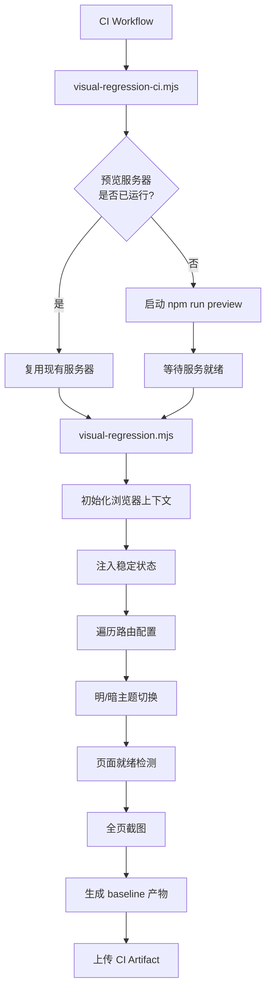
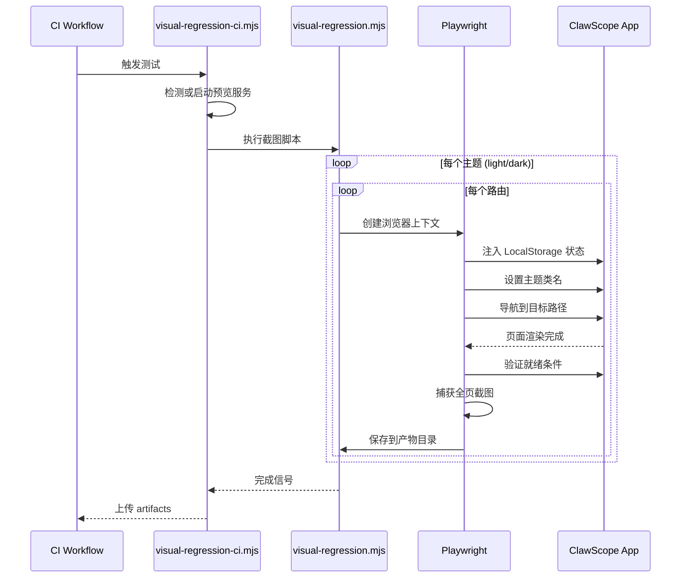

视觉回归测试是 ClawScope 项目质量保障体系的重要组成部分，通过自动化截图比对确保 UI 在不同主题和页面状态下的视觉一致性。本系统基于 Playwright 实现，支持明/暗双主题、多页面路由的批量截图捕获，并与 CI/CD 流程深度集成，为每次代码变更提供可靠的视觉基线验证。

## 架构概览

视觉回归测试系统采用分层架构设计，将环境准备、状态注入、截图捕获和产物管理解耦为独立模块。核心流程由两个脚本协同完成：`visual-regression-ci.mjs` 负责 CI 环境的预览服务器生命周期管理，`visual-regression.mjs` 则专注于页面遍历与截图生成。



Sources: [visual-regression-ci.mjs](scripts/visual-regression-ci.mjs#L41-L85), [visual-regression.mjs](scripts/visual-regression.mjs#L92-L124)

## 核心配置与路由定义

测试系统的行为通过环境变量和硬编码配置共同控制。基准 URL、视口尺寸、baseline 命名规则均可通过环境变量覆盖，确保在不同执行环境（本地开发、CI 流水线）下的灵活性。

| 环境变量 | 默认值 | 说明 |
|---------|--------|------|
| `VISUAL_BASE_URL` | `http://127.0.0.1:4173` | 目标应用地址 |
| `VISUAL_BASELINE_NAME` | 当前日期 ISO 格式 | 产物目录名称 |
| `VISUAL_VIEWPORT_WIDTH` | `1440` | 视口宽度（像素） |
| `VISUAL_VIEWPORT_HEIGHT` | `1200` | 视口高度（像素） |
| `VISUAL_GATEWAY_URL` | `http://127.0.0.1:18789` | 模拟网关地址 |
| `VISUAL_PORT` / `VISUAL_HOST` | `4173` / `127.0.0.1` | CI 脚本服务监听配置 |

路由配置采用声明式结构，每个路由条目包含名称、路径和就绪检测函数。就绪检测通过 URL 匹配与 DOM 元素存在性验证双重确认，确保截图时机在页面完全渲染之后。

Sources: [visual-regression.mjs](scripts/visual-regression.mjs#L5-L54)

## 状态注入与主题切换

为避免测试过程中出现设置向导干扰，系统通过 `seedStableState` 函数向浏览器注入预设的 LocalStorage 状态，模拟已完成初始配置的应用环境。状态包含主题偏好、网关连接信息及认证模式，使应用直接进入稳定运行状态而非引导流程。

主题切换通过 `setTheme` 函数实现，该函数在页面初始化脚本中设置 `theme` 键值并切换 `dark` 类名，与应用的 [主题系统与暗黑模式](14-zhu-ti-xi-tong-yu-an-hei-mo-shi) 实现保持一致。测试覆盖明/暗两种主题，每种主题下遍历全部路由，最终生成 `2 × 4 = 8` 张截图。



Sources: [visual-regression.mjs](scripts/visual-regression.mjs#L58-L86)

## 产物管理与保留策略

截图产物按 `<baseline-name>/<theme>/<route>.png` 的层级结构存储于 `artifacts/visual-regression/` 目录。`ci-baseline/` 目录作为仓库保留的默认基线，用于 CI 流程的 artifact 上传；按日期或版本命名的 baseline 则视为本地审查产物，不建议提交至版本库。

当前固定的页面截图命名对应应用的核心视图：
- `profile.png` — Profile 视图（代理身份管理）
- `memory.png` — Memory 视图（记忆库与文档管理）
- `config.png` — Config 视图（连接配置与设置）
- `evolution.png` — Evolution 视图（进化实验界面）

这些视图分别对应 [Profile 视图：代理身份管理](9-profile-shi-tu-dai-li-shen-fen-guan-li)、[Memory 视图：记忆库与文档管理](10-memory-shi-tu-ji-yi-ku-yu-wen-dang-guan-li)、[Config 视图：连接配置与设置](11-config-shi-tu-lian-jie-pei-zhi-yu-she-zhi)、[Evolution 视图：进化实验界面](12-evolution-shi-tu-jin-hua-shi-yan-jie-mian) 的文档页面。

Sources: [README.md](artifacts/visual-regression/README.md#L1-L22)

## 本地运行与 CI 集成

本地开发环境下，视觉回归测试提供两种运行模式：

**手动模式** — 适用于已有运行中的预览服务器：
```bash
npm run build
npm run preview -- --host 127.0.0.1 --port 4173
npm run visual:baseline
```

**自动模式** — CI 友好的无头一键流程，自动管理预览服务器生命周期：
```bash
npm run visual:ci
```

CI 工作流中，视觉回归测试作为 `check` job 的独立步骤执行，在 Rust 构建检查之后、artifact 上传之前运行。Playwright Chromium 浏览器在 job 初始化阶段安装，确保测试环境的可复现性。生成的 `ci-baseline` 产物通过 `actions/upload-artifact` 上传，供后续人工审查或自动化比对使用。

Sources: [ci.yml](.github/workflows/ci.yml#L37-L63), [package.json](package.json#L10-L11)

## 扩展与定制

如需添加新的路由到视觉回归覆盖范围，需在 `routes` 数组中追加配置项，定义页面就绪检测逻辑。就绪检测应基于页面特有的文本内容或 DOM 元素，确保截图时页面已完全加载而非处于加载中或错误状态。

自定义 baseline 名称可通过环境变量注入：
```bash
VISUAL_BASELINE_NAME=2026-04-02-theme-baseline npm run visual:baseline
```

自定义目标地址适用于非标准端口或远程预览环境：
```bash
VISUAL_BASE_URL=http://127.0.0.1:4173 npm run visual:baseline
```

Sources: [README.md](artifacts/visual-regression/README.md#L44-L54)

## 故障排查

| 现象 | 可能原因 | 解决方案 |
|------|---------|---------|
| 截图显示设置向导 | LocalStorage 状态未正确注入 | 检查 `stableStorageState` 配置与应用的存储键名一致性 |
| 页面就绪超时 | 预览服务器未启动或响应缓慢 | 确认 `npm run preview` 正常运行，或增加 `waitForUrl` 重试次数 |
| 暗色主题截图异常 | CSS 类名切换失败 | 验证 `document.documentElement.classList.toggle("dark", ...)` 执行时机 |
| CI 中 Chromium 安装失败 | 系统依赖缺失 | 确保 CI 镜像包含 `libwebkit2gtk-4.1-dev` 等依赖 |

Sources: [visual-regression.mjs](scripts/visual-regression.mjs#L81-L86), [visual-regression-ci.mjs](scripts/visual-regression-ci.mjs#L25-L39)

## 相关阅读

视觉回归测试与以下主题紧密相关：
- [主题系统与暗黑模式](14-zhu-ti-xi-tong-yu-an-hei-mo-shi) — 理解明/暗主题的实现机制
- [CI/CD 自动化工作流](23-ci-cd-zi-dong-hua-gong-zuo-liu) — 完整的持续集成配置说明
- [React 应用架构与路由设计](6-react-ying-yong-jia-gou-yu-lu-you-she-ji) — 被测试的路由结构定义