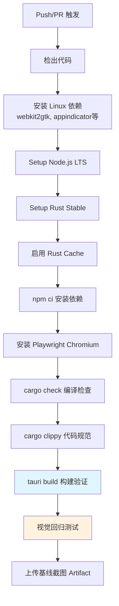
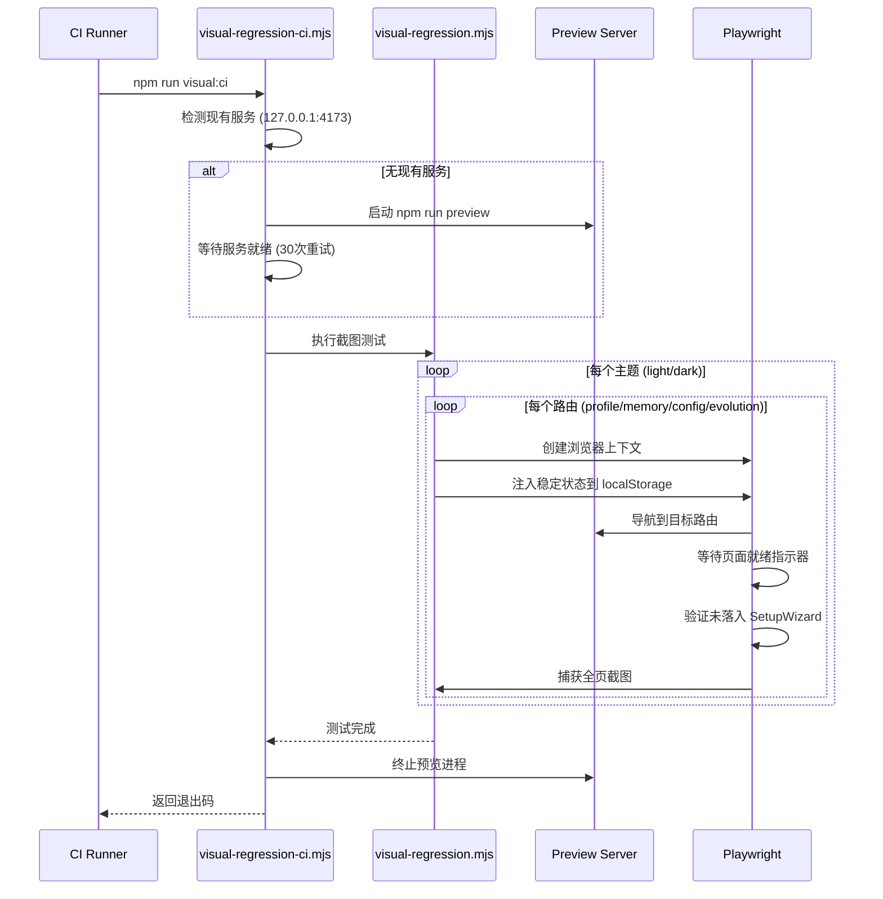
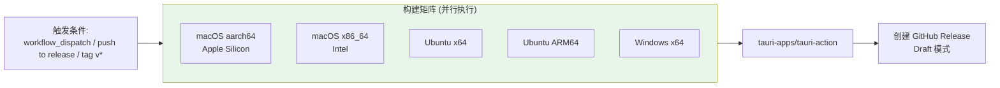

ClawScope 采用双轨并行的 CI/CD 架构：**持续集成（CI）工作流**负责代码质量验证与视觉回归测试，**发布（Release）工作流**负责跨平台桌面应用的自动化构建与分发。两条工作流均基于 GitHub Actions 实现，针对 Tauri 桌面应用的技术栈特性（Rust 后端 + React 前端）进行了专门优化。

## CI 工作流架构

CI 工作流在每次推送到 `main`/`master` 分支或发起 Pull Request 时触发，执行完整的质量门禁检查。该工作流采用单作业（single-job）设计，在 Ubuntu 22.04 环境下串行执行编译检查、代码规范审查、构建验证和视觉回归测试四个阶段。

**质量门禁的四个核心环节**构成了防御性开发的第一道防线。`cargo check` 验证 Rust 代码的编译正确性，`cargo clippy` 强制执行严格的代码风格规范（`-D warnings` 参数将警告视为错误），`npm run tauri build` 执行完整的桌面应用构建流程以验证前后端集成，最后通过 Playwright 驱动的视觉回归测试确保 UI 渲染的稳定性。

工作流针对 Tauri 应用的特殊需求配置了系统级依赖，包括 `libwebkit2gtk-4.1-dev`（WebKit 渲染引擎）、`libappindicator3-dev`（系统托盘支持）和 `librsvg2-dev`（SVG 图标处理）。Rust 缓存采用 `swatinem/rust-cache@v2` 动作，将 `src-tauri/target` 目录纳入缓存范围，显著缩短重复构建时间。Sources: [ci.yml](.github/workflows/ci.yml#L1-L64)

## 视觉回归测试集成

视觉回归测试是 ClawScope CI 的核心特色，通过 Playwright 在无头 Chromium 中捕获四个核心视图的明/暗主题截图，建立可追踪的视觉基线。

测试执行流程由 `visual-regression-ci.mjs` 脚本编排：首先检测是否存在已运行的预览服务器，若不存在则启动 `npm run preview` 作为测试目标，等待服务就绪后调用 `visual-regression.mjs` 执行实际截图，最后无论测试结果如何都确保清理预览进程。这种设计允许在本地开发时复用已运行的服务，同时在 CI 环境中实现完整的一键测试。

截图测试覆盖 Profile（代理身份管理）、Memory（记忆库）、Config（连接配置）和 Evolution（进化实验）四个核心视图，每个视图在 1440×1200 视口下分别捕获明/暗主题。测试脚本通过 `seedStableState` 函数注入预设的 localStorage 状态，确保测试环境的一致性——包括主题设置、网关 URL 和认证模式等关键配置。Sources: [visual-regression-ci.mjs](scripts/visual-regression-ci.mjs#L1-L86), [visual-regression.mjs](scripts/visual-regression.mjs#L1-L125)

测试产物按照 `artifacts/visual-regression/<baseline-name>/<theme>/<route>.png` 的结构组织，CI 工作流将 `ci-baseline` 目录作为 Artifact 上传，供后续人工审查或自动化比对使用。Sources: [README.md](artifacts/visual-regression/README.md#L1-L77)

## 发布工作流架构

Release 工作流支持两种触发模式：手动触发（`workflow_dispatch`）和自动触发（推送到 `release` 分支或推送 `v*` 标签）。该工作流采用矩阵策略（matrix strategy）实现真正的跨平台并行构建，同时生成 macOS（Intel/Apple Silicon 双架构）、Linux（x64/ARM64 双架构）和 Windows 的发行包。

矩阵配置的精妙之处在于平台特定的构建参数传递：macOS 构建需要显式指定 `--target` 参数以生成对应架构的二进制文件，并通过 `rust-toolchain` 动作的 `targets` 输入预装多架构支持；Ubuntu 构建需要安装与 CI 相同的系统依赖；Windows 构建则依赖 Tauri 的默认配置。`fail-fast: false` 确保单个平台构建失败不会中断其他平台的构建流程。Sources: [release.yml](.github/workflows/release.yml#L1-L68)

发布动作使用 `tauri-apps/tauri-action@v0`，该官方动作封装了 Tauri CLI 的复杂调用逻辑，自动处理代码签名、应用打包和 Release 创建。配置中的 `releaseDraft: true` 将发布创建为草稿状态，需要人工审核后正式发布；`tagName` 和 `releaseName` 中的 `__VERSION__` 占位符会被自动替换为 `package.json` 或 `Cargo.toml` 中定义的版本号。

## 缓存策略与性能优化

两条工作流均实施了多层缓存策略以优化构建性能。Node.js 依赖通过 `actions/setup-node@v4` 的内置缓存机制管理，基于 `package-lock.json` 的哈希值实现精确缓存。Rust 依赖则通过 `swatinem/rust-cache@v2` 进行智能缓存，该动作识别 `Cargo.lock` 的变化并缓存 `target` 目录的编译产物，在依赖未变更时可将 Rust 构建时间从数分钟缩短至数十秒。

| 缓存层级 | 管理动作 | 缓存键依据 | 适用工作流 |
|---------|---------|-----------|-----------|
| Node.js 依赖 | `actions/setup-node@v4` | `package-lock.json` | CI, Release |
| Rust 编译产物 | `swatinem/rust-cache@v2` | `Cargo.lock` + 工具链版本 | CI, Release |
| Playwright 浏览器 | `npx playwright install` | Playwright 版本 | CI |

缓存策略在 Release 工作流中尤为重要，因为矩阵构建会在五个独立 Runner 上重复执行相似的依赖安装步骤，有效的缓存可以显著降低整体发布时间和 GitHub Actions 的分钟数消耗。

## 环境变量与配置约定

CI/CD 工作流通过环境变量实现行为控制，关键配置如下：

| 变量名 | 默认值 | 用途 | 设置位置 |
|-------|-------|------|---------|
| `CI` | - | 启用 CI 模式，禁用交互式提示 | CI 步骤环境 |
| `VISUAL_BASELINE_NAME` | `ci-baseline` | 视觉基线目录名称 | CI 步骤环境 |
| `VISUAL_BASE_URL` | `http://127.0.0.1:4173` | 视觉测试目标地址 | 脚本内部 |
| `VISUAL_PORT` | `4173` | 预览服务器端口 | 脚本内部 |
| `GITHUB_TOKEN` | `${{ secrets.GITHUB_TOKEN }}` | GitHub API 认证 | Release 步骤环境 |

视觉回归脚本支持通过环境变量进行灵活配置，允许在本地开发时覆盖默认行为。例如，使用自定义基线名称可以保留多轮测试的历史记录，指定外部服务地址则支持针对部署环境进行测试。Sources: [visual-regression.mjs](scripts/visual-regression.mjs#L5-L10)

## 故障排查指南

**CI 构建失败常见问题：**

| 症状 | 可能原因 | 解决方案 |
|-----|---------|---------|
| `cargo clippy` 报错 | Rust 代码存在警告或错误 | 本地运行 `cargo clippy -- -D warnings` 修复 |
| Tauri 构建失败 | 系统依赖缺失 | 确保 CI 步骤包含 Linux 依赖安装 |
| 视觉测试超时 | 预览服务启动失败 | 检查 `npm run build` 是否成功生成 dist |
| 截图落入 SetupWizard | localStorage 状态注入失败 | 检查路由就绪指示器选择器是否匹配 |

**Release 构建失败常见问题：**

| 症状 | 可能原因 | 解决方案 |
|-----|---------|---------|
| macOS ARM64 构建失败 | Rust target 未安装 | 检查 `targets` 参数是否包含 `aarch64-apple-darwin` |
| Ubuntu ARM64 构建失败 | 平台标签错误 | 确认使用 `ubuntu-22.04-arm` 标签 |
| Release 创建失败 | 权限不足 | 检查 `permissions: contents: write` 是否配置 |

## 延伸阅读

- 视觉回归测试的详细实现原理与本地运行方式，请参考 [视觉回归测试流程](22-shi-jue-hui-gui-ce-shi-liu-cheng)
- 桌面应用的打包配置与签名设置，请参考 [桌面应用打包配置](25-zhuo-mian-ying-yong-da-bao-pei-zhi)
- 跨平台构建的平台特定注意事项，请参考 [跨平台构建注意事项](26-kua-ping-tai-gou-jian-zhu-yi-shi-xiang)