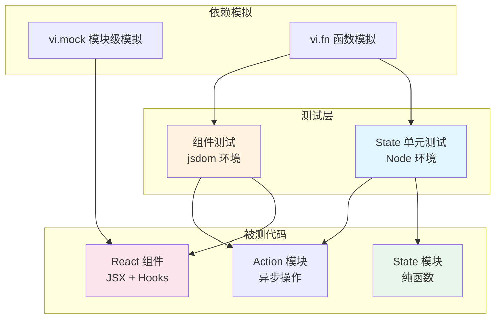

ClawScope 采用 **Vitest** 作为测试框架，配合 **Testing Library** 进行 React 组件测试。测试策略遵循"纯函数优先"原则——将业务逻辑抽取到独立的 state 模块中进行单元测试，组件层则聚焦于交互行为和渲染验证。这种分层测试架构确保了核心逻辑的可测试性，同时避免了过度依赖 UI 实现细节。

Sources: [package.json](package.json#L1-L80)

## 测试技术栈与配置

项目测试基础设施基于 Vitest 构建，无需额外配置文件即可运行。测试环境支持两种模式：**Node 环境**用于纯逻辑测试，**jsdom 环境**用于需要 DOM 操作的组件测试。通过 `@vitest-environment` 注释指令可在文件级别切换环境。

| 依赖项 | 用途 |
|--------|------|
| `vitest` | 测试运行器和断言库 |
| `@testing-library/react` | React 组件渲染和查询 |
| `@testing-library/user-event` | 用户交互模拟 |
| `jsdom` | 浏览器环境模拟 |

Sources: [package.json](package.json#L67-L77), [src/app/components/views/MemoryKnowledgePanel.test.tsx](src/app/components/views/MemoryKnowledgePanel.test.tsx#L1-L3)

## 单元测试：State 模块

State 模块是 ClawScope 测试策略的核心。这些模块导出纯函数，负责处理复杂的业务逻辑、数据转换和状态计算。由于不依赖 React 或浏览器 API，它们可以在 Node 环境中快速执行。

### 测试模式：纯函数验证

State 模块测试遵循**输入-输出对照**模式，每个测试用例明确验证特定输入条件下的预期输出。

```typescript
// 示例：记忆库状态选择器测试
describe("resolveSelectedMemoryAgentId", () => {
  it("keeps the current id when it still exists", () => {
    expect(
      resolveSelectedMemoryAgentId("agent-b", ["agent-a", "agent-b"]),
    ).toBe("agent-b");
  });

  it("falls back to the first agent when current id is missing", () => {
    expect(
      resolveSelectedMemoryAgentId("missing", ["agent-a", "agent-b"]),
    ).toBe("agent-a");
  });
});
```

Sources: [src/app/components/views/memoryState.test.ts](src/app/components/views/memoryState.test.ts#L1-L50)

### 核心 State 模块测试覆盖

项目中的主要 State 模块均已建立完整测试覆盖：

| 模块 | 测试文件 | 测试重点 |
|------|----------|----------|
| `memoryState.ts` | [memoryState.test.ts](src/app/components/views/memoryState.test.ts) | 记忆库文档选择、搜索匹配、时间线分组 |
| `memorySearchState.ts` | [memorySearchState.test.ts](src/app/components/views/memorySearchState.test.ts) | 语义搜索源分类、结果分组排序 |
| `memorySemanticState.ts` | [memorySemanticState.test.ts](src/app/components/views/memorySemanticState.test.ts) | 语义概念提取、知识图谱构建 |
| `memoryConfigStatus.ts` | [memoryConfigStatus.test.ts](src/app/components/views/memoryConfigStatus.test.ts) | 配置状态汇总、运行时匹配检测 |
| `memoryKnowledgeActions.ts` | [memoryKnowledgeActions.test.ts](src/app/components/views/memoryKnowledgeActions.test.ts) | 异步操作封装、错误分类处理 |
| `agentSettingsState.ts` | [agentSettingsState.test.ts](src/app/components/setup/agentSettingsState.test.ts) | 代理选择、权限校验 |
| `profileIdentityDocument.ts` | [profileIdentityDocument.test.ts](src/app/components/views/profileIdentityDocument.test.ts) | 身份文档解析与更新 |
| `contextSingleton.ts` | [contextSingleton.test.ts](src/app/contexts/contextSingleton.test.ts) | 单例模式缓存 |
| `openClawStorage.ts` | [openClawStorage.test.ts](src/app/contexts/openClawStorage.test.ts) | 本地存储读写与迁移 |

Sources: [src/app/components/views/memoryState.test.ts](src/app/components/views/memoryState.test.ts#L1-L844), [src/app/components/views/memoryKnowledgeActions.test.ts](src/app/components/views/memoryKnowledgeActions.test.ts#L1-L94)

### 错误处理测试

Action 模块测试特别关注错误路径，验证错误分类逻辑能够正确识别各种故障场景：

```typescript
it("wraps local-only config bridge errors with stable message", async () => {
  vi.mocked(gatewayConfigSetLocal).mockRejectedValueOnce(
    new Error("local-only config.set bridge for remote gateway sessions"),
  );

  await expect(setExternalKnowledgePaths(["D:/docs"], t)).rejects.toMatchObject({
    code: "local_only",
    message: "memory.knowledge.error.localOnly",
  });
});
```

Sources: [src/app/components/views/memoryKnowledgeActions.test.ts](src/app/components/views/memoryKnowledgeActions.test.ts#L17-L28)

## 组件测试：React 组件

组件测试使用 `@testing-library/react` 和 `jsdom` 环境，验证组件渲染输出和用户交互行为。测试策略侧重于**用户视角的验证**，而非实现细节检查。

### 测试环境配置

组件测试文件顶部需添加环境注释：

```typescript
// @vitest-environment jsdom
import { describe, expect, it, vi, beforeEach } from "vitest";
import { render, screen, waitFor } from "@testing-library/react";
import userEvent from "@testing-library/user-event";
```

Sources: [src/app/components/views/MemoryKnowledgePanel.test.tsx](src/app/components/views/MemoryKnowledgePanel.test.tsx#L1-L5)

### Mock 策略

组件测试广泛使用 Vitest 的 `vi.mock` 进行模块级模拟，隔离被测组件的依赖：

```typescript
// 模拟 toast 通知
vi.mock("sonner", () => ({
  toast: {
    success: vi.fn(),
    error: vi.fn(),
  },
}));

// 模拟子组件
vi.mock("./MemoryMindMapPanel", () => ({
  MemoryMindMapPanel: () => <div data-testid="mindmap-panel" />,
}));

// 模拟 action 模块
vi.mock("./memoryKnowledgeActions", () => ({
  runExternalKnowledgeReindex: vi.fn(),
  setExternalKnowledgePaths: vi.fn(),
}));
```

Sources: [src/app/components/views/MemoryKnowledgePanel.test.tsx](src/app/components/views/MemoryKnowledgePanel.test.tsx#L7-L22)

### 交互测试模式

组件测试使用 `userEvent` 模拟真实用户操作，配合 `waitFor` 处理异步状态更新：

```typescript
it("enables session memory and auto-adds sessions source", async () => {
  vi.mocked(setSessionMemoryEnabled).mockResolvedValue({ kind: "set_session_memory", stdout: "ok" });
  
  render(<MemoryKnowledgePanel {...baseProps} />);
  const user = userEvent.setup();
  const toggles = screen.getAllByRole("checkbox");
  await user.click(toggles[0]!);

  await waitFor(() => {
    expect(setSessionMemoryEnabled).toHaveBeenCalledWith(true, t);
    expect(setExternalKnowledgeSources).toHaveBeenCalledWith(["memory", "sessions"], t);
  });
});
```

Sources: [src/app/components/views/MemoryKnowledgePanel.test.tsx](src/app/components/views/MemoryKnowledgePanel.test.tsx#L67-L82)

## 测试执行

运行测试使用 npm 脚本：

```bash
# 运行所有测试
npm run test

# 等价于
npx vitest run
```

Sources: [package.json](package.json#L12)

## 测试架构图



## 编写新测试的最佳实践

### State 模块测试

1. **测试文件命名**：与被测模块同名，添加 `.test.ts` 后缀，如 `memoryState.test.ts` 对应 `memoryState.ts`
2. **测试组织**：使用 `describe` 按函数分组，`it` 描述具体场景
3. **边界条件**：覆盖空值、越界、异常输入等边界情况
4. **纯函数原则**：避免副作用，每个测试独立运行

Sources: [src/app/components/views/memorySemanticState.test.ts](src/app/components/views/memorySemanticState.test.ts#L1-L167)

### 组件测试

1. **最小化模拟**：仅模拟直接依赖，保留组件核心行为
2. **查询优先**：优先使用 `screen.getByRole`、`getByText` 等语义化查询
3. **用户事件**：使用 `userEvent` 而非 `fireEvent` 模拟交互
4. **异步处理**：使用 `waitFor` 等待状态更新完成

Sources: [src/app/components/views/MemoryKnowledgePanel.test.tsx](src/app/components/views/MemoryKnowledgePanel.test.tsx#L84-L97)

## 与 CI/CD 集成

测试在持续集成流程中自动执行。当前 CI 配置主要关注构建验证和视觉回归测试，单元测试可通过扩展 CI 工作流集成。

Sources: [.github/workflows/ci.yml](.github/workflows/ci.yml#L1-L64)

## 相关页面

- [视觉回归测试流程](22-shi-jue-hui-gui-ce-shi-liu-cheng) — 了解 UI 层面的自动化测试
- [CI/CD 自动化工作流](23-ci-cd-zi-dong-hua-gong-zuo-liu) — 完整的持续集成配置
- [Memory 视图：记忆库与文档管理](10-memory-shi-tu-ji-yi-ku-yu-wen-dang-guan-li) — 被测功能模块的业务背景