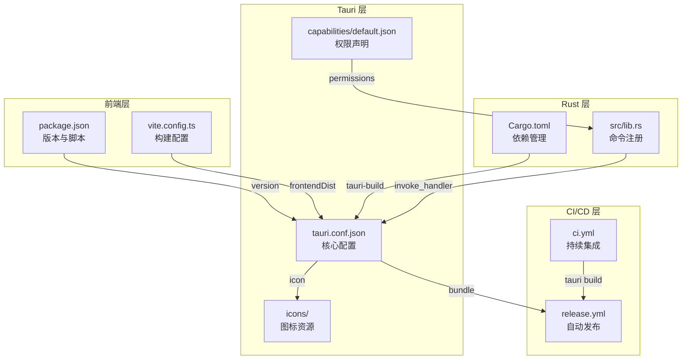

ClawScope 基于 Tauri 2.0 框架构建桌面应用，通过统一的配置体系实现跨平台打包。本文档详细解析打包配置的核心要素，涵盖 Tauri 配置、前端构建、图标资源、权限声明以及 CI/CD 自动化发布流程，帮助开发者理解并定制应用的打包行为。

## Tauri 核心配置解析

Tauri 的配置文件 `tauri.conf.json` 是打包流程的中枢，定义了应用元数据、构建流程、窗口行为和分发设置。该配置采用 JSON 格式，并通过 `$schema` 字段关联到 Tauri 官方 Schema 以提供 IDE 自动补全支持。

**应用标识与版本管理**通过 `productName`、`version` 和 `identifier` 字段实现。`productName` 为显示名称，`identifier` 采用反向域名格式（`com.claw.scope`），是操作系统识别应用的唯一标识。版本号遵循语义化版本规范，与 `package.json` 和 `Cargo.toml` 保持一致。

**构建流程配置**定义了开发服务器和前端构建的集成方式。`beforeDevCommand` 和 `beforeBuildCommand` 分别指定开发和生产构建时执行的前端脚本，`devUrl` 配置开发服务器地址，`frontendDist` 指向构建产物目录。这种设计实现了前后端构建的无缝衔接。

**窗口配置**采用无装饰（`decorations: false`）设计，由前端自主实现标题栏，支持自定义拖拽区域。窗口尺寸设定为 1440×900，最小尺寸限制为 1280×820，确保界面元素在各分辨率下的可用性。

**分发配置（bundle）**控制打包目标平台和输出格式。`targets: "all"` 表示构建所有支持的平台，包括 Windows 的 MSI/NSIS、macOS 的 DMG/App 以及 Linux 的 DEB/AppImage。`category` 归类为开发者工具，描述信息支持中英文展示。

Sources: [tauri.conf.json](src-tauri/tauri.conf.json#L1-L39)

## Rust 后端配置

`Cargo.toml` 定义了 Rust 后端的依赖管理和编译特性。作为 Tauri 应用的核心运行时，该配置决定了后端的功能边界和性能特征。

**包元数据**与前端配置保持同步，包括名称、版本、描述和许可证信息。`edition = "2024"` 指定使用 Rust 2024 版本，启用最新的语言特性和标准库改进。

**核心依赖**包括 Tauri 运行时（`tauri`）、异步运行时（`tokio`）、序列化框架（`serde`/`serde_json`）以及加密库（`ed25519-dalek`、`sha2`）。`tauri-plugin-dialog` 和 `tauri-plugin-shell` 提供系统对话框和外部命令执行能力，支撑文件选择和 URL 打开等功能。

**自定义协议特性**通过 `custom-protocol` feature 启用，这是生产构建的必要配置。该特性将前端资源嵌入到二进制文件中，使应用能够以 `tauri://` 协议访问本地资源，而非依赖外部服务器。

Sources: [Cargo.toml](src-tauri/Cargo.toml#L1-L36)

## 前端构建配置

Vite 作为前端构建工具，其配置与 Tauri 打包流程深度集成。`vite.config.ts` 中的关键配置项直接影响最终应用包的体积和兼容性。

**开发服务器配置**固定使用 127.0.0.1:1420 作为服务地址，与 `tauri.conf.json` 中的 `devUrl` 保持一致。HMR（热模块替换）使用独立端口 1421，避免与主服务冲突。`strictPort: true` 确保端口被占用时立即报错，而非自动切换端口导致 Tauri 连接失败。

**构建目标适配**根据目标平台动态调整。Windows 平台针对 Chrome 105 优化，macOS 则针对 Safari 13 优化，确保 WebView2 和 WebKit 的兼容性。`minify` 和 `sourcemap` 根据 `TAURI_DEBUG` 环境变量控制，调试构建保留源码映射以支持错误追踪。

**路径别名**配置 `@` 指向 `./src` 目录，简化模块导入路径。`assetsInclude` 扩展了静态资源类型，支持 SVG 和 CSV 文件的内联或复制处理。

Sources: [vite.config.ts](vite.config.ts#L1-L33)

## 图标资源规范

Tauri 要求提供多尺寸、多格式的图标资源以适配不同平台和场景。ClawScope 的图标资源位于 `src-tauri/icons/` 目录，遵循平台特定的命名和尺寸规范。

**通用图标**包括 PNG 格式（32×32、64×64、128×128、256×256@2x）和 ICO 格式（Windows）、ICNS 格式（macOS）。这些图标用于应用窗口、任务栏、安装程序和系统设置。

**Windows 专用图标**采用 Square 命名规范，覆盖 30×30 到 310×310 的多种尺寸，用于开始菜单磁贴、商店展示和不同 DPI 缩放场景。

**移动端图标**分别位于 `android/` 和 `ios/` 子目录。Android 使用 mipmap 结构，按密度（hdpi、xhdpi、xxhdpi、xxxhdpi）组织，支持自适应图标（adaptive icons）。iOS 使用 Apple 标准的命名规范（如 `AppIcon-60x60@2x`），覆盖所有设备和场景需求。

图标更新后需重新执行 `npm run tauri icon` 命令，Tauri CLI 将自动生成所有平台所需的尺寸变体。

Sources: [tauri.conf.json](src-tauri/tauri.conf.json#L31-L36)

## 权限与安全配置

Tauri 2.0 引入能力（Capability）系统，通过声明式配置控制前端可访问的系统 API。`capabilities/default.json` 定义了 ClawScope 的默认权限集合。

**核心权限**（`core:default`）包含应用运行所需的基础能力，如文件系统读取、网络请求等。该权限集经过 Tauri 团队审核，安全性有保障。

**窗口控制权限**显式声明了窗口拖拽（`allow-start-dragging`）、关闭、最小化和最大化操作。由于应用采用无装饰窗口设计，这些权限支撑了自定义标题栏的实现。

权限配置遵循最小权限原则，仅授予功能实现所必需的 API 访问权限。新增功能需要扩展权限时，应在此文件中添加相应的 `allow-*` 声明，并在代码中使用 Tauri 的权限检查 API 进行运行时验证。

Sources: [default.json](src-tauri/capabilities/default.json#L1-L13)

## CI/CD 自动化发布

`.github/workflows/release.yml` 定义了跨平台自动打包和发布流程，基于 GitHub Actions 实现。

**触发条件**包括手动触发（`workflow_dispatch`）和版本标签推送（`v*` 格式）。发布分支限定为 `release`，确保只有经过验证的代码进入分发流程。

**构建矩阵**覆盖五大目标平台：macOS（Intel 和 Apple Silicon 双架构）、Ubuntu（x64 和 ARM64）、Windows。每个平台使用对应的 GitHub-hosted runner，macOS 通过 `--target` 参数实现双架构构建。

**依赖安装**阶段针对 Ubuntu 安装系统级依赖（webkit2gtk、appindicator、librsvg），这些是 Tauri 在 Linux 平台运行的必要组件。其他平台依赖由 runner 预装或自动下载。

**Rust 缓存**配置使用 `swatinem/rust-cache`，将 `src-tauri/target` 目录作为缓存对象，显著缩短重复构建时间。

**发布动作**使用 `tauri-apps/tauri-action`，自动创建 GitHub Release 并上传各平台的安装包。`releaseDraft: true` 将发布标记为草稿，需手动确认后才对外可见。

Sources: [release.yml](.github/workflows/release.yml#L1-L68)

## 本地打包命令

开发者可通过以下命令在本地执行打包：

```bash
# 开发模式（热重载）
npm run tauri dev

# 生产构建（当前平台）
npm run tauri build

# 构建特定目标平台
npm run tauri build -- --target x86_64-pc-windows-msvc
```

首次打包时会自动下载 Tauri 所需的系统依赖和工具链，后续构建将利用缓存加速。构建产物位于 `src-tauri/target/release/bundle/`，包含各平台的安装包和可执行文件。

## 配置关联图

以下 Mermaid 图展示了打包配置文件的依赖关系和数据流向：



## 相关阅读

- [构建与打包发布](3-gou-jian-yu-da-bao-fa-bu) — 完整的构建流程指南
- [跨平台构建注意事项](26-kua-ping-tai-gou-jian-zhu-yi-shi-xiang) — 各平台特殊配置与问题排查
- [CI/CD 自动化工作流](23-ci-cd-zi-dong-hua-gong-zuo-liu) — 持续集成详细配置