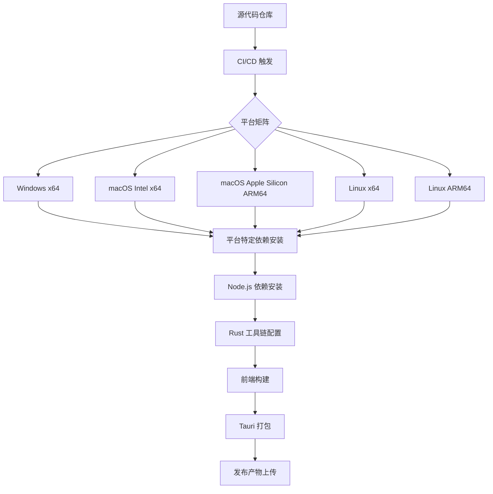
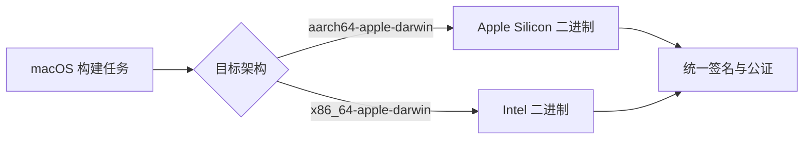

ClawScope 基于 Tauri v2 框架构建，采用 Rust 后端与 React 前端的技术架构，支持 Windows、macOS 和 Linux 三大桌面平台的原生应用打包。本文档面向高级开发者，详细阐述跨平台构建过程中的关键配置、平台特定依赖、CI/CD 自动化流程以及常见问题的解决方案。

## 构建架构概览

ClawScope 的跨平台构建流程遵循 Tauri 的标准构建模式，通过 GitHub Actions 实现自动化多平台发布。构建系统需要协调 Node.js 前端工具链、Rust 编译器以及各平台特定的系统依赖。



构建流程的核心在于平台矩阵策略，每个平台需要独立配置运行环境、系统依赖和编译参数。release 工作流通过 `matrix.include` 定义了五个构建目标，确保覆盖主流桌面平台架构。

Sources: [release.yml](.github/workflows/release.yml#L12-L25)

## 平台特定依赖配置

### Windows 构建环境

Windows 平台构建相对简单，主要依赖 Visual Studio 的 C++ 构建工具。Tauri 在 Windows 上使用 WebView2 运行时，该组件在现代 Windows 系统中已预装。构建时无需额外安装系统级依赖，仅需确保 Node.js 和 Rust 工具链正确配置。

Windows 构建产物包括 `.msi` 安装包和 `.exe` 便携版本，通过 Tauri 的 bundler 自动生成。

Sources: [release.yml](.github/workflows/release.yml#L24-L25)

### macOS 双架构支持

macOS 平台需要同时支持 Intel (x86_64) 和 Apple Silicon (aarch64) 两种架构。ClawScope 的 CI 配置通过矩阵策略分别构建两个目标架构，使用 `--target` 参数指定 Rust 编译目标。



macOS 构建需要特别注意代码签名和公证流程。虽然当前配置未显式配置签名证书，但在实际发布时需要通过 `APPLE_SIGNING_IDENTITY` 等环境变量配置开发者证书。双架构构建产物最终可以合并为 Universal Binary，或通过单独的安装包分发。

Sources: [release.yml](.github/workflows/release.yml#L13-L19), [Cargo.toml](src-tauri/Cargo.toml#L31-L33)

### Linux 系统依赖

Linux 构建是最复杂的环节，需要安装 WebKitGTK 和其他系统库。ClawScope 的 CI 配置针对 Ubuntu 22.04 定义了必需的依赖包：

| 依赖包 | 用途 |
|--------|------|
| `libwebkit2gtk-4.1-dev` | WebKitGTK 4.1 开发库，提供 WebView 支持 |
| `libappindicator3-dev` | 系统托盘图标支持 |
| `librsvg2-dev` | SVG 图像渲染支持 |
| `patchelf` | 二进制文件补丁工具，用于修复动态链接 |

Linux 构建产物包括 `.deb` 包（Debian/Ubuntu）、`.rpm` 包（Fedora/openSUSE）以及 AppImage 通用格式。ARM64 架构的构建使用 `ubuntu-22.04-arm` 运行器，确保与 x64 构建保持一致的依赖环境。

Sources: [ci.yml](.github/workflows/ci.yml#L15-L17), [release.yml](.github/workflows/release.yml#L33-L36)

## Tauri 配置与平台适配

### 应用标识与元数据

Tauri 配置文件定义了跨平台一致的应用标识和元数据。`identifier` 字段使用反向域名格式 `com.claw.scope`，这是 macOS 和 Linux 平台上应用唯一标识的基础。版本号遵循语义化版本规范，与 `package.json` 和 `Cargo.toml` 保持同步。

窗口配置在 `tauri.conf.json` 中定义，包括默认尺寸、最小尺寸约束以及无边框设置。这些配置在所有平台上保持一致的行为，但具体渲染效果会受各平台窗口管理器影响。

Sources: [tauri.conf.json](src-tauri/tauri.conf.json#L1-L40)

### 自定义协议配置

Cargo.toml 中定义了 `custom-protocol` feature，这是 Tauri v2 的推荐配置，用于生产环境构建。自定义协议允许应用使用 `tauri://` 或应用特定的协议 scheme 加载前端资源，提供比 `http://localhost` 更好的安全性和用户体验。

```toml
[features]
default = ["custom-protocol"]
custom-protocol = ["tauri/custom-protocol"]
```

开发模式下使用 `http://127.0.0.1:1420` 本地服务器热重载，生产构建则打包为嵌入式资源并通过自定义协议访问。

Sources: [Cargo.toml](src-tauri/Cargo.toml#L31-L33)

### 图标资源规范

跨平台应用需要提供多种尺寸和格式的图标资源，以满足不同平台的规范要求。ClawScope 的图标目录包含以下资源：

| 平台 | 格式 | 尺寸要求 |
|------|------|----------|
| Windows | `.ico` | 多尺寸合成（16x16 至 256x256）|
| macOS | `.icns` | 多尺寸合成（16x16 至 512x512@2x）|
| Linux | `.png` | 128x128, 256x256 |
| Android | PNG 目录 | mdpi 至 xxxhdpi |
| iOS | PNG 集合 | 20x20@1x 至 60x60@3x |

`tauri.conf.json` 的 `bundle.icon` 字段明确列出了 Windows 和 Linux 构建所需的图标文件。macOS 使用 `icon.icns`，iOS 和 Android 使用各自子目录中的资源。

Sources: [tauri.conf.json](src-tauri/tauri.conf.json#L28-L32)

## 前端构建的平台适配

### Vite 构建目标配置

Vite 配置文件根据目标平台调整构建参数。`build.target` 字段根据 `TAURI_ENV_PLATFORM` 环境变量设置为 `chrome105`（Windows）或 `safari13`（macOS/Linux），确保生成的 JavaScript 代码与 Tauri 内置的 WebView 引擎兼容。

代码压缩和 sourcemap 生成由 `TAURI_DEBUG` 环境变量控制，调试构建保留 sourcemap 便于问题排查，发布构建启用压缩减小产物体积。

Sources: [vite.config.ts](vite.config.ts#L28-L32)

### 资源路径处理

Vite 配置中的 `envPrefix` 允许以 `VITE_` 和 `TAURI_` 开头的环境变量被前端代码访问。这在跨平台场景下尤为重要，因为某些功能可能需要根据平台类型进行条件渲染或行为调整。

`assetsInclude` 配置显式包含了 `.svg` 和 `.csv` 文件类型，确保这些资源在构建过程中被正确处理。跨平台构建时，资源路径的解析需要保持一致性，Vite 的 `resolve.alias` 配置提供了 `@` 指向 `src` 目录的快捷方式。

Sources: [vite.config.ts](vite.config.ts#L22-L26)

## 本地存储与数据路径

### 跨平台存储路径解析

ClawScope 的 Gateway 模块需要持久化存储设备身份和认证令牌。`store.rs` 实现了跨平台的路径解析逻辑，根据不同操作系统的惯例选择合适的数据目录：

| 平台 | 环境变量 | 存储路径 |
|------|----------|----------|
| Windows | `APPDATA` | `%APPDATA%\claw-scope\gateway` |
| macOS/Linux | `HOME` | `~/.claw-scope/gateway` |
| 降级方案 | 当前目录 | `./.claw-scope/gateway` |

路径解析函数 `resolve_default_store_root` 按优先级检查环境变量，确保在各平台上都能找到合适的数据持久化位置。这种设计遵循了各平台的文件系统惯例，Windows 使用 Roaming AppData，Unix 类系统使用隐藏目录。

Sources: [store.rs](src-tauri/src/gateway/store.rs#L63-L77)

### 设备身份持久化

设备身份（Ed25519 密钥对）生成后存储在 `identity/device.json` 文件中，认证令牌存储在 `identity/device-auth.json` 中。存储操作使用原子写入模式，先序列化为 JSON 字符串，再写入文件系统，确保数据完整性。

跨平台文件操作通过 Rust 标准库的 `fs` 模块实现，路径操作使用 `std::path::PathBuf`，自动处理 Windows 反斜杠和 Unix 正斜杠的差异。

Sources: [store.rs](src-tauri/src/gateway/store.rs#L1-L10)

## CI/CD 构建流程

### 持续集成检查

CI 工作流在每次推送和 Pull Request 时触发，执行代码质量检查和冒烟构建。Linux 环境需要安装与发布构建相同的系统依赖，确保开发环境与生产环境的一致性。

CI 流程包括以下关键步骤：
1. 安装 Linux 系统依赖（WebKitGTK 等）
2. 配置 Node.js LTS 版本和 npm 缓存
3. 配置 Rust stable 工具链
4. 启用 Rust 缓存加速后续构建
5. 执行 `cargo check` 和 `cargo clippy` 静态分析
6. 执行完整 Tauri 构建验证
7. 运行视觉回归测试

视觉回归测试使用 Playwright 和 Chromium，生成 UI 截图并与基线对比，确保跨平台 UI 一致性。

Sources: [ci.yml](.github/workflows/ci.yml#L1-L64)

### 发布工作流矩阵

Release 工作流支持手动触发 (`workflow_dispatch`) 和标签触发 (`push.tags`) 两种模式。矩阵构建策略确保同时生成所有平台的安装包：

```yaml
matrix:
  include:
    - platform: macos-latest
      args: '--target aarch64-apple-darwin'
    - platform: macos-latest
      args: '--target x86_64-apple-darwin'
    - platform: ubuntu-22.04
      args: ''
    - platform: ubuntu-22.04-arm
      args: ''
    - platform: windows-latest
      args: ''
```

`tauri-action` 自动处理版本号替换（`v__VERSION__`）、发布草稿创建和产物上传。每个平台构建独立执行，`fail-fast: false` 确保单个平台失败不会影响其他平台。

Sources: [release.yml](.github/workflows/release.yml#L1-L68)

## 平台特定注意事项

### Windows 特定问题

Windows 构建可能遇到以下问题：
- **WebView2 运行时缺失**：旧版 Windows 10 可能需要安装 WebView2 Runtime
- **路径长度限制**：某些构建工具对长路径敏感，建议启用 Windows 长路径支持
- **杀毒软件误报**：新生成的可执行文件可能被 Windows Defender 标记，需要代码签名建立信誉

### macOS 特定问题

macOS 构建需要关注：
- **代码签名**：未签名的应用会被 Gatekeeper 阻止运行，需要 Apple Developer 证书
- **公证**：macOS 10.15+ 要求应用经过 Apple 公证才能在默认安全设置下运行
- **沙盒**：App Store 分发需要启用沙盒，当前配置针对直接分发优化

### Linux 特定问题

Linux 构建的复杂性主要来自：
- **发行版差异**：不同发行版的库版本和路径可能不同，建议基于较旧的 Ubuntu LTS 构建以保证兼容性
- **Wayland 与 X11**：Tauri 应用在不同显示服务器下的行为可能有细微差异
- **系统托盘**：`libappindicator` 在某些桌面环境中需要额外配置

## 故障排查指南

| 症状 | 可能原因 | 解决方案 |
|------|----------|----------|
| Linux 构建失败，提示 WebKitGTK 相关错误 | 缺少系统依赖 | 安装 `libwebkit2gtk-4.1-dev` 等依赖包 |
| macOS 构建警告 about code signing | 缺少签名证书 | 配置 `APPLE_SIGNING_IDENTITY` 环境变量或使用自签名 |
| Windows 构建产物无法启动 | WebView2 缺失 | 安装 WebView2 Runtime 或随应用分发 |
| 前端资源加载 404 | 路径配置错误 | 检查 `tauri.conf.json` 的 `frontendDist` 路径 |
| Rust 编译缓存未命中 | 缓存键不匹配 | 确保 `rust-cache` 的 `workspaces` 配置正确 |

## 延伸阅读与资源

完成跨平台构建配置后，建议继续阅读以下文档深入了解相关主题：

- [桌面应用打包配置](25-zhuo-mian-ying-yong-da-bao-pei-zhi) - 详细的 Tauri 打包配置说明
- [CI/CD 自动化工作流](23-ci-cd-zi-dong-hua-gong-zuo-liu) - 完整的持续集成流程文档
- [Tauri 命令与前端通信](15-tauri-ming-ling-yu-qian-duan-tong-xin) - 理解前后端交互机制
- [Gateway 模块架构概览](16-gateway-mo-kuai-jia-gou-gai-lan) - 后端 Rust 代码架构说明

Tauri 官方文档提供了最权威的跨平台构建指南，建议在遇到特定平台问题时参考官方平台的 Troubleshooting 章节。