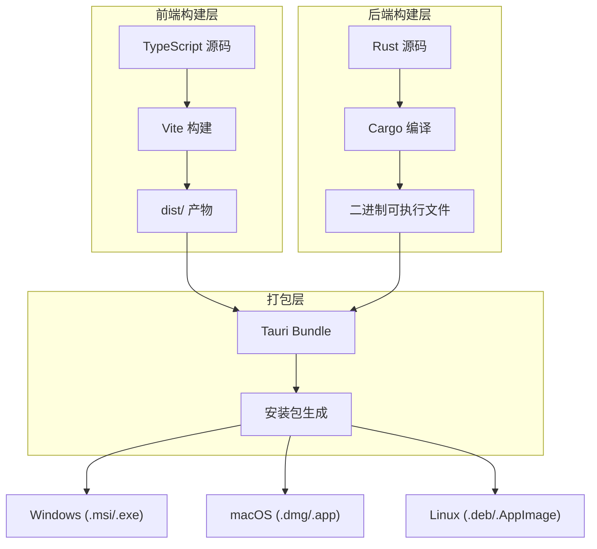

ClawScope 采用 Tauri 2 框架构建跨平台桌面应用，其构建流程融合了前端 Vite 构建与 Rust 后端编译，最终输出各平台的原生安装包。本章面向初学者，系统讲解从开发环境到生产发布的完整构建链路，涵盖本地构建、CI/CD 自动化以及跨平台发布策略。

## 技术架构概览

ClawScope 的构建系统采用**双栈分层架构**：前端为 React + TypeScript + Vite 技术栈，负责用户界面渲染；后端为 Rust + Tauri 运行时，提供系统级 API 与原生窗口能力。Tauri CLI 作为编排核心，协调前后端构建流程并输出最终产物。



**构建流程核心特征**：Vite 负责前端资源打包输出至 `dist/` 目录，Tauri 将该目录作为嵌入式 WebView 的静态资源，与 Rust 编译生成的二进制文件整合为最终应用。这种架构确保了前端开发的灵活性与后端执行的高性能。

Sources: [package.json](package.json#L1-L80), [src-tauri/tauri.conf.json](src-tauri/tauri.conf.json#L1-L40)

## 本地构建流程

### 前置条件

构建 ClawScope 前需确保以下环境就绪：

| 组件 | 版本要求 | 验证命令 |
|------|----------|----------|
| Node.js | LTS 版本 | `node --version` |
| Rust | Stable 工具链 | `rustc --version` |
| Tauri CLI | v2.x | `npm run tauri -- --version` |

**Windows 用户特别注意**：需安装 [Visual Studio Build Tools](https://visualstudio.microsoft.com/visual-cpp-build-tools/) 并勾选「使用 C++ 的桌面开发」工作负载。若构建时报错 `dlltool.exe: program not found`，即表示缺少此依赖。建议执行 `rustup default stable-msvc` 确保使用 MSVC 工具链。

Sources: [README.md](README.md#L50-L58)

### 开发模式构建

开发模式支持热重载与调试能力，是日常开发的首选方式：

```bash
# 安装依赖
npm install

# 启动开发服务器（同时启动 Vite 与 Tauri）
npm run tauri dev
```

执行 `tauri dev` 时，Tauri 首先启动 Vite 开发服务器（默认监听 `127.0.0.1:1420`），待前端就绪后加载 Rust 后端并打开应用窗口。此模式下前端代码变更会触发热重载，Rust 代码变更会触发后端重编译。

Sources: [package.json](package.json#L6-L8), [src-tauri/tauri.conf.json](src-tauri/tauri.conf.json#L7-L9)

### 生产构建

生产构建输出可分发的安装包，流程如下：

```bash
# 方式一：使用 Tauri CLI（推荐）
npm run tauri build

# 方式二：分步执行（用于调试构建问题）
npm run build        # 仅构建前端
cargo build --release # 仅构建 Rust（需在 src-tauri 目录）
```

`npm run tauri build` 执行以下步骤：

1. **前端构建**：执行 `npm run build`（即 `tsc && vite build`），TypeScript 编译后由 Vite 打包输出至 `dist/`
2. **后端编译**：Cargo 以 Release 模式编译 Rust 代码
3. **应用打包**：Tauri 将前端资源嵌入二进制，生成平台特定的安装包

Sources: [package.json](package.json#L7-L7), [src-tauri/tauri.conf.json](src-tauri/tauri.conf.json#L10-L13)

### 构建配置解析

Vite 配置针对 Tauri 环境做了特定调整：

| 配置项 | 作用 | 生产值 |
|--------|------|--------|
| `build.target` | JavaScript 目标环境 | Windows: `chrome105` / 其他: `safari13` |
| `build.minify` | 代码压缩 | `true`（非调试模式） |
| `build.sourcemap` | 源码映射 | `false`（非调试模式） |
| `server.strictPort` | 端口占用检查 | `true` |

Tauri 配置定义了应用元数据与打包参数：

- **标识符**：`com.claw.scope`（用于操作系统注册）
- **窗口配置**：1440×900 默认尺寸，无边框设计
- **输出目标**：`all`（生成所有支持平台的安装包格式）
- **分类**：`DeveloperTool`（应用商店分类）

Sources: [vite.config.ts](vite.config.ts#L25-L32), [src-tauri/tauri.conf.json](src-tauri/tauri.conf.json#L1-L40)

## CI/CD 自动化构建

ClawScope 配置了完整的 GitHub Actions 工作流，支持持续集成检查与自动发布。

### 持续集成（CI）

CI 工作流在每次推送到 `main`/`master` 分支或 Pull Request 时触发，执行以下检查：


关键检查项包括：

1. **代码检查**：`cargo check` 验证 Rust 代码可编译性
2. **静态分析**：`cargo clippy` 执行 lint 检查（`-D warnings` 将警告视为错误）
3. **冒烟构建**：在 Linux 环境执行完整构建验证
4. **视觉回归**：基于 Playwright 的截图对比测试

Sources: [.github/workflows/ci.yml](.github/workflows/ci.yml#L1-L64)

### 自动发布（Release）

Release 工作流支持手动触发（`workflow_dispatch`）或推送版本标签（`v*`）时自动执行，并行构建多平台安装包：

| 平台 | 目标架构 | Runner |
|------|----------|--------|
| macOS | aarch64-apple-darwin | macos-latest |
| macOS | x86_64-apple-darwin | macos-latest |
| Linux | x86_64 | ubuntu-22.04 |
| Linux | ARM64 | ubuntu-22.04-arm |
| Windows | x86_64 | windows-latest |

**Linux 构建特殊依赖**：需安装 `libwebkit2gtk-4.1-dev`、`libappindicator3-dev`、`librsvg2-dev`、`patchelf` 等系统库以支持 WebView 与图标处理。

Sources: [.github/workflows/release.yml](.github/workflows/release.yml#L1-L68)

## 跨平台发布策略

### 安装包格式

Tauri 根据目标平台自动生成对应的安装包格式：

- **Windows**：`.msi`（标准安装程序）、`.exe`（便携版）
- **macOS**：`.dmg`（磁盘映像）、`.app`（应用包）
- **Linux**：`.deb`（Debian/Ubuntu）、`.rpm`（Fedora）、`.AppImage`（通用便携）

所有产物均通过 GitHub Releases 分发，Draft 模式允许在正式发布前人工审核。

Sources: [src-tauri/tauri.conf.json](src-tauri/tauri.conf.json#L24-L38)

### 版本管理

版本号在以下文件中同步维护：

| 文件 | 字段 | 用途 |
|------|------|------|
| `package.json` | `version` | NPM 包版本 |
| `src-tauri/tauri.conf.json` | `version` | Tauri 应用版本 |
| `src-tauri/Cargo.toml` | `version` | Rust crate 版本 |

发布工作流中的 `v__VERSION__` 占位符会被自动替换为 `tauri.conf.json` 中的版本号。

Sources: [package.json](package.json#L4-L4), [src-tauri/tauri.conf.json](src-tauri/tauri.conf.json#L3-L3), [src-tauri/Cargo.toml](src-tauri/Cargo.toml#L3-L3)

## 下一步

完成构建与打包发布后，建议继续学习以下内容：

- 如需配置桌面应用打包细节，请参阅 [桌面应用打包配置](25-zhuo-mian-ying-yong-da-bao-pei-zhi)
- 如需处理特定平台的构建问题，请参阅 [跨平台构建注意事项](26-kua-ping-tai-gou-jian-zhu-yi-shi-xiang)
- 如需了解 CI/CD 工作流的详细配置，请参阅 [CI/CD 自动化工作流](23-ci-cd-zi-dong-hua-gong-zuo-liu)