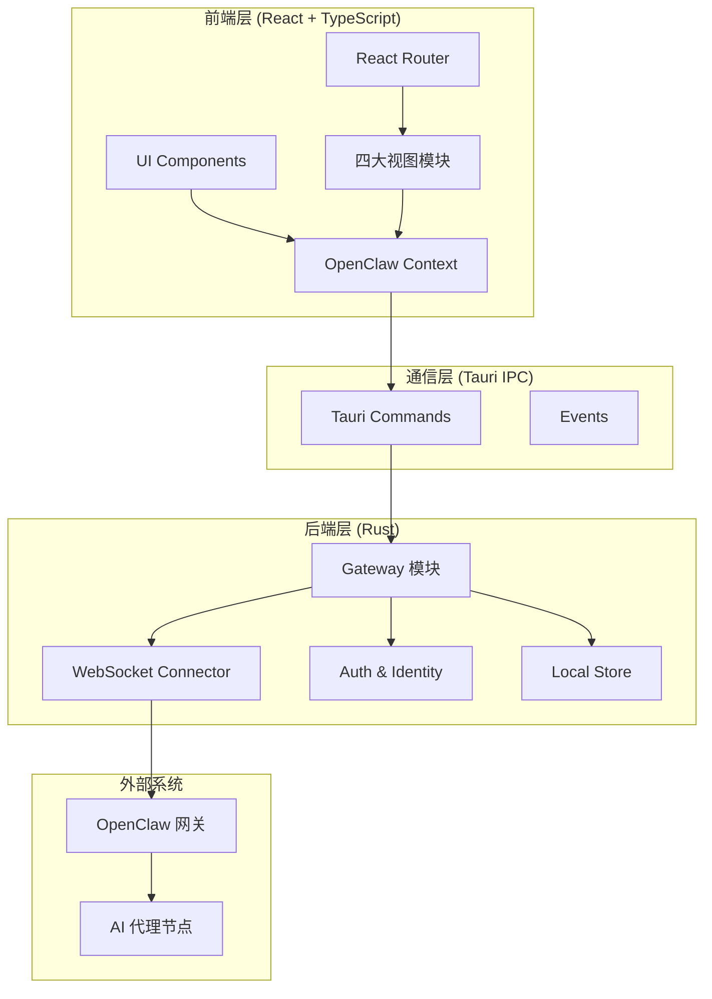

**ClawScope** 是 OpenClaw 生态中的记忆与进化管理桌面应用，采用 **Tauri 2 + Rust** 构建跨平台后端，**React + TypeScript + Vite** 构建现代化前端界面。产品口号「记忆可见，进化可期」准确概括了其核心价值：为 AI 代理提供可视化的记忆管理能力与可实验的进化迭代支持。

Sources: [README.md](README.md#L1-L10), [tauri.conf.json](src-tauri/tauri.conf.json#L1-L40)

## 产品定位

ClawScope 定位于 **OpenClaw 网关的本地管理客户端**，作为连接用户与 OpenClaw 代理网络的桥梁。产品规划文档中正式名称为 **ClawForge**，而本仓库与可执行侧使用代号 **ClawScope**。它解决了以下核心问题：

| 问题域 | ClawScope 解决方案 |
|--------|-------------------|
| 代理身份不可见 | Profile 视图提供完整的代理身份信息展示与编辑 |
| 记忆管理分散 | Memory 视图集中管理记忆文档、时间线与语义搜索 |
| 连接配置复杂 | Config 视图提供向导式 OpenClaw 网关配置 |
| 进化过程黑盒 | Evolution 视图提供实验性的记忆进化界面 |

Sources: [README.md](README.md#L1-L10), [tauri.conf.json](src-tauri/tauri.conf.json#L25-L30)

## 技术架构概览

ClawScope 采用经典的分层架构设计，前端与后端通过 Tauri 的 IPC 机制通信：

Sources: [lib.rs](src-tauri/src/lib.rs#L1-L46), [OpenClawContext.tsx](src/app/contexts/OpenClawContext.tsx#L1-L100)

## 四大核心功能模块

ClawScope 围绕四个核心视图构建功能体系，每个视图对应一个独立的功能域：

### 1. Profile 视图 — 代理身份管理

Profile 视图是应用的默认入口，负责展示和编辑 AI 代理的身份信息。它从 OpenClaw 网关获取代理的 **identity**（身份元数据）、**soul**（灵魂文档）和 **workspaceIdentity**（工作区身份配置），并以可编辑的界面呈现。

该视图支持以下核心功能：
- 代理身份卡片展示（状态、头像、标签、统计数据）
- 身份文档（Identity Document）的实时渲染与搜索
- Soul 文档的查看与编辑
- 工作区身份配置管理
- 身份文档的导出（Markdown 格式）

Sources: [ProfileView.tsx](src/app/components/views/ProfileView.tsx#L1-L100), [routes.tsx](src/app/routes.tsx#L1-L26)

### 2. Memory 视图 — 记忆库与文档管理

Memory 视图是 ClawScope 最复杂的功能模块，提供对代理记忆的全面管理能力。它采用 **Archive UI** 设计语言，将记忆内容组织为多个可切换的面板：

| 面板 | 功能描述 |
|------|----------|
| Overview | 记忆系统概览与诊断信息 |
| Documents | 记忆文档（memory.md）的查看与编辑 |
| Footprints | 时间线足迹的浏览与管理 |
| Search | 全文搜索与语义搜索 |
| Knowledge | 知识图谱与语义关联探索 |

记忆视图支持多代理工作区的记忆共享、本地时间线扫描、远程时间线探测等高级功能。

Sources: [MemoryView.tsx](src/app/components/views/MemoryView.tsx#L1-L100), [memoryArchiveUi.tsx](src/app/components/views/memoryArchiveUi.tsx)

### 3. Config 视图 — 连接配置与设置

Config 视图采用标签页设计，将配置内容分为三个模块：

- **General（通用设置）**：应用级配置项
- **Connection（连接配置）**：OpenClaw 网关的连接参数、认证方式
- **Agent（代理设置）**：代理特定的行为配置

配置视图集成了设置向导（SetupWizard），为新用户提供引导式的首次配置体验。

Sources: [ConfigView.tsx](src/app/components/views/ConfigView.tsx#L1-L73), [OpenClawConfigModule.tsx](src/app/components/setup/OpenClawConfigModule.tsx)

### 4. Evolution 视图 — 进化实验界面

Evolution 视图提供实验性的记忆进化功能，允许用户通过预设模板对代理记忆进行结构化更新。界面包含：

- 节点选择器（支持多节点环境）
- 进化模板卡片（推荐模板、实验模板、开发中模板）
- 实时预览面板（显示记忆变更的 diff 视图）
- 应用变更操作

该视图目前处于实验阶段，部分功能标记为开发中。

Sources: [EvolutionView.tsx](src/app/components/views/EvolutionView.tsx#L1-L113)

## 应用壳层设计

Shell 组件作为应用的布局容器，提供以下基础能力：

- **自定义标题栏**：支持最小化、最大化、关闭操作（Tauri 环境）
- **侧边导航栏**：桌面端左侧固定导航，包含四个主视图的入口
- **底部导航栏**：移动端底部标签栏适配
- **主题切换**：支持亮色/暗色模式切换，带涟漪动画效果
- **国际化切换**：内置多语言支持菜单
- **设置向导集成**：自动检测首次使用并弹出配置向导

导航采用 React Router 的 `NavLink` 实现，支持激活状态视觉反馈。

Sources: [Shell.tsx](src/app/components/Shell.tsx#L1-L150)

## 后端 Gateway 架构

Rust 后端的核心是 **Gateway 模块**，负责与 OpenClaw 网关的 WebSocket 通信。主要子模块包括：

| 模块 | 职责 |
|------|------|
| `connector.rs` | WebSocket 连接管理与消息路由 |
| `auth.rs` | 认证流程处理（挑战-响应机制） |
| `device_identity.rs` | 设备身份与 Ed25519 签名 |
| `protocol.rs` | OpenClaw 协议消息序列化/反序列化 |
| `commands.rs` | Tauri 命令实现（前端调用入口） |
| `state.rs` | 连接状态管理 |
| `store.rs` | 本地令牌与配置持久化 |

Gateway 模块实现了完整的 OpenClaw 协议客户端，支持设备配对、代理列表获取、记忆文档读写、语义搜索等操作。

Sources: [lib.rs](src-tauri/src/lib.rs#L1-L46), [commands.rs](src-tauri/src/gateway/commands.rs#L1-L100)

## 阅读建议

作为初学者，建议按照以下顺序深入理解 ClawScope：

1. **[项目概览](1-xiang-mu-gai-lan)** — 了解整体项目结构与技术选型
2. **[环境搭建与开发启动](2-huan-jing-da-jian-yu-kai-fa-qi-dong)** — 配置本地开发环境
3. **[OpenClaw 网关连接原理](5-openclaw-wang-guan-lian-jie-yuan-li)** — 理解后端 Gateway 的工作机制
4. **[React 应用架构与路由设计](6-react-ying-yong-jia-gou-yu-lu-you-she-ji)** — 深入前端架构
5. **[OpenClaw 上下文与状态管理](7-openclaw-shang-xia-wen-yu-zhuang-tai-guan-li)** — 掌握前后端通信模式