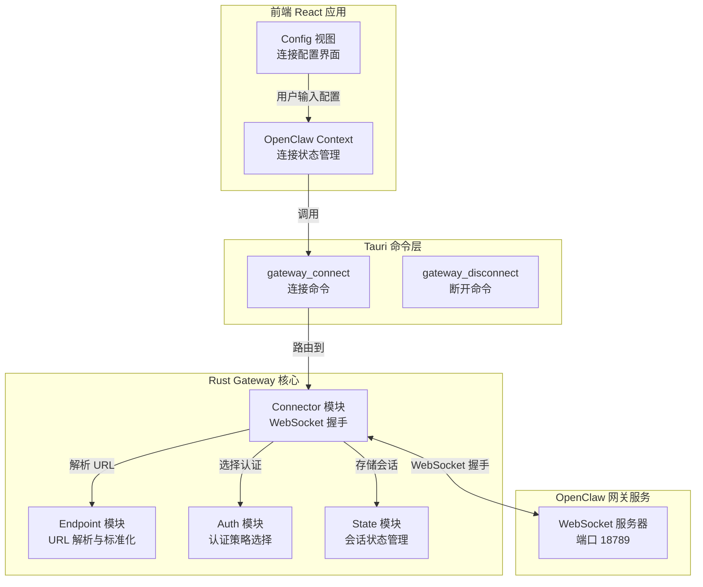
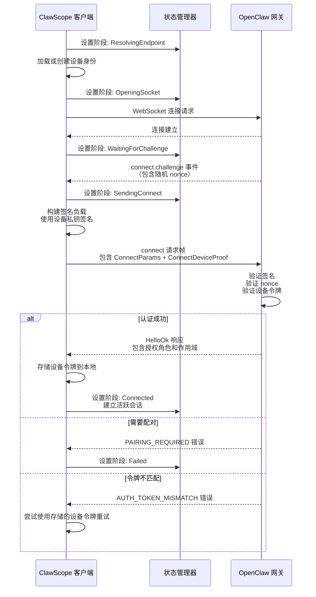

ClawScope 作为 OpenClaw 生态系统的桌面客户端，其核心能力依赖于与 OpenClaw 网关建立安全、可靠的 WebSocket 连接。本文档面向初学者开发者，系统性地介绍网关连接的完整流程、认证机制以及通信协议。

## 连接架构概览

OpenClaw 网关连接采用**分层架构设计**，从前端 React 应用到后端 Rust 核心，通过 Tauri 的命令系统实现跨层通信。整个连接流程可以分解为三个主要阶段：**端点解析**、**握手认证**和**会话建立**。



这种分层设计确保了关注点分离：前端专注于用户体验，Tauri 层提供安全的进程间通信桥梁，而 Rust 核心处理所有网络层面的复杂性。

Sources: [lib.rs](src-tauri/src/lib.rs#L1-L46), [commands.rs](src-tauri/src/gateway/commands.rs#L38-L55), [mod.rs](src-tauri/src/gateway/mod.rs#L1-L13)

## 端点解析与标准化

在建立连接之前，系统首先需要将用户输入的网关地址转换为标准化的 WebSocket URL。这个过程由 **Endpoint 模块** 负责处理。

### 传输协议自动转换

网关支持多种 URL 格式输入，系统会自动进行协议转换：

| 输入协议 | 转换后 WebSocket URL | 传输类型 |
|---------|---------------------|---------|
| `http://127.0.0.1:18789` | `ws://127.0.0.1:18789/` | LocalLoopback |
| `https://claw.example.com:443` | `wss://claw.example.com/` | Direct |
| `ws://localhost:18789` | `ws://localhost:18789/` | LocalLoopback |
| `wss://remote.server.com` | `wss://remote.server.com/` | Direct |

传输类型的分类基于主机地址判断：本地回环地址（`127.0.0.1`、`localhost`）被归类为 `LocalLoopback`，其他地址则为 `Direct`。这一分类在后续的功能实现中具有重要意义——例如本地配置修改功能仅对 `LocalLoopback` 连接可用。

Sources: [endpoint.rs](src-tauri/src/gateway/endpoint.rs#L1-L115)

## 认证机制详解

OpenClaw 网关支持三种认证模式，系统会根据配置自动选择最合适的认证策略。

### 认证模式对比

| 认证模式 | 适用场景 | 凭证要求 | 安全级别 |
|---------|---------|---------|---------|
| **PairedDevice**（配对设备） | 首次连接后的后续访问 | 本地存储的设备令牌 | 高（Ed25519 签名） |
| **Token**（令牌认证） | 共享访问或临时连接 | 用户提供的共享令牌 | 中 |
| **Password**（密码认证） | 开发测试环境 | 用户提供的密码 | 低 |

### 设备身份与签名

在 **PairedDevice** 模式下，系统使用 **Ed25519 数字签名** 进行设备身份验证。每个 ClawScope 实例在首次启动时会生成唯一的设备密钥对，私钥安全存储在本地，公钥用于向网关证明设备身份。

签名负载采用版本化的管道分隔格式（v3 协议），包含以下字段：

```
v3|{device_id}|{client_id}|{client_mode}|{role}|{scopes}|{signed_at_ms}|{token}|{nonce}|{platform}|{device_family}
```

这种设计确保了签名的不可伪造性和请求的唯一性（通过 nonce 防止重放攻击）。

Sources: [auth.rs](src-tauri/src/gateway/auth.rs#L1-L186), [device_identity.rs](src-tauri/src/gateway/device_identity.rs#L1-L147), [signer.rs](src-tauri/src/gateway/signer.rs#L1-L103)

## 连接握手流程

完整的连接握手是一个多步骤的异步流程，涉及挑战-响应机制和多次网络往返。



### 连接阶段状态机

连接过程中的每个阶段都由 `GatewayConnectionPhase` 枚举精确定义：

1. **Idle** - 初始状态，无活跃连接
2. **ResolvingEndpoint** - 解析和标准化网关地址
3. **OpeningSocket** - 建立底层 WebSocket 连接
4. **WaitingForChallenge** - 等待网关发送挑战 nonce
5. **SendingConnect** - 发送带签名的连接请求
6. **WaitingForApproval** - 等待网关验证和授权
7. **Connected** - 连接成功，会话活跃
8. **Disconnected** - 连接已断开
9. **Failed** - 连接失败

Sources: [types.rs](src-tauri/src/gateway/types.rs#L38-L51), [connector.rs](src-tauri/src/gateway/connector.rs#L73-L197)

## 会话管理与请求处理

连接建立后，系统创建 `GatewayActiveConnection` 实例来管理会话生命周期。该结构体封装了 WebSocket 写入器、待处理请求注册表和可用方法列表。

### 请求-响应模式

所有与网关的交互都遵循异步请求-响应模式：

```rust
// 请求帧结构
pub struct RequestFrame<T> {
    pub frame_type: "req",
    pub id: String,        // 唯一请求 ID
    pub method: String,    // 远程方法名
    pub params: T,         // 方法参数
}

// 响应帧结构
pub struct ResponseFrame {
    pub frame_type: "res",
    pub id: String,        // 对应请求 ID
    pub ok: bool,          // 成功/失败
    pub payload: Option<Value>,  // 成功时的数据
    pub error: Option<ResponseError>, // 失败时的错误
}
```

每个请求都会生成唯一的请求 ID，并注册一个 `oneshot` 通道来等待响应。当响应到达时，通过请求 ID 查找对应的通道并发送结果。

Sources: [protocol.rs](src-tauri/src/gateway/protocol.rs#L84-L124), [state.rs](src-tauri/src/gateway/state.rs#L25-L112)

## 令牌持久化与自动重连

为了提供无缝的用户体验，系统实现了智能的令牌管理机制。

### 本地存储结构

设备认证令牌存储在本地 JSON 文件中，路径根据操作系统自动确定：

- **Windows**: `%APPDATA%/claw-scope/gateway/identity/device-auth.json`
- **macOS/Linux**: `~/.claw-scope/gateway/identity/device-auth.json`

令牌存储采用版本化的数据结构，支持按网关地址、角色和作用域进行精确匹配。

### 智能重试逻辑

当使用共享令牌（Token 模式）连接失败时，系统会自动尝试使用本地存储的设备令牌进行重试。这种回退机制确保了即使共享令牌过期或失效，已配对的设备仍能重新建立连接。

Sources: [store.rs](src-tauri/src/gateway/store.rs#L1-L200)

## 安全考虑

OpenClaw 网关连接在多个层面实现了安全防护：

1. **传输层安全**: 支持 `wss://` 协议，所有通信默认使用 TLS 加密
2. **身份验证**: Ed25519 数字签名确保设备身份不可伪造
3. **重放攻击防护**: 每次连接使用随机 nonce，签名包含时间戳
4. **令牌隔离**: 设备令牌按网关地址、角色和作用域分别存储
5. **私钥保护**: 设备私钥仅存储在本地，永不传输到网络

## 下一步学习

理解网关连接原理后，建议继续学习以下相关内容：

- [连接管理：认证与 WebSocket 通信](17-lian-jie-guan-li-ren-zheng-yu-websocket-tong-xin) - 深入了解连接管理的实现细节
- [设备身份与签名机制](20-she-bei-shen-fen-yu-qian-ming-ji-zhi) - 探索 Ed25519 签名的完整实现
- [本地存储与令牌管理](21-ben-di-cun-chu-yu-ling-pai-guan-li) - 了解令牌持久化的完整机制
- [Tauri 命令与前端通信](15-tauri-ming-ling-yu-qian-duan-tong-xin) - 学习前后端通信的 Tauri 实现