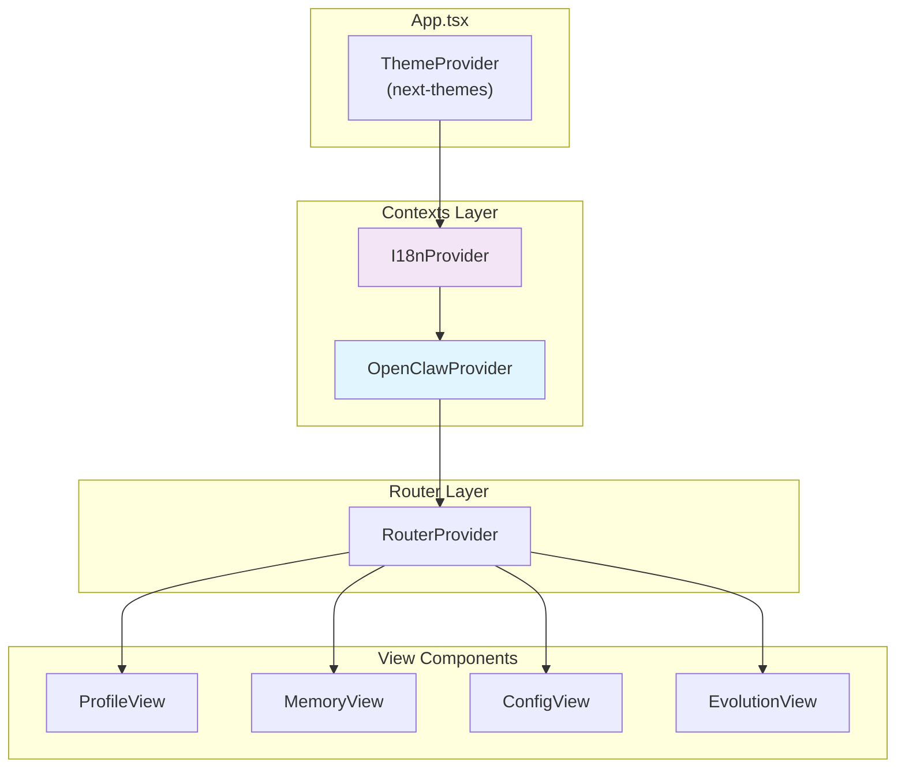
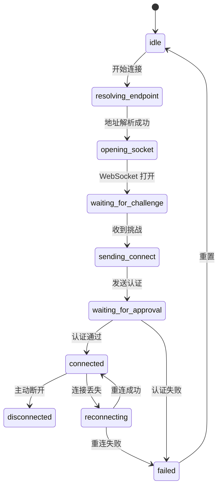

ClawScope 作为连接 OpenClaw 网关的桌面客户端，其核心能力依赖于一套精心设计的上下文状态管理系统。本文档深入剖析 `OpenClawContext` 与 `I18nContext` 两大核心上下文的架构设计、状态流转机制以及最佳实践，帮助开发者理解如何在前端 React 应用中高效管理网关连接状态与国际化配置。

## 架构概览

ClawScope 采用分层 Provider 模式组织全局状态，形成清晰的依赖层级：



这种嵌套结构确保了主题配置最先加载，随后是国际化上下文，最后是 OpenClaw 连接状态——后者依赖前者提供的翻译能力来渲染错误消息和界面文本。Sources: [App.tsx](src/app/App.tsx#L1-L23)

## OpenClawContext：网关连接的核心状态

### 状态模型设计

`OpenClawContext` 封装了与 OpenClaw 网关交互所需的全部状态，可分为四大类别：

| 状态类别 | 状态字段 | 说明 |
|---------|---------|------|
| **连接状态** | `isConnected`, `connectedOrigin`, `grantedScopes`, `lastError` | 反映当前与网关的 WebSocket 连接状况 |
| **配置状态** | `isConfigured`, `gatewayUrl`, `authMode`, `authSecret` | 存储用户配置的网关地址与认证信息 |
| **引导状态** | `isSetupWizardOpen`, `hasSkippedSetup`, `showReminder` | 控制首次使用引导流程的显示逻辑 |
| **数据实体** | `nodes`, `agents` | 缓存从网关获取的节点与代理列表 |

Sources: [OpenClawContext.tsx](src/app/contexts/OpenClawContext.tsx#L332-L354)

### 连接生命周期管理

网关连接遵循明确的状态机模型，包含 10 个阶段：



Sources: [OpenClawContext.tsx](src/app/contexts/OpenClawContext.tsx#L12-L22)

### 状态持久化策略

配置状态通过 `localStorage` 实现跨会话持久化，存储键定义集中管理：

```typescript
export const OPENCLAW_STORAGE_KEYS = {
  configured: 'oc_configured',
  skipped: 'oc_skipped',
  url: 'oc_url',
  authMode: 'oc_auth_mode',
  authSecret: 'oc_auth_secret',
} as const;
```

Sources: [openClawStorage.ts](src/app/contexts/openClawStorage.ts#L3-L9)

认证模式支持三种类型：`paired_device`（配对设备）、`token`（令牌）、`password`（密码）。存储层实现了向后兼容的迁移逻辑，将遗留的 `'none'` 模式映射为 `'paired_device'`。Sources: [openClawStorage.ts](src/app/contexts/openClawStorage.ts#L13-L24)

### 开发模式特殊处理

在开发环境（`import.meta.env.DEV` 为真）下，上下文会清除持久化标志，强制显示设置向导，便于开发者测试配置流程。Sources: [OpenClawContext.tsx](src/app/contexts/OpenClawContext.tsx#L736-L746)

## I18nContext：轻量级国际化方案

### 设计哲学

与引入完整 i18n 库（如 react-i18next）不同，ClawScope 采用内联字典的轻量方案，支持 13 种语言：

```typescript
export type LangCode =
  | "en" | "zh" | "zh-TW" | "es" | "fr" | "de"
  | "ja" | "ko" | "ru" | "pt" | "it" | "ar" | "hi";
```

Sources: [I18nContext.tsx](src/app/contexts/I18nContext.tsx#L10-L23)

### 字典结构

翻译数据以数组形式存储，索引与 `langIndices` 映射表对应：

```typescript
const DICT: Record<string, string[]> = {
  "app.subtitle": [
    " — Memories Visible, Evolution Expected",  // en (0)
    " — 记忆可见，进化可期",                      // zh (1)
    " — 記憶可見，進化可期",                      // zh-TW (2)
    // ... 其他语言
  ],
};
```

这种结构避免了嵌套对象查找，提升了运行时性能。Sources: [I18nContext.tsx](src/app/contexts/I18nContext.tsx#L59-L74)

### 参数插值与回退

翻译函数 `t` 支持位置参数插值（`{0}`, `{1}` 等），并实现了多级回退策略：目标语言缺失时回退至英语，英语缺失时返回键名本身。Sources: [I18nContext.tsx](src/app/contexts/I18nContext.tsx#L2963-L2978)

### 单例模式应用

`I18nContext` 使用 `getSingletonValue` 工具函数确保 React Context 实例在热重载场景下的稳定性：

```typescript
const I18nContext = getSingletonValue(
  "__clawscope_i18n_context__",
  () => createContext<I18nContextType | undefined>(undefined),
);
```

Sources: [I18nContext.tsx](src/app/contexts/I18nContext.tsx#L2950-L2953)

## 工具函数与辅助模块

### contextSingleton：全局单例管理

`getSingletonValue` 函数利用 `globalThis` 实现跨模块的单例模式，确保在 React 严格模式或热重载时 Context 实例不被重复创建：

```typescript
export function getSingletonValue<T>(key: string, factory: () => T): T {
  const globalStore = globalThis as typeof globalThis & Record<string, unknown>;
  const existing = globalStore[key] as T | undefined;
  if (existing) return existing;
  const created = factory();
  globalStore[key] = created;
  return created;
}
```

Sources: [contextSingleton.ts](src/app/contexts/contextSingleton.ts#L1-L12)

### Tauri 运行时检测

由于 ClawScope 同时支持浏览器开发环境和 Tauri 桌面环境，`isTauriRuntimeAvailable()` 函数通过检测 `window.__TAURI_INTERNALS__` 判断当前是否具备调用 Rust 后端命令的能力：

```typescript
export function isTauriRuntimeAvailable() {
  if (typeof window === 'undefined') return false;
  const runtimeWindow = window as Window & { __TAURI_INTERNALS__?: unknown };
  return '__TAURI_INTERNALS__' in runtimeWindow;
}
```

Sources: [OpenClawContext.tsx](src/app/contexts/OpenClawContext.tsx#L381-L388)

## 在组件中使用上下文

### 基础用法

通过自定义 Hook 访问 OpenClaw 状态：

```typescript
import { useOpenClaw } from "../contexts/OpenClawContext";

function MyComponent() {
  const { isConnected, agents, refreshAgents } = useOpenClaw();
  
  useEffect(() => {
    if (isConnected) {
      refreshAgents();
    }
  }, [isConnected]);
  
  return (
    <div>
      {agents.map(agent => (
        <AgentCard key={agent.id} agent={agent} />
      ))}
    </div>
  );
}
```

### 错误处理模式

OpenClaw 定义了结构化的错误类型 `GatewayErrorSummary`，包含分类、代码、消息、是否可重试等字段。组件应据此向用户呈现友好的错误提示：

```typescript
interface GatewayErrorSummary {
  category: string;
  code?: string | null;
  message: string;
  retryable: boolean;
  hint?: string | null;
}
```

Sources: [OpenClawContext.tsx](src/app/contexts/OpenClawContext.tsx#L39-L45)

### 独立 API 函数

除 `useOpenClaw` Hook 外，上下文还导出了一系列可直接调用的异步函数，如 `gatewayAgentMemorySearch`、`gatewayAgentSoulGet` 等，适用于不需要订阅状态变化的场景（如事件处理器）。Sources: [OpenClawContext.tsx](src/app/contexts/OpenClawContext.tsx#L463-L664)

## 测试策略

上下文模块包含配套的单元测试：

| 测试文件 | 覆盖范围 |
|---------|---------|
| `contextSingleton.test.ts` | 单例模式的实例唯一性验证 |
| `openClawStorage.test.ts` | 认证模式迁移与密钥读取逻辑 |

Sources: [contextSingleton.test.ts](src/app/contexts/contextSingleton.test.ts#L1-L23), [openClawStorage.test.ts](src/app/contexts/openClawStorage.test.ts#L1-L48)

## 最佳实践

1. **避免在渲染路径中直接调用 Tauri 命令**：始终通过 `OpenClawContext` 提供的封装方法，以统一处理运行时不可用的情况

2. **利用 `startTransition` 优化 UI 响应**：在代理数据加载等耗时操作前调用 `startTransition`，避免阻塞用户交互

3. **遵循状态分层原则**：视图层状态（如选中标签页）使用本地 `useState`，跨组件共享的网关数据才放入 Context

4. **国际化键命名规范**：使用 `section.subsection.key` 的点分命名空间，如 `profile.agents`、`nav.memory`

## 下一步阅读

掌握上下文机制后，建议继续探索以下主题：

- [Profile 视图：代理身份管理](9-profile-shi-tu-dai-li-shen-fen-guan-li) — 了解如何使用 `OpenClawContext` 获取并编辑代理身份
- [Memory 视图：记忆库与文档管理](10-memory-shi-tu-ji-yi-ku-yu-wen-dang-guan-li) — 深入学习记忆搜索与文档操作 API
- [Tauri 命令与前端通信](15-tauri-ming-ling-yu-qian-duan-tong-xin) — 理解后端 Rust 命令如何与前端上下文对接