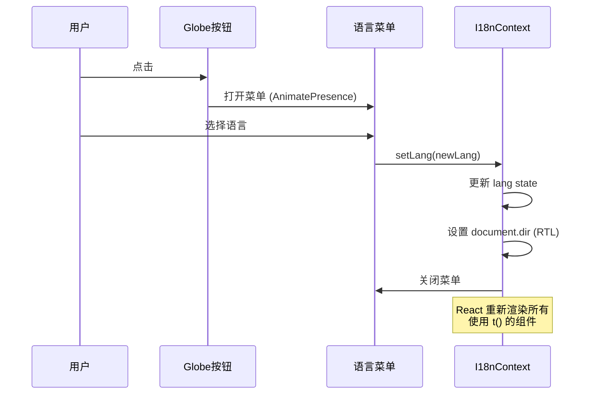
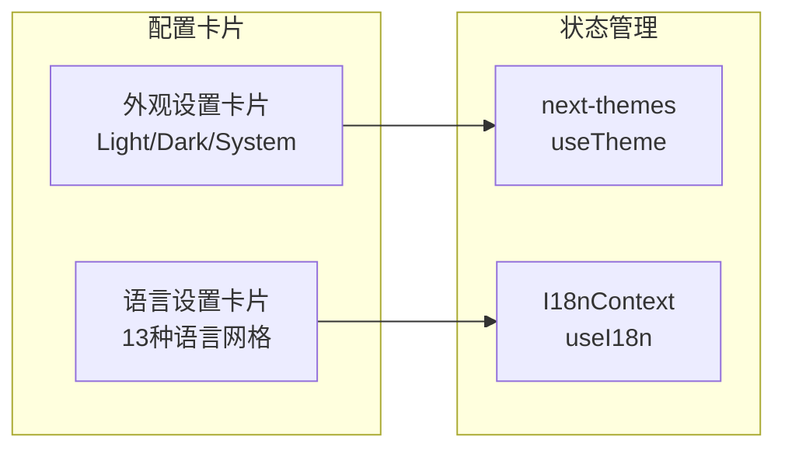

ClawScope 采用轻量级、自研的国际化方案，通过 React Context 提供全局语言状态管理，支持 13 种语言的即时切换。该方案摒弃了复杂的第三方 i18n 库，以极简的键值映射架构实现高效的多语言渲染，同时内置 RTL（从右到左）语言支持和参数插值功能，满足桌面级应用的国际化需求。

## 架构设计

### 核心架构图

```mermaid
flowchart TB
    subgraph App["应用根层"]
        A[ThemeProvider<br/>主题管理]
    end
    
    subgraph I18nLayer["国际化层"]
        B[I18nProvider<br/>语言上下文]
        C[I18nContext<br/>Context 实例]
        D[DICT<br/>翻译字典]
        E[LANGUAGES<br/>语言配置]
    end
    
    subgraph Components["组件层"]
        F[Shell<br/>导航外壳]
        G[ConfigView<br/>配置视图]
        H[ProfileView<br/>档案视图]
        I[GeneralConfigModule<br/>通用设置]
    end
    
    subgraph Hooks["消费层"]
        J[useI18n<br/>Hook API]
        K[t(key)<br/>翻译函数]
        L[setLang<br/>语言切换]
    end
    
    A --> B
    B --> C
    C --> D
    C --> E
    C --> J
    J --> K
    J --> L
    K --> F
    K --> G
    K --> H
    K --> I
    L --> I
```

### 设计原则

**轻量优先**：不引入 i18next、react-intl 等重型依赖，通过原生 React Context 实现状态管理，减少打包体积约 50KB+。字典数据采用数组索引映射而非嵌套对象，提升运行时查找效率。

**类型安全**：`LangCode` 联合类型和 `I18nContextType` 接口提供完整的 TypeScript 支持，编译时即可捕获翻译键名错误和语言代码拼写错误。

**即时响应**：语言切换无需页面刷新，通过 React state 驱动重新渲染，配合 CSS transition 实现平滑的视觉过渡效果。

Sources: [I18nContext.tsx](src/app/contexts/I18nContext.tsx#L1-L30), [App.tsx](src/app/App.tsx#L1-L24)

## 语言配置与字典结构

### 支持语言列表

ClawScope 支持 13 种语言，覆盖全球主要语言区域：

| 语言代码 | 英文名称 | 本地名称 | 索引 |
|---------|---------|---------|-----|
| `en` | English | English | 0 |
| `zh` | Chinese (Simplified) | 简体中文 | 1 |
| `zh-TW` | Chinese (Traditional) | 繁體中文 | 2 |
| `es` | Spanish | Español | 3 |
| `fr` | French | Français | 4 |
| `de` | German | Deutsch | 5 |
| `ja` | Japanese | 日本語 | 6 |
| `ko` | Korean | 한국어 | 7 |
| `ru` | Russian | Русский | 8 |
| `pt` | Portuguese | Português | 9 |
| `it` | Italian | Italiano | 10 |
| `ar` | Arabic | العربية | 11 |
| `hi` | Hindi | हिन्दी | 12 |

### 字典存储格式

翻译数据采用**扁平键值 + 数组索引**的存储结构，而非传统的嵌套对象格式。每个翻译键对应一个字符串数组，数组索引与 `langIndices` 映射表严格对齐：

```typescript
// 语言索引映射表
const langIndices: Record<LangCode, number> = {
  en: 0, zh: 1, "zh-TW": 2, es: 3, /* ... */
};

// 翻译字典结构
const DICT: Record<string, string[]> = {
  "nav.profile": [
    "Profile",                    // en (0)
    "档案 (Profile)",              // zh (1)
    "檔案 (Profile)",              // zh-TW (2)
    "Perfil",                     // es (3)
    // ... 其他语言
  ],
  "profile.connected": [
    "Connected ({0} nodes)",      // 支持参数插值
    "已连接至本地工作区 ({0} 节点)",
    // ...
  ],
};
```

这种设计带来两个显著优势：**内存布局紧凑**（数组比对象更省内存）、**访问速度恒定**（O(1) 索引访问无需递归查找）。目前字典包含约 200+ 个翻译键，覆盖完整的 UI 界面文本。

Sources: [I18nContext.tsx](src/app/contexts/I18nContext.tsx#L14-L50), [I18nContext.tsx](src/app/contexts/I18nContext.tsx#L2950-L2992)

## Context API 与 Hook 使用

### I18nProvider 配置

`I18nProvider` 位于组件树顶层，包裹整个应用，提供语言状态和翻译函数：

```typescript
interface I18nContextType {
  lang: LangCode;           // 当前语言代码
  setLang: (l: LangCode) => void;  // 语言切换函数
  t: (key: string, ...args: (string | number)[]) => string;  // 翻译函数
}
```

**RTL 自动适配**：当语言切换为阿拉伯语 (`ar`) 时，`useEffect` 自动设置 `document.documentElement.dir = "rtl"`，触发 CSS 的 RTL 布局支持。

**智能回退**：若某个翻译键在目标语言中缺失，自动回退到英语（索引 0）；若英语也缺失，则返回键名本身，确保界面始终可渲染。

### useI18n Hook

组件通过 `useI18n` Hook 访问国际化能力：

```tsx
import { useI18n } from "../../contexts/I18nContext";

function MyComponent() {
  const { t, lang, setLang } = useI18n();
  
  return (
    <div>
      <h1>{t("nav.profile")}</h1>
      <p>{t("profile.connected", 5)}</p>  // 参数插值: "已连接至本地工作区 (5 节点)"
      <button onClick={() => setLang("en")}>Switch to English</button>
    </div>
  );
}
```

**参数插值语法**：使用 `{0}`、`{1}` 等占位符，支持字符串和数字类型的动态替换。

Sources: [I18nContext.tsx](src/app/contexts/I18nContext.tsx#L2950-L2992)

## 语言切换界面

### 顶部工具栏切换

Shell 组件的标题栏集成了语言切换按钮，点击 Globe 图标弹出语言选择菜单：



### 设置页面语言选择

在 [Config 视图](11-config-shi-tu-lian-jie-pei-zhi-yu-she-zhi) 的"通用设置"标签页中，提供网格布局的语言选择器，展示所有 13 种语言的本地名称，当前选中语言以高亮边框和勾选图标标识：

```tsx
<div className="grid grid-cols-2 sm:grid-cols-3 md:grid-cols-4 gap-3">
  {LANGUAGES.map((l) => (
    <button
      key={l.code}
      onClick={() => setLang(l.code)}
      className={lang === l.code ? "active-styles" : "default-styles"}
    >
      {l.native}
      {lang === l.code && <Check className="w-4 h-4" />}
    </button>
  ))}
</div>
```

Sources: [Shell.tsx](src/app/components/Shell.tsx#L100-L150), [GeneralConfigModule.tsx](src/app/components/setup/GeneralConfigModule.tsx#L140-L170)

## 翻译键命名规范

采用**层级点号命名法**，按功能模块组织翻译键，确保可维护性和避免命名冲突：

| 前缀 | 用途 | 示例 |
|-----|-----|-----|
| `app.*` | 应用级文本 | `app.subtitle` |
| `nav.*` | 导航菜单 | `nav.profile`, `nav.memory` |
| `profile.*` | 档案视图 | `profile.connected`, `profile.agents` |
| `memory.*` | 记忆库视图 | `memory.search.placeholder` |
| `config.*` | 配置视图 | `config.tab.general`, `config.wip.title` |
| `evo.*` | 进化实验视图 | `evo.preview.add`, `evo.apply` |
| `tooltip.*` | 悬停提示 | `tooltip.lang`, `tooltip.theme.dark` |

**参数插值示例**：
- `"profile.connected": "Connected ({0} nodes)"` → `t("profile.connected", nodeCount)`
- `"profile.stat.memory": "Indexed Memories"` → `t("profile.stat.memory")`（无参数）

Sources: [I18nContext.tsx](src/app/contexts/I18nContext.tsx#L50-L200)

## 与主题系统的协同

国际化与 [主题系统](14-zhu-ti-xi-tong-yu-an-hei-mo-shi) 紧密集成，共享配置界面和视觉风格。在 `GeneralConfigModule` 中，语言切换和主题切换并排展示，采用一致的卡片式布局：



两者均支持**即时预览**：切换语言后，界面文本立即更新；切换主题时，配合 Framer Motion 的 `clipPath` 动画实现圆形扩散的过渡效果。

Sources: [GeneralConfigModule.tsx](src/app/components/setup/GeneralConfigModule.tsx#L1-L100)

## 扩展与维护指南

### 添加新语言

1. 在 `LangCode` 类型中添加新的语言代码
2. 在 `LANGUAGES` 数组中添加语言元数据（code, name, native）
3. 在 `langIndices` 中添加索引映射
4. 为每个 `DICT` 键的数组添加新语言的翻译（保持顺序一致）
5. 测试 RTL 支持（如适用）

### 添加新翻译键

1. 在 `DICT` 对象中添加新键，值为包含 13 个字符串的数组
2. 确保数组顺序与 `langIndices` 一致
3. 在组件中使用 `t("new.key")` 调用

### 最佳实践

- **避免运行时计算键名**：始终使用字符串字面量作为 `t()` 的参数，便于静态分析和类型检查
- **复用现有键**：相似的文本尽量复用同一翻译键，减少维护负担
- **参数化而非拼接**：使用 `{0}` 插值而非字符串拼接，确保语序可调整

## 下一步阅读

- 了解主题系统的实现细节：[主题系统与暗黑模式](14-zhu-ti-xi-tong-yu-an-hei-mo-shi)
- 查看配置视图的完整实现：[Config 视图：连接配置与设置](11-config-shi-tu-lian-jie-pei-zhi-yu-she-zhi)
- 探索 OpenClaw 上下文的状态管理：[OpenClaw 上下文与状态管理](7-openclaw-shang-xia-wen-yu-zhuang-tai-guan-li)