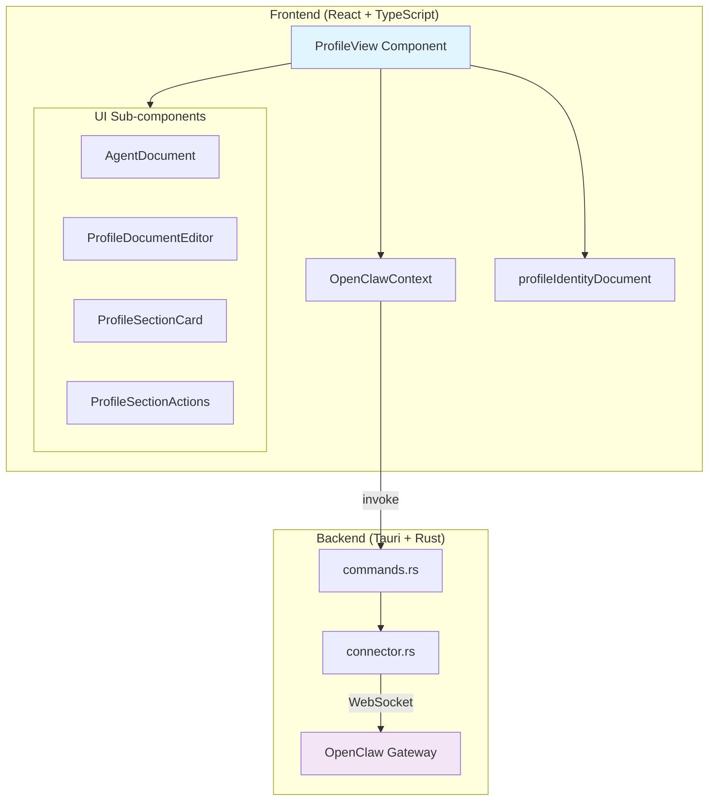
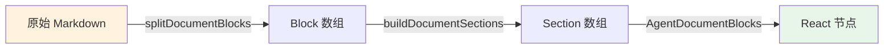

Profile 视图是 ClawScope 桌面应用的核心界面之一，用于管理和展示 OpenClaw 网关连接的 AI 代理（Agent）的身份信息。该视图采用三栏式布局设计，左侧为代理列表与节点切换，中间展示选中代理的详细身份信息，底部提供快捷导航入口。通过 Profile 视图，用户可以查看和编辑代理的 **Identity**（身份文档）与 **Soul**（灵魂文档），管理代理的元数据字段，并实时监控代理状态。

Sources: [ProfileView.tsx](src/app/components/views/ProfileView.tsx#L2180-L2190), [routes.tsx](src/app/routes.tsx#L17)

## 架构概览

Profile 视图的组件架构遵循分层设计原则，将数据获取、状态管理、UI 渲染和文档处理逻辑清晰分离。核心架构包含三个主要层次：**数据层**通过 Tauri 命令与 Rust 后端通信获取代理身份信息；**状态层**使用 React Hooks 管理复杂的编辑状态和草稿数据；**UI 层**采用函数式组件组合，支持响应式布局和暗黑模式。



Sources: [ProfileView.tsx](src/app/components/views/ProfileView.tsx#L1-L60), [OpenClawContext.tsx](src/app/contexts/OpenClawContext.tsx#L463-L467), [commands.rs](src-tauri/src/gateway/commands.rs#L66-L104)

## 数据模型与类型定义

Profile 视图涉及多个核心数据类型，用于描述代理身份信息、文档结构和 UI 状态。

### 代理身份核心类型

| 类型名 | 用途 | 关键字段 |
|--------|------|----------|
| `DisplayAgent` | UI 展示的代理对象 | `id`, `name`, `avatarUrl`, `statusKey`, `stats` |
| `AgentDetailsState` | 代理详情加载状态 | `identity`, `soul`, `workspaceIdentity`, `error` |
| `AgentEditableMetaDraft` | 可编辑的元数据草稿 | `name`, `avatar` |
| `AgentDocumentSection` | 文档分节结构 | `id`, `title`, `level`, `blocks`, `synthetic` |

`DisplayAgent` 是前端内部使用的统一代理表示，整合了来自网关的原始数据、本地解析的身份字段以及 Mock 数据备份。当网关连接不可用时，系统会自动切换到 `MOCK_AGENTS_BACKUP` 提供演示数据。

Sources: [ProfileView.tsx](src/app/components/views/ProfileView.tsx#L75-L98), [ProfileView.tsx](src/app/components/views/ProfileView.tsx#L62-L68), [OpenClawContext.tsx](src/app/contexts/OpenClawContext.tsx#L72-L92)

### 网关通信类型

前端通过 Tauri 命令与 Rust 后端通信，核心类型定义在 `OpenClawContext.tsx` 中：

- **GatewayAgentIdentityResult**: 包含 `agentId`, `name`, `avatar`, `emoji` 等基础身份字段
- **GatewayAgentFileGetResult**: 文件获取结果，包含工作区路径、文件名、内容等
- **GatewayAgentFileEntry**: 文件条目详情，包含 `name`, `path`, `missing`, `size`, `content`

Sources: [OpenClawContext.tsx](src/app/contexts/OpenClawContext.tsx#L72-L92)

## 核心功能模块

### 代理列表与节点选择

Profile 视图左侧栏提供代理列表展示和节点（Node）切换功能。代理按所属节点分组显示，支持桌面端的垂直列表和移动端的水平滚动卡片两种交互模式。

节点选择使用 Radix UI 的 Tabs 组件实现，当存在多个节点时会显示切换提示。代理列表项展示代理头像、名称、状态指示器和短 ID，选中项会有视觉高亮和边框标识。


Sources: [ProfileView.tsx](src/app/components/views/ProfileView.tsx#L2679-L2693), [ProfileView.tsx](src/app/components/views/ProfileView.tsx#L2808-L2856)

### 身份元数据编辑

身份元数据编辑区允许用户修改代理的 **Name**（名称）和 **Avatar**（头像 URL）两个字段。这两个字段是代理身份的核心标识，修改后会同步更新到工作区的 IDENTITY.md 文件中。

编辑流程采用草稿模式：用户点击"编辑"后，当前值被复制到 `identityMetaDraft` 状态；用户修改草稿后，点击"保存"将调用 `gatewayAgentWorkspaceIdentitySet` 命令将变更写入文件；点击"取消"则丢弃草稿恢复原始值。

Sources: [ProfileView.tsx](src/app/components/views/ProfileView.tsx#L2528-L2569), [profileIdentityDocument.ts](src/app/components/views/profileIdentityDocument.ts#L52-L103)

### Identity 与 Soul 文档管理

Profile 视图的核心功能是管理代理的两类 Markdown 文档：

| 文档类型 | 文件名 | 用途 | 编辑权限 |
|----------|--------|------|----------|
| **Identity** | `IDENTITY.md` | 代理身份描述、角色定义、行为准则 | 需要 `operator.admin` 权限 |
| **Soul** | `SOUL.md` | 代理灵魂宣言、核心价值观、情感表达 | 需要 `operator.admin` 权限 |

文档展示使用自定义的 Markdown 渲染引擎，支持标题、段落、引用、代码块、列表和分隔线等元素。渲染器还支持**文档内搜索**功能，可以高亮匹配文本并自动滚动定位。

Sources: [ProfileView.tsx](src/app/components/views/ProfileView.tsx#L730-L870), [ProfileView.tsx](src/app/components/views/ProfileView.tsx#L1196-L1400)

### 文档搜索与高亮

文档搜索功能允许用户在 Identity 或 Soul 文档中快速定位内容。搜索实现采用以下技术策略：

1. **匹配计数**: 遍历所有文档区块计算匹配总数
2. **高亮渲染**: 使用 `<mark>` 元素包裹匹配文本，当前激活匹配使用蓝色高亮，其他匹配使用琥珀色
3. **自动滚动**: 切换激活匹配时自动滚动到视口中心
4. **渐进展开**: 搜索时自动展开所有包含匹配的章节

搜索状态通过 `AgentDocumentSearchContext` 在组件树中传递，确保所有文本渲染函数都能访问当前搜索上下文。

Sources: [ProfileView.tsx](src/app/components/views/ProfileView.tsx#L514-L573), [ProfileView.tsx](src/app/components/views/ProfileView.tsx#L1422-L1467)

## 组件详细设计

### AgentDocument 组件

`AgentDocument` 是文档展示的核心组件，负责 Markdown 解析、章节管理和搜索交互。它将 Markdown 内容解析为 `AgentDocumentBlock` 数组，再组织为 `AgentDocumentSection` 章节结构。

组件支持以下交互功能：
- **章节折叠/展开**: 点击章节标题切换展开状态，状态持久化到 localStorage
- **全部展开/折叠**: 批量操作所有章节，大量章节时采用渐进式展开避免卡顿
- **原文复制**: 一键复制 Markdown 原文到剪贴板
- **文件导出**: 调用 Tauri 对话框保存为本地 Markdown 文件
- **路径复制**: 复制文档在工作区的文件路径

Sources: [ProfileView.tsx](src/app/components/views/ProfileView.tsx#L1196-L1400), [ProfileView.tsx](src/app/components/views/ProfileView.tsx#L1477-L1517)

### 文档渲染管道

Markdown 文档的渲染流程分为三个阶段：



**Block 解析** (`splitDocumentBlocks`) 识别六种块类型：
- `heading`: 1-6 级标题
- `paragraph`: 段落文本
- `quote`: 引用块（`>` 开头）
- `code`: 代码块（``` 包裹）
- `list`: 有序/无序列表
- `divider`: 分隔线（`---`）

**Section 构建** (`buildDocumentSections`) 将 blocks 按 H1/H2 标题分组，无标题内容归入合成的 "Overview" 章节。

**内联渲染** (`parseInlineMarkdown`) 支持行内代码、粗体、斜体、删除线和链接的解析与高亮。

Sources: [ProfileView.tsx](src/app/components/views/ProfileView.tsx#L730-L870), [ProfileView.tsx](src/app/components/views/ProfileView.tsx#L872-L922), [ProfileView.tsx](src/app/components/views/ProfileView.tsx#L575-L701)

## 权限与安全

Profile 视图的编辑功能受权限系统控制。用户需要具备 `operator.admin` 权限才能修改代理身份文档和元数据。

权限检查逻辑：
```typescript
const hasAdminScope = grantedScopes.includes("operator.admin");
const canEditActiveAgent = hasRealAgents && hasAdminScope && Boolean(activeAgent?.id);
```

当用户没有编辑权限时，编辑按钮被禁用并显示只读提示。这一设计确保了代理身份数据的安全性，防止非授权修改。

Sources: [ProfileView.tsx](src/app/components/views/ProfileView.tsx#L2463-L2468), [ProfileView.tsx](src/app/components/views/ProfileView.tsx#L3107-L3124)

## 主题与视觉系统

Profile 视图使用视图色调（View Tone）系统来区分不同功能模块的视觉风格。Identity 相关组件使用 **sky**（天蓝）色调，Soul 相关组件使用 **violet**（紫罗兰）色调。

色调系统定义在 `viewTone.ts` 中，提供以下样式类别：
- `softBadge`: 柔和徽章背景
- `iconText`: 图标文字颜色
- `cardAccent`: 卡片强调线
- `metricBadge`: 指标徽章
- `navActive`: 导航激活状态

暗黑模式支持通过 Tailwind 的 `dark:` 前缀实现，所有颜色都有对应深色变体。

Sources: [viewTone.ts](src/app/components/views/viewTone.ts#L1-L80), [ProfileView.tsx](src/app/components/views/ProfileView.tsx#L57)

## 与后端的数据流

Profile 视图与 Rust 后端的通信通过以下 Tauri 命令实现：

| 命令 | 功能 | 对应 Rust 函数 |
|------|------|----------------|
| `gateway_agent_identity_get` | 获取代理基础身份 | `agent_identity_get` |
| `gateway_agent_soul_get` | 获取 Soul 文档 | `agent_soul_get` |
| `gateway_agent_workspace_identity_get` | 获取 Identity 文档 | `agent_workspace_identity_get` |
| `gateway_agent_workspace_identity_set` | 保存 Identity 文档 | `agent_workspace_identity_set` |
| `gateway_agent_soul_set` | 保存 Soul 文档 | `agent_soul_set` |
| `gatewayExportMarkdownDocument` | 导出文档到本地 | `export_markdown_document` |

所有命令都通过 `invokeGateway` 包装器调用，该包装器会检查 Tauri 运行时可用性并提供统一的错误处理。

Sources: [OpenClawContext.tsx](src/app/contexts/OpenClawContext.tsx#L606-L631), [commands.rs](src-tauri/src/gateway/commands.rs#L97-L104), [commands.rs](src-tauri/src/gateway/commands.rs#L280-L300)

## 性能优化

Profile 视图实现了多项性能优化策略：

1. **延迟加载**: 代理详情数据仅在选中代理时加载，使用 `agentDetailsById` 缓存避免重复请求
2. **渐进展开**: 大量章节时采用 `requestAnimationFrame` 分批展开，避免阻塞主线程
3. **startTransition**: 使用 React 18 的 `startTransition` 标记非紧急状态更新
4. **本地存储**: 章节展开状态持久化到 localStorage，减少重复配置
5. **记忆化计算**: 使用 `useMemo` 缓存代理分组和节点列表计算

Sources: [ProfileView.tsx](src/app/components/views/ProfileView.tsx#L2304-L2334), [ProfileView.tsx](src/app/components/views/ProfileView.tsx#L1281-L1306)

## 相关文档

- [OpenClaw 上下文与状态管理](7-openclaw-shang-xia-wen-yu-zhuang-tai-guan-li) - 了解全局状态管理架构
- [Memory 视图：记忆库与文档管理](10-memory-shi-tu-ji-yi-ku-yu-wen-dang-guan-li) - 探索代理记忆管理功能
- [Tauri 命令与前端通信](15-tauri-ming-ling-yu-qian-duan-tong-xin) - 深入了解前后端通信机制
- [主题系统与暗黑模式](14-zhu-ti-xi-tong-yu-an-hei-mo-shi) - 学习视觉主题实现细节