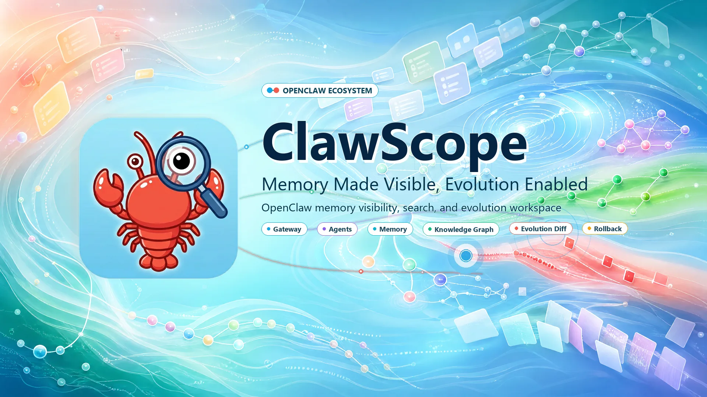
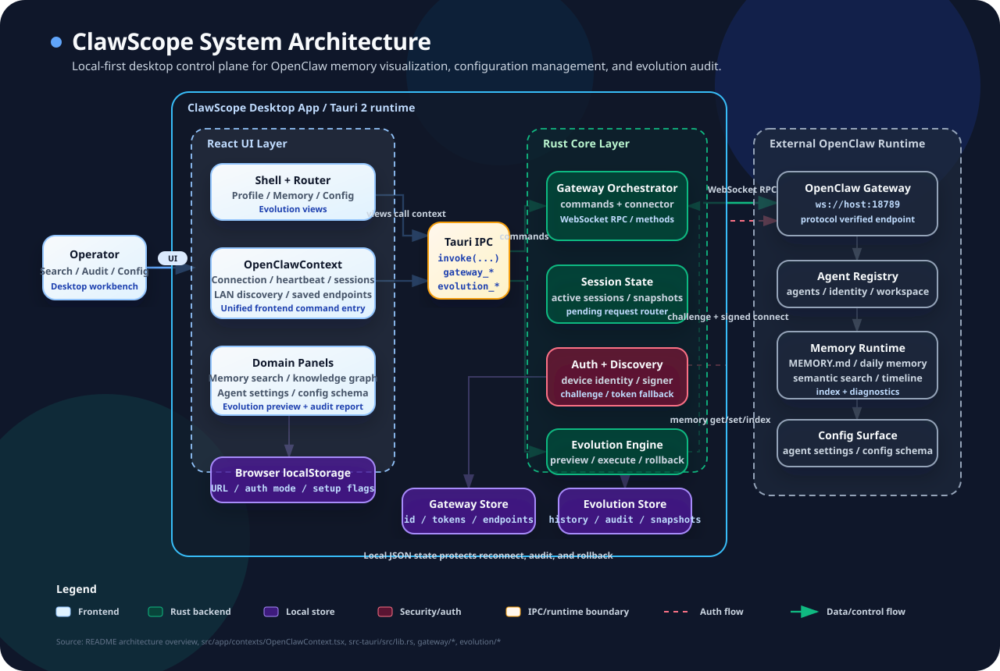
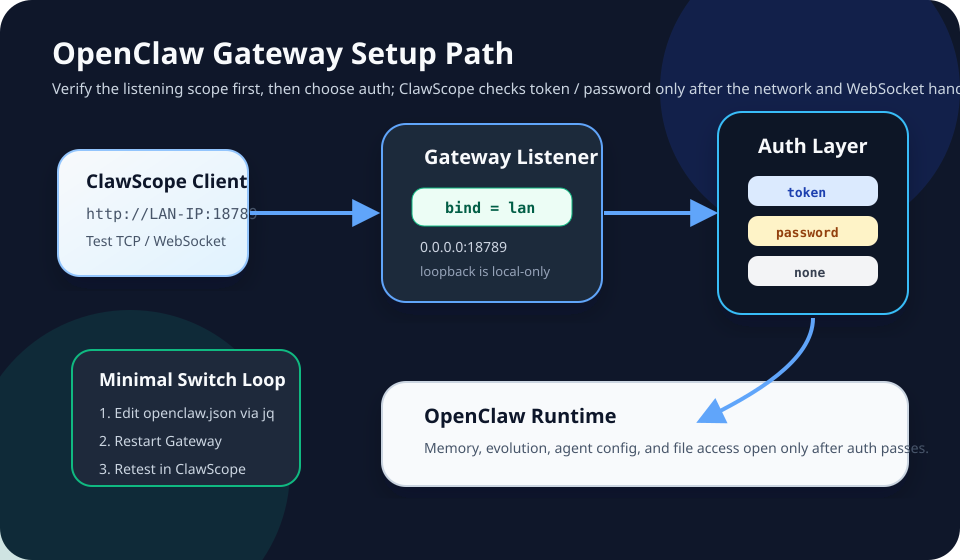

# ClawScope

<p align="center">
  
</p>

**Memory Made Visible, Evolution Enabled** · [中文](README.zh.md)

An OpenClaw memory and evolution management tool — a cross-platform desktop app built with Tauri 2 + Rust.

**Codename:** Both the repository and executable use **ClawScope** as the project codename.

## Feature Overview

- **Memory Management** — Browse, search, and archive OpenClaw memory entries with semantic search and knowledge graph support
- **Evolution Tracking** — Review and trace OpenClaw evolution history, generate audit reports
- **Configuration Management** — Centrally manage OpenClaw node configurations and state
- **Cross-Platform** — Native desktop app for Windows / macOS / Linux

## Architecture Overview

ClawScope is a local-first desktop control plane: React renders the memory, configuration, and evolution workspaces; Tauri IPC forwards UI actions into the Rust command layer; and Rust talks to OpenClaw Gateway over WebSocket to access agents, memory, configuration, and evolution targets. Local JSON storage only keeps connection identity, endpoints, audit history, and snapshots for reconnect, traceability, and rollback.



## Quick Start

```bash
npm install
npm run tauri dev
```

## OpenClaw Gateway Setup Guide

ClawScope connects to OpenClaw through the OpenClaw Gateway. When troubleshooting, verify the Gateway bind mode first, then verify authentication. If TCP / WebSocket cannot connect, the token or password has not been checked yet.



### Config File And jq

OpenClaw normally stores its config at:

```text
~/.openclaw/openclaw.json
```

This guide uses `jq` to edit JSON. Prefer `jq --arg` for token and password values so examples do not hard-code secrets into the jq expression.

Install `jq`:

```bash
# macOS
brew install jq

# Ubuntu / Debian
sudo apt-get update && sudo apt-get install -y jq

# Windows
winget install jqlang.jq
# or
scoop install jq
```

Safe write pattern:

```bash
config="$HOME/.openclaw/openclaw.json"
tmp="$(mktemp)"
jq '.gateway.port = 18789' "$config" > "$tmp" && mv "$tmp" "$config"
```

If the config does not yet contain a `gateway` object, initialize it first:

```bash
config="$HOME/.openclaw/openclaw.json"
tmp="$(mktemp)"
jq '.gateway = (.gateway // {})' "$config" > "$tmp" && mv "$tmp" "$config"
```

### Gateway Config Shape

A typical LAN-accessible config looks like this. Replace the redacted token with your own value.

```json
{
  "gateway": {
    "port": 18789,
    "mode": "local",
    "bind": "lan",
    "auth": {
      "mode": "token",
      "token": "clawx-***REDACTED***"
    }
  }
}
```

### Bind Modes

| Mode | Meaning | Effective Listen Address | Use Case |
|---|---|---|---|
| `loopback` | Localhost only | `127.0.0.1` | Local development and same-machine ClawScope |
| `lan` | LAN access | `0.0.0.0` | Multiple devices on the same LAN |
| `public` | Public-facing bind | `0.0.0.0` | Reverse proxy or public deployment with strong authentication |

Set LAN binding, which exposes `0.0.0.0:18789`:

```bash
config="$HOME/.openclaw/openclaw.json"
tmp="$(mktemp)"
jq '.gateway = (.gateway // {}) | .gateway.bind = "lan" | .gateway.port = 18789 | .gateway.mode = "local"' "$config" > "$tmp" && mv "$tmp" "$config"
```

Switch back to local-only binding:

```bash
config="$HOME/.openclaw/openclaw.json"
tmp="$(mktemp)"
jq '.gateway = (.gateway // {}) | .gateway.bind = "loopback"' "$config" > "$tmp" && mv "$tmp" "$config"
```

Check the configured bind mode:

```bash
jq '.gateway.bind' ~/.openclaw/openclaw.json
```

Check the actual listener:

```bash
# macOS / Linux
lsof -nP -iTCP:18789 -sTCP:LISTEN

# Windows PowerShell
Get-NetTCPConnection -LocalPort 18789 -State Listen
```

For LAN access, the listener should be `*:18789`, `0.0.0.0:18789`, or a LAN interface address, not only `127.0.0.1:18789`.

### Authentication Modes

| Mode | Config Field | Connection Shape | Use Case |
|---|---|---|---|
| `none` | No extra field | Direct connection | Local development or trusted private networks |
| `token` | `token` | `Authorization: Bearer <token>` | Multi-device access, API calls, LAN sharing |
| `password` | `password` | `X-OpenClaw-Password: <password>` | Simple manual entry |
| `trusted-proxy` | `trustedProxies` | Trust proxy source IPs | Reverse proxy deployments |

### Token Auth

Config example:

```json
{
  "gateway": {
    "port": 18789,
    "auth": {
      "mode": "token",
      "token": "clawx-***REDACTED***"
    }
  }
}
```

Set token auth:

```bash
config="$HOME/.openclaw/openclaw.json"
gateway_token="clawx-***REDACTED***"
tmp="$(mktemp)"
jq --arg token "$gateway_token" '.gateway = (.gateway // {}) | .gateway.auth = {"mode": "token", "token": $token}' "$config" > "$tmp" && mv "$tmp" "$config"
```

Connection header shape:

```http
Authorization: Bearer clawx-***REDACTED***
```

### Password Auth

Config example:

```json
{
  "gateway": {
    "port": 18789,
    "auth": {
      "mode": "password",
      "password": "***REDACTED***"
    }
  }
}
```

Set password auth:

```bash
config="$HOME/.openclaw/openclaw.json"
gateway_password="***REDACTED***"
tmp="$(mktemp)"
jq --arg password "$gateway_password" '.gateway = (.gateway // {}) | .gateway.auth = {"mode": "password", "password": $password}' "$config" > "$tmp" && mv "$tmp" "$config"
```

Connection header shape:

```http
X-OpenClaw-Password: ***REDACTED***
```

Equivalent WebSocket connect message shape:

```json
{
  "type": "connect",
  "auth": {
    "password": "***REDACTED***"
  }
}
```

### No Auth And Trusted Proxy

For same-machine or temporary trusted-network debugging:

```bash
config="$HOME/.openclaw/openclaw.json"
tmp="$(mktemp)"
jq '.gateway = (.gateway // {}) | .gateway.auth = {"mode": "none"}' "$config" > "$tmp" && mv "$tmp" "$config"
```

For reverse proxy deployments, replace these example addresses with your proxy source IPs:

```bash
config="$HOME/.openclaw/openclaw.json"
proxy_a="192.168.1.100"
proxy_b="10.0.0.1"
tmp="$(mktemp)"
jq --arg proxyA "$proxy_a" --arg proxyB "$proxy_b" '.gateway = (.gateway // {}) | .gateway.auth = {"mode": "trusted-proxy", "trustedProxies": [$proxyA, $proxyB]}' "$config" > "$tmp" && mv "$tmp" "$config"
```

### Switching Modes

1. Update `gateway.bind` and `gateway.auth` in `~/.openclaw/openclaw.json`.
2. Restart OpenClaw Gateway.
3. In ClawScope, test `http://<OpenClaw-host-LAN-IP>:18789` again.

Restart examples:

```bash
# Foreground process: stop the old process with Ctrl+C, then run:
openclaw gateway

# If your environment uses openclaw-gateway as the process name:
pkill -f openclaw-gateway
sleep 2
openclaw gateway > /tmp/openclaw-gateway.log 2>&1 &
```

### Quick Switch Script

The script below uses `jq --arg` and redacted placeholders.

```bash
#!/usr/bin/env bash
set -euo pipefail

OPENCLAW_CONFIG="${OPENCLAW_CONFIG:-$HOME/.openclaw/openclaw.json}"

write_gateway_config() {
  local bind="$1"
  local auth_mode="$2"
  local auth_value="${3:-}"
  local tmp
  tmp="$(mktemp)"

  case "$auth_mode" in
    token)
      jq --arg bind "$bind" --arg token "$auth_value" '
        .gateway = (.gateway // {})
        | .gateway.mode = "local"
        | .gateway.port = 18789
        | .gateway.bind = $bind
        | .gateway.auth = {"mode": "token", "token": $token}
      ' "$OPENCLAW_CONFIG" > "$tmp"
      ;;
    password)
      jq --arg bind "$bind" --arg password "$auth_value" '
        .gateway = (.gateway // {})
        | .gateway.mode = "local"
        | .gateway.port = 18789
        | .gateway.bind = $bind
        | .gateway.auth = {"mode": "password", "password": $password}
      ' "$OPENCLAW_CONFIG" > "$tmp"
      ;;
    none)
      jq --arg bind "$bind" '
        .gateway = (.gateway // {})
        | .gateway.mode = "local"
        | .gateway.port = 18789
        | .gateway.bind = $bind
        | .gateway.auth = {"mode": "none"}
      ' "$OPENCLAW_CONFIG" > "$tmp"
      ;;
    *)
      echo "unsupported auth mode: $auth_mode" >&2
      rm -f "$tmp"
      return 2
      ;;
  esac

  mv "$tmp" "$OPENCLAW_CONFIG"
}

restart_gateway() {
  pkill -f openclaw-gateway || true
  sleep 2
  openclaw gateway > /tmp/openclaw-gateway.log 2>&1 &
}

show_gateway_status() {
  echo "=== Gateway config ==="
  jq '.gateway' "$OPENCLAW_CONFIG"
  echo
  echo "=== Non-loopback IPv4 addresses ==="
  if command -v ip >/dev/null 2>&1; then
    ip -4 addr show | grep -oE 'inet [0-9.]+' | awk '{print $2}' | grep -v '^127\.'
  else
    ifconfig | grep "inet " | grep -v 127.0.0.1
  fi
}

# Examples:
# write_gateway_config "lan" "password" "***REDACTED***" && restart_gateway && show_gateway_status
# write_gateway_config "lan" "token" "clawx-***REDACTED***" && restart_gateway && show_gateway_status
# write_gateway_config "loopback" "none" && restart_gateway && show_gateway_status
```

### Viewing Current Config Safely

Show the full Gateway config:

```bash
jq '.gateway' ~/.openclaw/openclaw.json
```

Show auth config with secrets masked:

```bash
jq '
  .gateway.auth
  | if .token then .token = "***REDACTED***" else . end
  | if .password then .password = "***REDACTED***" else . end
' ~/.openclaw/openclaw.json
```

LAN connection summary template:

| Item | Example |
|---|---|
| Host IP | `192.168.1.xxx` |
| Gateway URL | `http://192.168.1.xxx:18789` |
| Listen Address | `0.0.0.0:18789` |
| Auth Mode | `token` or `password` |
| Credential | `***REDACTED***` |

### Common Config Combinations

| Scenario | `bind` | `auth.mode` | Notes |
|---|---|---|---|
| Local debug | `loopback` | `none` | Easiest same-machine setup |
| Local secure | `loopback` | `token` | Same-machine access with token |
| LAN sharing | `lan` | `password` | Good for a small number of manually configured devices |
| LAN API | `lan` | `token` | Better for multiple devices or automation |
| Public deployment | `public` | `token` | Requires a strong token, reverse proxy, and extra network controls |

### Troubleshooting Order

1. Confirm `openclaw gateway` is running on the OpenClaw host.
2. Confirm `gateway.bind` is `lan` and the actual listener is not only `127.0.0.1`.
3. From the ClawScope machine, run `Test-NetConnection <OpenClaw-host-IP> -Port 18789` or `nc -vz <OpenClaw-host-IP> 18789`.
4. Only after TCP works, check whether token / password matches the host config.
5. If you see `Handshake not finished`, confirm the target port is really the OpenClaw Gateway WebSocket service and not a proxy, stale process, or another service.

## Build

```bash
npm run tauri build
```

Notes:

- Local `tauri build` only produces installers for the current host platform.
- Running on Windows yields Windows artifacts only (e.g., `msi` / `nsis`).
- For the canonical cross-platform release matrix, see the GitHub Actions release workflow documented below under "Release Platforms".

## Testing

```bash
# Run all tests
npm test

# Run type checking
npm run lint
```

## Visual Regression

This repository includes a Playwright-based light/dark theme screenshot regression workflow that captures baselines for the four main pages: `Profile`, `Memory`, `Config`, and `Evolution`.

With an existing preview server:

```bash
npm run build
npm run preview -- --host 127.0.0.1 --port 4173
npm run visual:baseline
```

One-command local / CI:

```bash
npm run visual:ci
```

Environment variables:

| Variable | Description |
|---|---|
| `VISUAL_BASELINE_NAME` | Output directory name; defaults to the current date or `ci-baseline` in CI |
| `VISUAL_BASE_URL` | Specify an existing preview URL |
| `VISUAL_PORT` / `VISUAL_HOST` | Host/port for the preview server started by `visual:ci` |

Screenshots are output to `artifacts/visual-regression/<baseline-name>/`. See [`artifacts/visual-regression/README.md`](artifacts/visual-regression/README.md) for directory conventions and manual review instructions.

## Tech Stack

| Layer | Technology |
|---|---|
| Frontend | React 18 + TypeScript + Vite |
| UI | Radix UI + Tailwind CSS 4 + shadcn/ui |
| Desktop | Tauri 2 + Rust |
| Charts | Recharts |
| Testing | Vitest + Playwright |

## Prerequisites

- **Windows:** Install [Visual Studio Build Tools](https://visualstudio.microsoft.com/visual-cpp-build-tools/) with the "Desktop development with C++" workload, or a full Visual Studio installation
- **Rust:** `rustup default stable-msvc` (MSVC toolchain recommended on Windows)

If you encounter `dlltool.exe: program not found` during build, install the toolchain above.

## Release Platforms

ClawScope targets the following platforms for open-source releases:

| Platform | Artifact Formats |
|---|---|
| Windows x64 | NSIS `setup.exe` / `MSI` |
| macOS Apple Silicon | `.app` / `.dmg` |
| macOS Intel | `.app` / `.dmg` |
| Linux x64 | `AppImage` / `deb` / `rpm` |

A cross-platform release workflow is included in the repository:

- [`.github/workflows/release.yml`](.github/workflows/release.yml)

For additional details and the release matrix, see:

- [`docs/release/platform-support.md`](docs/release/platform-support.md)

## Documentation

- Project setup: `_bmad-output/planning-artifacts/main/PROJECT_SETUP.md`
- Help: [`docs/help/choose-extra-paths-or-knowledge-injection.md`](docs/help/choose-extra-paths-or-knowledge-injection.md)

## License

[MIT](LICENSE)
