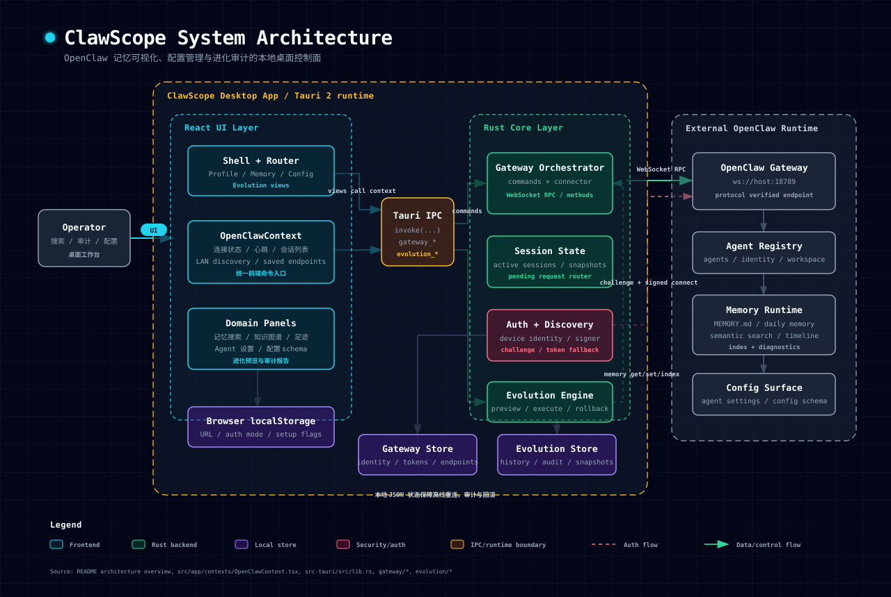
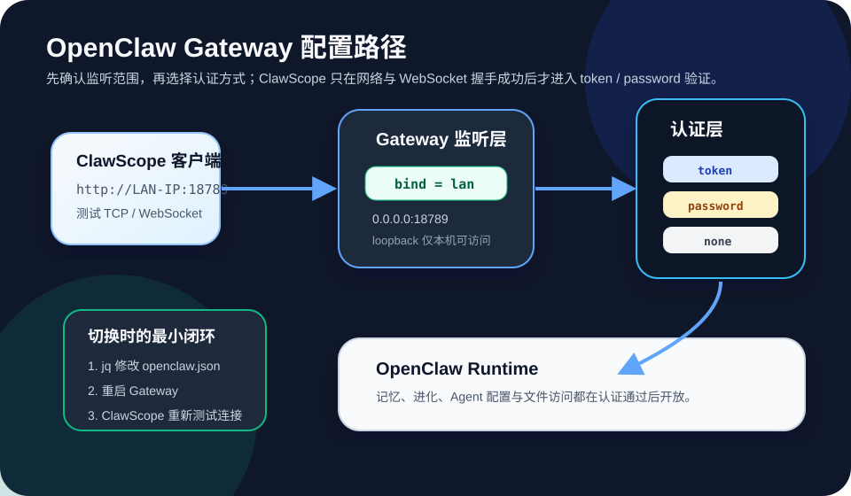

# ClawScope

<p align="center">
  
</p>

**记忆可见，进化可期** · [English](README.md)

OpenClaw 记忆与进化管理工具 — 基于 Tauri 2 + Rust 构建的跨平台桌面应用。

**代号：** 本仓库与可执行文件均使用 **ClawScope** 作为项目代号。

## 功能概览

- **记忆管理** — 查看、搜索、归档 OpenClaw 记忆条目，支持语义搜索与知识图谱
- **进化追踪** — 审视与回溯 OpenClaw 进化历史，生成审计报告
- **配置管理** — 集中管理 OpenClaw 节点配置与状态
- **跨平台** — Windows / macOS / Linux 原生桌面应用

## 架构一览

ClawScope 是一个本地优先的桌面控制面：React 负责记忆、配置、进化等工作视图，Tauri IPC 将界面动作转发到 Rust 命令层，Rust 侧再通过 OpenClaw Gateway 的 WebSocket 协议访问 Agent、记忆、配置与进化目标。本地 JSON 存储只保存连接身份、端点、审计历史与快照，用于重连、追踪和回滚。



## 快速开始

```bash
npm install
npm run tauri dev
```

## OpenClaw Gateway 设置指南

ClawScope 通过 OpenClaw Gateway 访问记忆、进化和 Agent 配置。排查连接问题时先确认 Gateway 监听范围，再确认认证模式；如果 TCP / WebSocket 都没有连通，token 或 password 不会被校验。



### 配置文件与 jq

OpenClaw 配置文件默认位于：

```text
~/.openclaw/openclaw.json
```

本指南使用 `jq` 修改 JSON 配置。推荐使用 `--arg` 传入 token、password、bind 等变量，避免把实际凭据直接拼进 jq 表达式。

安装 `jq`：

```bash
# macOS
brew install jq

# Ubuntu / Debian
sudo apt-get update && sudo apt-get install -y jq

# Windows
winget install jqlang.jq
# 或
scoop install jq
```

安全写回配置的通用写法：

```bash
config="$HOME/.openclaw/openclaw.json"
tmp="$(mktemp)"
jq '.gateway.port = 18789' "$config" > "$tmp" && mv "$tmp" "$config"
```

如果当前配置缺少 `gateway` 节点，先初始化最小结构：

```bash
config="$HOME/.openclaw/openclaw.json"
tmp="$(mktemp)"
jq '.gateway = (.gateway // {})' "$config" > "$tmp" && mv "$tmp" "$config"
```

### Gateway 配置结构

局域网访问的典型配置如下。示例中的 token 已脱敏，请替换为你自己的值。

```json
{
  "gateway": {
    "port": 18789,
    "mode": "local",
    "bind": "lan",
    "auth": {
      "mode": "token",
      "token": "clawx-***REDACTED***"
    }
  }
}
```

### 绑定模式

| 模式 | 说明 | 实际监听地址 | 适用场景 |
|---|---|---|---|
| `loopback` | 仅本机访问 | `127.0.0.1` | 本机开发、本机 ClawScope |
| `lan` | 局域网访问 | `0.0.0.0` | 同一局域网内多设备连接 |
| `public` | 对公网地址开放 | `0.0.0.0` | 反向代理或公网部署，必须配合强认证与网络边界 |

设置局域网监听，也就是让 Gateway 监听 `0.0.0.0:18789`：

```bash
config="$HOME/.openclaw/openclaw.json"
tmp="$(mktemp)"
jq '.gateway = (.gateway // {}) | .gateway.bind = "lan" | .gateway.port = 18789 | .gateway.mode = "local"' "$config" > "$tmp" && mv "$tmp" "$config"
```

切回仅本机监听：

```bash
config="$HOME/.openclaw/openclaw.json"
tmp="$(mktemp)"
jq '.gateway = (.gateway // {}) | .gateway.bind = "loopback"' "$config" > "$tmp" && mv "$tmp" "$config"
```

查看当前绑定模式：

```bash
jq '.gateway.bind' ~/.openclaw/openclaw.json
```

确认进程实际监听地址：

```bash
# macOS / Linux
lsof -nP -iTCP:18789 -sTCP:LISTEN

# Windows PowerShell
Get-NetTCPConnection -LocalPort 18789 -State Listen
```

如果局域网访问正常，服务端应监听在 `*:18789`、`0.0.0.0:18789` 或对应网卡地址，而不是只监听 `127.0.0.1:18789`。

### 认证模式对比

| 模式 | 配置字段 | 连接方式 | 适用场景 |
|---|---|---|---|
| `none` | 无额外字段 | 直接连接 | 本地开发或可信内网 |
| `token` | `token` | `Authorization: Bearer <token>` | 多设备连接、API 调用、局域网共享 |
| `password` | `password` | `X-OpenClaw-Password: <password>` | 简单场景、人工输入 |
| `trusted-proxy` | `trustedProxies` | 信任代理来源 IP | 反向代理部署 |

### Token 认证

配置示例：

```json
{
  "gateway": {
    "port": 18789,
    "auth": {
      "mode": "token",
      "token": "clawx-***REDACTED***"
    }
  }
}
```

设置命令：

```bash
config="$HOME/.openclaw/openclaw.json"
gateway_token="clawx-***REDACTED***"
tmp="$(mktemp)"
jq --arg token "$gateway_token" '.gateway = (.gateway // {}) | .gateway.auth = {"mode": "token", "token": $token}' "$config" > "$tmp" && mv "$tmp" "$config"
```

连接侧含义：

```http
Authorization: Bearer clawx-***REDACTED***
```

### Password 认证

配置示例：

```json
{
  "gateway": {
    "port": 18789,
    "auth": {
      "mode": "password",
      "password": "***REDACTED***"
    }
  }
}
```

设置命令：

```bash
config="$HOME/.openclaw/openclaw.json"
gateway_password="***REDACTED***"
tmp="$(mktemp)"
jq --arg password "$gateway_password" '.gateway = (.gateway // {}) | .gateway.auth = {"mode": "password", "password": $password}' "$config" > "$tmp" && mv "$tmp" "$config"
```

连接侧含义：

```http
X-OpenClaw-Password: ***REDACTED***
```

WebSocket connect 消息中的等价含义：

```json
{
  "type": "connect",
  "auth": {
    "password": "***REDACTED***"
  }
}
```

### 无认证与 Trusted Proxy

仅本机或可信内网临时调试可使用无认证：

```bash
config="$HOME/.openclaw/openclaw.json"
tmp="$(mktemp)"
jq '.gateway = (.gateway // {}) | .gateway.auth = {"mode": "none"}' "$config" > "$tmp" && mv "$tmp" "$config"
```

反向代理场景可使用 trusted proxy。示例 IP 请替换为你的代理出口地址：

```bash
config="$HOME/.openclaw/openclaw.json"
proxy_a="192.168.1.100"
proxy_b="10.0.0.1"
tmp="$(mktemp)"
jq --arg proxyA "$proxy_a" --arg proxyB "$proxy_b" '.gateway = (.gateway // {}) | .gateway.auth = {"mode": "trusted-proxy", "trustedProxies": [$proxyA, $proxyB]}' "$config" > "$tmp" && mv "$tmp" "$config"
```

### 模式切换步骤

1. 修改 `~/.openclaw/openclaw.json` 中的 `gateway.bind` 和 `gateway.auth`。
2. 重启 OpenClaw Gateway，使配置生效。
3. 在 ClawScope 中使用 `http://<OpenClaw主机局域网IP>:18789` 重新测试连接。

重启示例：

```bash
# 如果 Gateway 是前台进程，先在原终端按 Ctrl+C 停止，再启动：
openclaw gateway

# 如果确认当前环境使用 openclaw-gateway 作为进程名，可使用：
pkill -f openclaw-gateway
sleep 2
openclaw gateway > /tmp/openclaw-gateway.log 2>&1 &
```

### 快速切换脚本

下面脚本使用 `jq --arg` 写入配置，并在写入后重启 Gateway。示例值均为脱敏占位符。

```bash
#!/usr/bin/env bash
set -euo pipefail

OPENCLAW_CONFIG="${OPENCLAW_CONFIG:-$HOME/.openclaw/openclaw.json}"

write_gateway_config() {
  local bind="$1"
  local auth_mode="$2"
  local auth_value="${3:-}"
  local tmp
  tmp="$(mktemp)"

  case "$auth_mode" in
    token)
      jq --arg bind "$bind" --arg token "$auth_value" '
        .gateway = (.gateway // {})
        | .gateway.mode = "local"
        | .gateway.port = 18789
        | .gateway.bind = $bind
        | .gateway.auth = {"mode": "token", "token": $token}
      ' "$OPENCLAW_CONFIG" > "$tmp"
      ;;
    password)
      jq --arg bind "$bind" --arg password "$auth_value" '
        .gateway = (.gateway // {})
        | .gateway.mode = "local"
        | .gateway.port = 18789
        | .gateway.bind = $bind
        | .gateway.auth = {"mode": "password", "password": $password}
      ' "$OPENCLAW_CONFIG" > "$tmp"
      ;;
    none)
      jq --arg bind "$bind" '
        .gateway = (.gateway // {})
        | .gateway.mode = "local"
        | .gateway.port = 18789
        | .gateway.bind = $bind
        | .gateway.auth = {"mode": "none"}
      ' "$OPENCLAW_CONFIG" > "$tmp"
      ;;
    *)
      echo "unsupported auth mode: $auth_mode" >&2
      rm -f "$tmp"
      return 2
      ;;
  esac

  mv "$tmp" "$OPENCLAW_CONFIG"
}

restart_gateway() {
  pkill -f openclaw-gateway || true
  sleep 2
  openclaw gateway > /tmp/openclaw-gateway.log 2>&1 &
}

show_gateway_status() {
  echo "=== Gateway 配置 ==="
  jq '.gateway' "$OPENCLAW_CONFIG"
  echo
  echo "=== 本机非 loopback IPv4 ==="
  if command -v ip >/dev/null 2>&1; then
    ip -4 addr show | grep -oE 'inet [0-9.]+' | awk '{print $2}' | grep -v '^127\.'
  else
    ifconfig | grep "inet " | grep -v 127.0.0.1
  fi
}

# 使用示例：
# write_gateway_config "lan" "password" "***REDACTED***" && restart_gateway && show_gateway_status
# write_gateway_config "lan" "token" "clawx-***REDACTED***" && restart_gateway && show_gateway_status
# write_gateway_config "loopback" "none" && restart_gateway && show_gateway_status
```

### 当前配置查看

查看完整 Gateway 配置：

```bash
jq '.gateway' ~/.openclaw/openclaw.json
```

查看认证配置，避免在截图或日志中泄露真实凭据：

```bash
jq '
  .gateway.auth
  | if .token then .token = "***REDACTED***" else . end
  | if .password then .password = "***REDACTED***" else . end
' ~/.openclaw/openclaw.json
```

局域网连接信息汇总模板：

| 项目 | 示例值 |
|---|---|
| 本机 IP | `192.168.1.xxx` |
| Gateway URL | `http://192.168.1.xxx:18789` |
| 监听地址 | `0.0.0.0:18789` |
| 认证方式 | `token` 或 `password` |
| 凭据 | `***REDACTED***` |

### 常见配置组合

| 场景 | `bind` | `auth.mode` | 说明 |
|---|---|---|---|
| 本机调试 | `loopback` | `none` | 最简单，仅本机无认证 |
| 本机安全 | `loopback` | `token` | 仅本机访问，但仍要求 token |
| 局域网共享 | `lan` | `password` | 适合少量人工输入的设备 |
| 局域网 API | `lan` | `token` | 适合多设备、自动化或 API 调用 |
| 公网部署 | `public` | `token` | 需要强 token、反向代理与额外网络边界 |

### 连接排查顺序

1. 在 OpenClaw 主机上确认 `openclaw gateway` 已启动。
2. 确认 `gateway.bind` 是 `lan`，并且实际监听不是只在 `127.0.0.1`。
3. 在 ClawScope 所在机器上执行 `Test-NetConnection <OpenClaw主机IP> -Port 18789` 或 `nc -vz <OpenClaw主机IP> 18789`。
4. TCP 通了之后，再检查 token / password 是否和服务端配置一致。
5. 如果报 `Handshake not finished`，优先确认目标端口是否真的是 OpenClaw Gateway WebSocket 服务，而不是被代理、旧进程或其他服务占用。

## 构建

```bash
npm run tauri build
```

说明：

- 本地 `tauri build` 只会产出当前宿主平台的安装包。
- 在 Windows 本机执行时，默认只会得到 Windows 产物（如 `msi` / `nsis`）。
- 标准开源发布矩阵以 GitHub Actions 的跨平台 release workflow 为准，见下文"发布平台"。

## 测试

```bash
# 运行所有测试
npm test

# 运行类型检查
npm run lint
```

## Visual Regression

本仓库内置一套基于 Playwright 的明 / 暗主题截图回归流程，用于对 `Profile`、`Memory`、`Config`、`Evolution` 四个主页面做逐页基线采样。

本地已有预览服务时：

```bash
npm run build
npm run preview -- --host 127.0.0.1 --port 4173
npm run visual:baseline
```

一键本地 / CI 方式：

```bash
npm run visual:ci
```

可选环境变量：

| 变量 | 说明 |
|---|---|
| `VISUAL_BASELINE_NAME` | 指定输出目录名，默认取当天日期或 CI 中的 `ci-baseline` |
| `VISUAL_BASE_URL` | 指定已有预览地址 |
| `VISUAL_PORT` / `VISUAL_HOST` | 用于 `visual:ci` 自动拉起预览服务时指定监听地址 |

截图产物默认输出到 `artifacts/visual-regression/<baseline-name>/`，目录规范与人工审查方式见 [`artifacts/visual-regression/README.md`](artifacts/visual-regression/README.md)。

## 技术栈

| 层 | 技术 |
|---|---|
| 前端 | React 18 + TypeScript + Vite |
| UI | Radix UI + Tailwind CSS 4 + shadcn/ui |
| 桌面 | Tauri 2 + Rust |
| 图表 | Recharts |
| 测试 | Vitest + Playwright |

## 环境要求

- **Windows：** 需安装 [Visual Studio Build Tools](https://visualstudio.microsoft.com/visual-cpp-build-tools/)（含「使用 C++ 的桌面开发」工作负载）或完整 Visual Studio
- **Rust：** `rustup default stable-msvc`（Windows 上建议使用 MSVC 工具链）

若构建报错 `dlltool.exe: program not found`，请安装上述工具链。

## 发布平台

面向开源发布时，ClawScope 目标对齐以下平台：

| 平台 | 产物格式 |
|---|---|
| Windows x64 | NSIS `setup.exe` / `MSI` |
| macOS Apple Silicon | `.app` / `.dmg` |
| macOS Intel | `.app` / `.dmg` |
| Linux x64 | `AppImage` / `deb` / `rpm` |

仓库内已提供跨平台发布工作流：

- [`.github/workflows/release.yml`](.github/workflows/release.yml)

补充说明与发布矩阵见：

- [`docs/release/platform-support.md`](docs/release/platform-support.md)

## 相关文档

- 项目设置: `_bmad-output/planning-artifacts/main/PROJECT_SETUP.md`
- 帮助文档: [`docs/help/choose-extra-paths-or-knowledge-injection.md`](docs/help/choose-extra-paths-or-knowledge-injection.md)

## License

[MIT](LICENSE)
